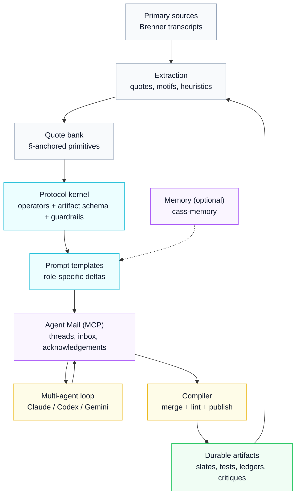

## Brenner Bot

**Brenner Bot is a research “seed crystal”**: a curated primary-source corpus (Sydney Brenner transcripts) plus multi-model syntheses, built to eventually power **collaborative scientific research conversations** that follow the “Brenner approach.”

### The north star

The endgame is to marry this repository with **Agent Mail** (coordination + memory + workflow glue) so multiple coding agents can collaborate as a *research group*:

- **Claude Code** running **Opus 4.5**
- **Codex** running **GPT‑5.2** (extra-high reasoning)
- **Gemini CLI** running **Gemini 3**

…all coordinating via Agent Mail, using prompt templates and repeatable workflows grounded in deep study of Brenner’s method.

> **Status**: this repo is documents-first (corpus + notes + syntheses), evolving into a web-based multi-agent “research lab” coordinated via Agent Mail.

Early scaffolding exists for:
- a Next.js web app in `apps/web/` (corpus browse + session kickoff UI)
- a Bun CLI entrypoint in `brenner.ts` (prompt composition + Agent Mail orchestration)

Deployment target: **`brennerbot.org`** (Cloudflare-managed domain; Vercel-hosted app).

---

### Table of contents

- [Why this repo is interesting](#why-this-repo-is-interesting)
- [The Core Insight: Why Brenner?](#the-core-insight-why-brenner)
- [What's here today](#whats-here-today)
- [What this is ultimately for](#what-this-is-ultimately-for)
- [How the future system is intended to work](#how-the-future-system-is-intended-to-work)
- [How to use this repo right now](#how-to-use-this-repo-right-now)
- [Repository map](#repository-map)
- [The three distillations](#the-three-distillations)
- [Working vocabulary](#working-vocabulary)
- [The Operator Algebra](#the-operator-algebra)
- [The Implicit Bayesianism](#the-implicit-bayesianism)
- [The Brenner Method: Ten Principles](#the-brenner-method-ten-principles)
- [The Required Contradictions](#the-required-contradictions)
- [Why This Matters for AI-Assisted Research](#why-this-matters-for-ai-assisted-research)
- [Provenance, attribution, and epistemic hygiene](#provenance-attribution-and-epistemic-hygiene)
- [Roadmap](#roadmap)

---

## Why this repo is interesting

This project is not “a bot that talks like Brenner.” It’s an attempt to **operationalize a scientific method** and make it runnable as a collaboration protocol.

What makes it unusually useful (and fun):

- **Primary sources with stable anchors**: `complete_brenner_transcript.md` is the canonical text, organized into numbered sections (`§n`) so claims can be cited precisely.
- **Verbatim primitive extraction**: `quote_bank_restored_primitives.md` is a growing bank of high-signal verbatim quotes keyed by `§n` and intended to be tagged to operators/motifs.
- **Three incompatible distillation styles**: Opus 4.5, GPT‑5.2, and Gemini 3 saw the *same* transcript corpus and produced **different “coordinate systems”** for the Brenner method. Comparing them is itself a Brenner move: a representation change that reveals invariants and failure modes.
- **Artifacts, not chat logs**: the goal state is a lab-like output format (hypothesis slates, discriminative tests, assumption ledgers, anomaly registers, adversarial critiques) that can be audited and iterated.
- **Protocol + orchestration substrate**: Agent Mail provides durable threads and coordination primitives; Bun provides a path to a single self-contained CLI binary; Beads provides a dependency-aware roadmap in-repo.

---

## The Core Insight: Why Brenner?

Sydney Brenner (1927–2019) was one of the most successful experimental biologists in history: co-discoverer of messenger RNA, architect of the genetic code experiments, founder of *C. elegans* as a model organism, and Nobel laureate. But his *method* is more valuable than any single discovery.

Brenner's "superpower" was not updating faster—it was **repeatedly redesigning the world so that updates become easy**. He changed organisms to change costs. He changed readouts to change likelihood sharpness. He changed question forms to turn mush into discrete constraints. He changed abstraction levels to avoid misspecified model classes.

This repository attempts to **reverse-engineer that cognitive architecture** and render it reusable for AI-assisted scientific research.

### The Two Axioms

After extensive analysis, we distilled Brenner's approach to two fundamental commitments from which everything else derives:

**Axiom 1: Reality Has a Generative Grammar**
> The world is not merely patterns and correlations. It is *produced* by causal machinery that operates according to discoverable rules. Biology is computation—not metaphorically, but literally.

**Axiom 2: To Understand Is to Be Able to Reconstruct**
> You have not explained a phenomenon until you can specify, in principle, how to *build it from primitives*. Description is not understanding. Prediction is not understanding. Only reconstruction is understanding.

From these axioms flow all of Brenner's operational moves: finding the "machine language" of each system, separating program from interpreter, hunting forbidden patterns, choosing organisms strategically, and designing experiments with extreme likelihood ratios.

### Signature Quotes

A taste of Brenner's voice (all from the transcripts):

> "Exclusion is always a tremendously good thing in science."

> "We proposed three models... 'You've forgotten there's a third alternative.' 'What's that?' 'Both could be wrong.'"

> "I had invented something called HAL biology. HAL, that's H-A-L, it stood for Have A Look biology. I mean, what's the use of doing a lot of biochemistry when you can just see what happened?"

> "The best thing in science is to work out of phase. That is, either half a wavelength ahead or half a wavelength behind. It doesn't matter. But if you're out of phase with the fashion you can do new things."

> "One should not fall in love with one's theories. They should be treated as mistresses to be discarded once the pleasure is over."

> "A proper simulation must be done in the machine language of the object being simulated... you need to be able to say: there are no more wires—we know all the wires."

> "The choice of the experimental object remains one of the most important things to do in biology."

> "I'm a great believer in the power of ignorance... when you know too much you're dangerous in the subject because you will deter originality."

> "The best people to push a science forward are in fact those who come from outside it... the émigrés are always the best people to make the new discoveries."

---

## What's here today

This repository provides the raw material and early syntheses needed to build “Brenner-style” research workflows — and the beginnings of the tooling needed to run them as protocols.

### What you can do immediately

- **Read and search the corpus** to find Brenner’s recurring heuristics, jokes, and sharp conceptual tools.
- **Compare syntheses across models** to identify consensus themes vs model-specific hallucinations.
- **Generate additional writeups** by prompting an LLM with `initial_metaprompt.md` + selected transcript excerpts.
- **Kick off Agent Mail sessions** via the web UI (`apps/web/`) or CLI (`brenner.ts`) if you have Agent Mail running locally.

### What you cannot do yet

- There is currently **no polished end-to-end “lab IDE”**. The web app and CLI are intentionally minimal scaffolding; the goal is to harden them into a protocol-driven system that produces durable lab artifacts (not chat logs).

---

## What this is ultimately for

The goal isn’t “summarize Brenner.” It’s to *operationalize* his approach as a set of reusable collaboration patterns:

- **How to pick problems** (and when to walk away)
- **How to formulate discriminative questions**
- **How to choose experiments/observations** that collapse hypothesis space fast
- **How to design “decision procedures”** rather than accumulate “interesting data”
- **How to reason with constraints, paradoxes, and representation changes**

The idea is to turn those into **prompt templates + structured research protocols** that a multi-agent team can repeatedly execute (and audit).

---

## How the future system is intended to work

### Conceptual architecture



### The Agent Mail connection

Agent Mail is the coordination substrate that makes “a research group of agents” viable: durable threads, inbox/outbox, acknowledgements, and coordination primitives (like reserving files or surfacing pending actions). See the Agent Mail repository: [`Dicklesworthstone/mcp_agent_mail`](https://github.com/Dicklesworthstone/mcp_agent_mail).

### The intended output style

The future workflows should produce artifacts that look like what a serious lab would create:

- **Research thread**: a single problem statement that stays stable
- **Hypothesis slate**: 2–5 candidate explanations, always including the “third alternative” (both wrong / misspecification)
- **Predictions table**: discriminative predictions per hypothesis (in chosen representation / machine language)
- **Discriminative tests**: ranked “decision experiments”, each stating which hypotheses it separates
- **Potency checks**: “chastity vs impotence” controls so negative results are interpretable
- **Assumption ledger**: load-bearing assumptions + at least one explicit scale/physics check
- **Anomaly register**: exceptions quarantined explicitly (or “none”)
- **Adversarial critique**: what would make the whole framing wrong? what’s the real third alternative?

---

## How to use this repo right now

### Reading paths

- Understand the source material: `complete_brenner_transcript.md` (scan headings, then deep-read clusters)
- Understand the prompting intent: `initial_metaprompt.md`, `metaprompt_by_gpt_52.md`
- Compare syntheses across models: read batch 1 across GPT Pro / Opus / Gemini and diff what they emphasize
- Find specific Brenner moves: search the transcript for phrases like “Occam’s broom”, “Have A Look (HAL)”, “out of phase”, “choice of the experimental object”

### A pragmatic “triangulation” workflow (recommended)

1. **Pick a narrow theme** (e.g., “discriminative experiments”, “problem choice”, “inversion”, “digital handles”).
2. **Pull quotes** from `complete_brenner_transcript.md` (treat headings as anchors).
3. **Read the three model writeups** on that theme (at least one batch per model).
4. **Write down the intersection**:
   - What appears in *all* syntheses and is strongly supported by quotes?
   - What appears in *one* synthesis but isn’t supported by quotes?
5. **Generate a new synthesis** with your own prompt variant and a fresh excerpt to test if the idea generalizes.

<details>
<summary><strong>Why triangulation matters</strong></summary>

If you only read an LLM synthesis, you tend to inherit its narrative biases. If you only read raw transcripts, you’ll drown in volume. Triangulation keeps you grounded while still compressing the search space.

</details>

### Run the web app (local)

```bash
cd apps/web
bun install
bun run dev
```

Key routes:
- `/corpus`: browse primary docs (read server-side from repo root)
- `/sessions/new`: compose a kickoff prompt and send it via Agent Mail (requires local Agent Mail + lab gating)

### Use the CLI (local)

The CLI is the terminal equivalent of the web “lab” flow:

```bash
./brenner.ts mail tools
./brenner.ts prompt compose --template metaprompt_by_gpt_52.md --excerpt-file excerpt.md
./brenner.ts orchestrate start --project-key "$PWD" --sender GreenCastle --to BlueMountain,RedForest --thread-id FEAT-123 --excerpt-file excerpt.md
```

### Build a self-contained executable (Bun)

Bun can compile the CLI into **one portable executable** (the output is a single native binary that bundles your code + dependencies + the Bun runtime):

```bash
bun build --compile --outfile brenner ./brenner.ts
```

The CLI source does **not** need to be a single `.ts` file — Bun follows the import graph and bundles it into one executable.

---

## Repository map

### Primary source corpus

- **`complete_brenner_transcript.md`**
  - A single consolidated document containing **236 transcript segments** (as stated in-file), organized into numbered sections with headings and quoted transcript text.
  - Treat this as the canonical text you search/cite from.

### Prompt seed

- **`initial_metaprompt.md`**
  - The starter prompt used to elicit the “inner threads / symmetries / heuristics” analysis.
  - Designed to be paired with transcript excerpts.

### Model syntheses (batched)

These are long-form writeups produced from transcript excerpts. They're useful as *candidate lenses*, not truth.

- `opus_45_responses/` (Claude Opus 4.5): coherent “mental architecture” narratives; strong at structural synthesis.
- `gpt_pro_extended_reasoning_responses/` (GPT‑5.2 Pro): explicit decision-theory / Bayesian framing; strong at operational rubrics.
- `gemini_3_deep_think_responses/` (Gemini 3): alternate clustering and computational metaphors; strong at reframing.

### Unified distillations

These are the **final synthesis documents**—triangulated across all three models and grounded in direct transcript quotes:

- `final_distillation_of_brenner_method_by_opus45.md` (Opus 4.5): “Two Axioms” framing + operator algebra + worksheet.
- `final_distillation_of_brenner_method_by_gpt_52_extra_high_reasoning.md` (GPT‑5.2 Pro): formal operators + experiment scoring rubric + guardrails.
- `final_distillation_of_brenner_method_by_gemini3.md` (Gemini 3): “Brenner Kernel” metaphor + instruction set + debugging protocols.

### Web app (early scaffolding)

- **`apps/web/`**
  - Next.js App Router UI for browsing the corpus and kicking off Agent Mail–coordinated sessions.

### CLI (early scaffolding)

- **`brenner.ts`**
  - Bun CLI entrypoint for prompt composition and Agent Mail messaging/orchestration.
  - Compiles to a **standalone portable executable** via `bun build --compile`:
    ```bash
    bun build --compile --outfile brenner ./brenner.ts
    ```
  - The resulting binary bundles the Bun runtime, all dependencies, and your code into a single executable that runs without installing Node/Bun separately.

### Issue tracking (Beads)

- **`.beads/`**: repo-native issue tracking (dependencies, epics, and a roadmap graph). Use `bd` and `bv --robot-triage`.

---

## The three distillations

All three distillation documents draw on the same transcript corpus, but each model compresses the material differently. The result is a useful kind of triangulation: **three incompatible representations of the same method**.

Treat them as coordinate systems. The invariants that survive translation are the likely “real” primitives; the disagreements point to places where a representation change is doing work (or where a model drifted).

### Claude Opus 4.5: “Two Axioms → operator algebra → loop”

Primary file: `final_distillation_of_brenner_method_by_opus45.md`

- **Abstraction style**: coherent mental architecture (axioms → derived moves → social technology → failure modes).
- **Best at**: a readable *theory of the method*; the “why” and the inner structure.
- **Unique contributions**: the “Two Axioms” framing; an operator algebra and its compositions; an actionable worksheet; explicit failure modes for the method itself.
- **Watch-outs**: narrative coherence can feel stronger than the evidence; treat it as a map that still requires §-anchored grounding.

### GPT‑5.2 Pro: “Objective function + rubrics + machine-checkable guardrails”

Primary file: `final_distillation_of_brenner_method_by_gpt_52_extra_high_reasoning.md`

- **Abstraction style**: operationalization-first (define primitives precisely; define a loop; define a scoring rubric).
- **Best at**: making the method executable (scoring experiments, structuring artifacts, defining guardrails).
- **Unique contributions**: “evidence per week” objective function; a next-experiment scoring rubric; explicit protocol artifacts (slates, tests, ledgers); hygiene rules suitable for a linter/validator.
- **Watch-outs**: the method can become over-formalized; treat the rubric as a decision aid, not a substitute for taste.

### Gemini 3: “The Brenner Kernel” (decompilation + instruction set)

Primary file: `final_distillation_of_brenner_method_by_gemini3.md`

- **Abstraction style**: computational metaphor + systems decomposition (root access, scheduler, drivers, debugging protocol).
- **Best at**: reframing and memorability; “how would I implement this as an OS?” thinking that’s useful for UI and orchestration design.
- **Unique contributions**: the Kernel / instruction-set framing; explicit “distributed cognition” motifs; a debugging-oriented lens that pairs naturally with multi-agent workflows.
- **Watch-outs**: metaphors can drift; keep the mapping anchored to verbatim primitives and transcripts.

### Crosswalk (same object, different coordinates)

- Opus “Two Axioms” ↔ Gemini “Root Access” ↔ GPT “one sentence + objective function”.
- Opus “operator algebra + composition” ↔ GPT “operator basis + loop + rubric” ↔ Gemini “instruction set + debugging protocol”.
- Opus worksheet ↔ GPT worksheet + scoring rubric ↔ Gemini debugging checklist.

### How to use them together (recommended)

1. Start with Opus for coherence and the “shape” of the method.
2. Use GPT‑5.2 to turn the shape into an executable protocol (artifacts + scoring + guardrails).
3. Use Gemini when you need reframing, alternate clustering, or a systems metaphor that suggests UI/architecture.
4. When any claim matters, walk back to `complete_brenner_transcript.md` and cite `§n` anchors (treat everything else as inference).

---

## Working vocabulary

This repo is implicitly converging on a "Brenner approach" playbook. These terms are useful as targets for future prompt templates:

### Core concepts

- **Brenner move**: a recurring reasoning pattern (e.g., hunt paradoxes, invert the problem, pick the experimental object).
- **Decision experiment**: an observation designed to eliminate whole families of explanations at once.
- **Digital handle**: a readout that is effectively yes/no (robust to noise, high leverage).
- **Representation change**: restating the problem in a domain where constraints are clearer (e.g., logic/topology vs chemistry).
- **Assumption ledger**: explicit list of load-bearing assumptions + tests that would break them.
- **Third alternative**: the "both models are wrong" option; systematic guard against false dichotomies.

### Extended vocabulary (from the distillations)

- **Abundance trick**: Bypassing purification by choosing systems where target dominates signal (50-70% of synthesis).
- **Dimensional reduction**: Collapsing 3D physical problems into 1D informational problems (DNA reduces biology from spatial nightmare to algebra).
- **Don't Worry hypothesis**: Assume required mechanisms exist; proceed with theory development ("Don't worry about unwinding—assume an enzyme exists").
- **Forbidden pattern**: An observation that cannot occur if a hypothesis is true (e.g., adjacent amino acid pairs forbidden under overlapping code).
- **Gedanken organism**: The reconstruction standard—could you compute the animal from DNA sequences alone?
- **Generative grammar**: The production rules that generate phenomena (biology *is* computation).
- **House of cards**: Theory with interlocking mutual constraints; if N predictions each have probability p, all N true has probability p^N.
- **Imprisoned imagination**: Staying within physical/scale constraints ("DNA is 1mm long in a 1μm bacterium—folded 1000×").
- **Machine language**: The operational vocabulary the system actually uses (for development: cells, divisions, recognition proteins—not gradients or differential equations).
- **Materialization**: Translating theory to "what would I see if this were true?"
- **Occam's broom**: The junk swept under the carpet to keep a theory tidy (count this, not entities).
- **Out of phase**: Misaligned with (or deliberately avoiding) scientific fashion—"half a wavelength ahead or behind."
- **Productive ignorance**: Fresh eyes unconstrained by expert priors (experts have overly tight probability mass on known solutions).
- **Seven-cycle log paper**: Test for qualitative, visible differences ("hold at one end of room, stand at other—if you can see the difference, it's significant").
- **Topological proof**: Deducing structure from invariants rather than molecular details (the triplet code from frameshift algebra).
- **Chastity vs impotence**: Same outcome, fundamentally different reasons—a diagnostic for causal typing.

---

## The Operator Algebra

The distillations formalize Brenner's moves into a compact algebra of cognitive operators. These can be composed and applied systematically:

- **⊘ Level‑split**: Separate program from interpreter; message from machine; “chastity vs impotence” control typing.
- **𝓛 Recode**: Change representation / coordinates; reduce dimensionality; choose the machine language.
- **≡ Invariant‑extract**: Find what survives; use physics/scale to kill impossible cartoons.
- **✂ Exclusion‑test**: Derive forbidden patterns; design model-killing experiments.
- **⟂ Object‑transpose**: Change organism/system until the decisive test becomes cheap.
- **↑ Amplify**: Use selection, dominance, regime switches; get “across the room” differences.
- **⊕ Cross‑domain**: Import tools/encodings; use pattern transfer to break monopolies.
- **◊ Paradox‑hunt**: Use contradictions as beacons; start where the model can’t be true.
- **ΔE Exception‑quarantine**: Isolate anomalies explicitly without hiding them or nuking the coherent core.
- **∿ Dephase**: Work out of phase with fashion; stay in the opening game.
- **† Theory‑kill**: Drop hypotheses aggressively when the world says no.
- **⌂ Materialize**: Compile stories into a decision procedure (“what would I see?”).
- **🔧 DIY**: Build what you need; don’t wait for infrastructure.
- **⊞ Scale‑check**: Calculate; stay imprisoned in physics.

### The Core Composition

The signature "Brenner move" can be expressed as:

```
(⌂ ∘ ✂ ∘ ≡ ∘ ⊘)  powered by  (↑ ∘ ⟂ ∘ 🔧)  seeded by  (◊ ∘ ⊕)  constrained by  (⊞)  kept honest by  (ΔE ∘ †)
```

**In English:** Starting from a paradox noticed through cross-domain vision, split levels and reduce dimensions to extract invariants, then materialize as an exclusion test—powered by amplification in a well-chosen system you can build yourself—constrained by physical reality, with honest exception handling and willingness to kill failing theories.

---

## The Implicit Bayesianism

Brenner never used formal probability, but his reasoning maps precisely onto Bayesian concepts:

Brenner move → Bayesian operation:

- Enumerate 3+ models before experimenting → maintain an explicit prior distribution.
- Hunt paradoxes → find high-probability contradictions in the posterior.
- “Third alternative: both wrong” → reserve probability mass for misspecification.
- Design forbidden patterns → maximize expected information gain / KL divergence.
- Seven-cycle log paper → choose experiments with extreme likelihood ratios.
- Choose organism for decisive test → change the data-generating process so likelihoods separate.
- “House of cards” theories → interlocking constraints (posterior ~ product of likelihoods).
- Exception quarantine → treat anomalies as typed mixture components, not “noise to ignore forever.”
- “Don’t Worry” hypothesis → marginalize over latent mechanisms temporarily (explicitly labeled).
- Kill theories early → update aggressively; avoid sunk-cost fallacy.
- Scale/physics constraints → use strong physical priors to prune before experimenting.
- Productive ignorance → avoid over-tight expert priors that prematurely collapse hypothesis space.

The objective function Brenner was implicitly maximizing:

```
                Expected Information Gain × Downstream Leverage
Score(E) = ─────────────────────────────────────────────────────────
              Time × Cost × Ambiguity × Infrastructure-Dependence
```

His genius was in making all the denominator terms small (DIY, clever design, digital handles) while keeping the numerator large (exclusion tests, paradox resolution)—by changing the problem rather than brute-forcing the experiment.

---

## The Brenner Method: Ten Principles

A compressed summary of the method, suitable for quick reference:

1. **Enter problems as an outsider** — Embrace productive ignorance; émigrés make the best discoveries
2. **Reduce dimensionality** — Find the representation that transforms the problem into algebra
3. **Go digital** — Choose systems with qualitative differences; avoid statistics where possible
4. **Defer secondary problems** — "Don't Worry" about mechanisms you can't yet see; assume they exist
5. **Materialize immediately** — Ask "what experiment would test this?" before theorizing further
6. **Build what you need** — Don't let infrastructure be the bottleneck; crude apparatus that works beats elegant apparatus you're waiting for
7. **Think out loud** — Ideas are 50% wrong the first time; conversation is a thinking technology
8. **Stay imprisoned in physics** — Calculate scale; respect mechanism; filter impossible cartoons
9. **Distinguish information from implementation** — Separate the program from the interpreter (von Neumann's insight)
10. **Play with words and inversions** — Puns and inversions train mental flexibility ("what if the obvious interpretation is wrong?")

---

## The Required Contradictions

Brenner was explicit that science demands contradictory traits held in tension:

Brenner’s method requires oscillations (not a single personality setting):

- Imagination ↔ Focus
- Passion ↔ Ruthlessness
- Ignorance ↔ Learning
- Attachment ↔ Detachment
- Conversation ↔ Solitude
- Theory ↔ Experiment

> "There are brilliant people that can never accomplish anything. And there are people that have no ideas but do things. And if only one could chimerise them—join them into one person—one would have a good scientist."

The method requires **oscillating between these modes**, not choosing one.

---

## Why This Matters for AI-Assisted Research

Large language models are powerful pattern-matchers, but they lack the **meta-cognitive architecture** that made Brenner effective:

- They don't spontaneously ask "what organism would make this test easy?"
- They don't naturally hunt for forbidden patterns
- They don't instinctively separate program from interpreter
- They don't automatically calculate scale constraints
- They don't maintain assumption ledgers or exception quarantines

By encoding Brenner's operators, vocabulary, and protocols as **explicit prompts and workflows**, we can scaffold this meta-cognition onto LLMs. The goal is not to make LLMs "think like Brenner" (they can't), but to make them **follow Brenner-style protocols** that a human researcher can audit and steer.

### The Multi-Model Advantage

Different models have different strengths:

- **Claude (Opus)**: Strong at coherent narrative synthesis, maintaining context, and identifying structural relationships
- **GPT-5.2 Pro**: Strong at formal reasoning, decision-theoretic framing, and explicit calculation
- **Gemini 3**: Strong at alternative clustering, novelty search, and computational metaphors

By having these models **collaborate via Agent Mail** using shared Brenner protocols, we get triangulation at the workflow level—reducing the risk that any single model's biases dominate the research direction.

---

## Provenance, attribution, and epistemic hygiene

### Provenance / attribution

- **Transcript source**: `complete_brenner_transcript.md` states it is “a collection of 236 video transcripts from Web of Stories.” If you publish derived work, verify applicable rights/terms and attribute appropriately.

### Epistemic hygiene rules (recommended)

- **Treat syntheses as hypotheses**: the model writeups can be brilliant *and* wrong.
- **Prefer quotes over vibes**: if a claim matters, ground it in the transcripts.
- **Separate “Brenner said” from “we infer”**: label interpretation explicitly.

---

## Roadmap

This README describes the intended direction, not finished functionality. A realistic build-out likely looks like:

### Track 1 — Protocol kernel (make Brenner executable)

- Canonical **artifact schema** (stable IDs; mergeable deltas).
- Operator library (⊘/𝓛/≡/✂/⟂/↑/⊞/ΔE/∿/…): definitions, triggers, failure modes, anchored quotes.
- Role prompt pack (Codex/Opus/Gemini) that outputs structured deltas (not essays).
- Guardrails + linter spec (third alternative, potency checks, citations, scale checks).

### Track 2 — Corpus engine (make primary sources usable as a tool)

- Parse `complete_brenner_transcript.md` into a structured index keyed by `§n`.
- Fast search across transcript + distillations + quote bank, returning stable anchors and snippets.
- Normalize/tag the quote bank by operators and motifs.
- Excerpt builder (web + CLI) that composes cited excerpt blocks for kickoffs.

### Track 3 — Orchestration (Agent Mail → compiled artifacts)

- Thread protocol contract (message types, required sections, ack semantics).
- Session runner (kickoff → rounds → publish).
- Artifact compiler (parse deltas → merge deterministically → lint → render).
- Persistence policy (minimal file sprawl; explicit writes).

### Track 4 — Web app (brennerbot.org)

- Polished corpus reader (markdown render, TOC, anchors, copy citations).
- Search + excerpt builder UX.
- Sessions UI (timeline, artifact panel, linter results).
- Lab mode auth + gating (fail closed); public mode safe by default.

### Track 5 — CLI/binary (brenner)

- Coherent CLI command surface + config.
- Inbox/thread tooling for Agent Mail.
- Session start/status/compile/publish.
- `bun build --compile` release workflow for a single self-contained executable.

### Track 6 — Memory (optional)

- CLI integration with `cass_memory_system` (`cm context … --json`) to augment kickoffs.
- (Later) a careful feedback loop from artifacts back into durable memory.

### Track 7 — Deployment & safety

- Vercel deployment for `apps/web` and Cloudflare DNS for `brennerbot.org`.
- Cloudflare Access (preferred) + app-layer fallback gating for lab mode.
- Content policy for what can be served publicly (verify transcript source terms; attribute appropriately).
