## Brenner Bot

**🌐 Live at [brennerbot.org](https://brennerbot.org)**

[](https://codecov.io/gh/Dicklesworthstone/brenner_bot)

<p align="center">
  
  <br />
  <em>Harness the scientific methods of Sydney Brenner using AI Agents</em>
</p>

---

**Brenner Bot is a research "seed crystal"**: a curated primary-source corpus (Sydney Brenner transcripts) plus multi-model syntheses, powering **collaborative scientific research conversations** that follow the "Brenner approach."

> 📊 **[End-to-End Test Report: Bio-Inspired Nanochat Session](./ANALYSIS_OF_USING_BRENNERBOT_FOR_BIO_INSPIRED_NANOCHAT.md)** — A complete walkthrough demonstrating the Brenner method in action on a real research question about biological vs. synthetic nanoparticle communication.

### The north star

This repository integrates with **Agent Mail** (coordination + memory + workflow glue) so multiple coding agents can collaborate as a *research group*:

- **Claude Code** running **Opus 4.5**
- **Codex CLI** running **GPT‑5.2** (extra-high reasoning)
- **Gemini CLI** running **Gemini 3**

> **Critical constraint (non-negotiable):** We do **not** call vendor AI APIs from code. Instead, we coordinate CLI tools via their **subscription tiers** (Claude Max / GPT Pro / Gemini Ultra) running in terminal sessions. Orchestration is *message passing + compilation*, not remote inference.

The agents run in parallel via **ntm** (Named Tmux Manager), coordinating through **Agent Mail** threads, producing structured deltas that get compiled into durable artifacts.

The system includes:
- A **Next.js web app** at `brennerbot.org` — human interface for corpus browsing + session viewing (not agent execution)
- A **Bun CLI** (`brenner`) — terminal-first workflows for power users
- A **cockpit runtime** — ntm-based multi-agent sessions with Agent Mail coordination

Deployed on Vercel with Cloudflare DNS at **`brennerbot.org`**.

---

### Table of contents

- [Why this repo is interesting](#why-this-repo-is-interesting)
- [The Core Insight: Why Brenner?](#the-core-insight-why-brenner)
- [What's here](#whats-here)
- [Quick Install](#quick-install)
- [What this is ultimately for](#what-this-is-ultimately-for)
- [How the system works](#how-the-system-works)
- [How to use this repo](#how-to-use-this-repo)
- [Repository map](#repository-map)
- [The three distillations](#the-three-distillations)
- [Working vocabulary](#working-vocabulary)
- [The Operator Algebra](#the-operator-algebra)
- [The Implicit Bayesianism](#the-implicit-bayesianism)
- [The Brenner Method: Ten Principles](#the-brenner-method-ten-principles)
- [The Required Contradictions](#the-required-contradictions)
- [Why This Matters for AI-Assisted Research](#why-this-matters-for-ai-assisted-research)
- [Provenance, attribution, and epistemic hygiene](#provenance-attribution-and-epistemic-hygiene)
- [System Architecture](#system-architecture)
- [Design Principles](#design-principles)
- [The Artifact Merge Algorithm](#the-artifact-merge-algorithm)
- [The Linting System](#the-linting-system)
- [Performance Characteristics](#performance-characteristics)
- [Testing Infrastructure](#testing-infrastructure)
- [Development Workflow](#development-workflow)
- [Releases](#releases)
- [Research Artifact Lifecycle Management](#research-artifact-lifecycle-management)
  - [Hypothesis Management](#hypothesis-management)
  - [Test Management](#test-management)
  - [Assumption Management](#assumption-management)
  - [Anomaly Management](#anomaly-management)
  - [Critique Management](#critique-management)
- [Scoring & Evaluation System](#scoring--evaluation-system)
  - [The 7-Dimension Session Score](#the-7-dimension-session-score)
  - [Role-Specific Scoring](#role-specific-scoring)
  - [Pass/Fail Gates](#passfail-gates)
- [Research Program Orchestration](#research-program-orchestration)
  - [Dashboard Metrics](#dashboard-metrics)
- [Experiment Capture & Encoding](#experiment-capture--encoding)
- [Cockpit Runtime](#cockpit-runtime)
- [Web Application Pages](#web-application-pages)
- [Specification Reference](#specification-reference)
- [Storage & Schema Architecture](#storage--schema-architecture)
- [JSON Output Mode](#json-output-mode)

---

## Why this repo is interesting

The goal is to **operationalize a scientific method** and make it runnable as a collaboration protocol between AI agents and human researchers.

What you get:

- **Primary sources with stable anchors**: `complete_brenner_transcript.md` is the canonical text, organized into numbered sections (`§n`) so claims can be cited precisely.
- **Verbatim primitive extraction**: `quote_bank_restored_primitives.md` is a growing bank of high-signal verbatim quotes keyed by `§n` and intended to be tagged to operators/motifs.
- **Three incompatible distillation styles**: Opus 4.5, GPT‑5.2, and Gemini 3 saw the *same* transcript corpus and produced **different “coordinate systems”** for the Brenner method. Comparing them is itself a Brenner move: a representation change that reveals invariants and failure modes.
- **Artifacts, not chat logs**: Sessions produce lab-like outputs (hypothesis slates, discriminative tests, assumption ledgers, anomaly registers, adversarial critiques) that can be audited and iterated.
- **Protocol + orchestration substrate**: Agent Mail provides durable threads and coordination primitives; Bun provides a path to a single self-contained CLI binary; Beads provides a dependency-aware roadmap in-repo.

---

## The Core Insight: Why Brenner?

Sydney Brenner (1927–2019) was one of the most successful experimental biologists in history: co-discoverer of messenger RNA, architect of the genetic code experiments, founder of *C. elegans* as a model organism, and Nobel laureate. But his *method* is more valuable than any single discovery.

Brenner's "superpower" was **repeatedly redesigning the world so that updates become easy**. He changed organisms to change costs. He changed readouts to change likelihood sharpness. He changed question forms to turn mush into discrete constraints. He changed abstraction levels to avoid misspecified model classes.

This repository attempts to **reverse-engineer that cognitive architecture** and render it reusable for AI-assisted scientific research.

### The Two Axioms

After extensive analysis, we distilled Brenner's approach to two fundamental commitments from which everything else derives:

**Axiom 1: Reality Has a Generative Grammar**
> The world is not merely patterns and correlations. It is *produced* by causal machinery that operates according to discoverable rules. Biology is computation, not metaphorically, but literally.

**Axiom 2: To Understand Is to Be Able to Reconstruct**
> You have not explained a phenomenon until you can specify, in principle, how to *build it from primitives*. Description is not understanding. Prediction is not understanding. Only reconstruction is understanding.

From these axioms flow all of Brenner's operational moves: finding the "machine language" of each system, separating program from interpreter, hunting forbidden patterns, choosing organisms strategically, and designing experiments with extreme likelihood ratios.

### Signature Quotes

A taste of Brenner's voice (all from the transcripts):

> "Exclusion is always a tremendously good thing in science."

> "We proposed three models... 'You've forgotten there's a third alternative.' 'What's that?' 'Both could be wrong.'"

> "I had invented something called HAL biology. HAL, that's H-A-L, it stood for Have A Look biology. I mean, what's the use of doing a lot of biochemistry when you can just see what happened?"

> "The best thing in science is to work out of phase. That is, either half a wavelength ahead or half a wavelength behind. It doesn't matter. But if you're out of phase with the fashion you can do new things."

> "One should not fall in love with one's theories. They should be treated as mistresses to be discarded once the pleasure is over."

> "A proper simulation must be done in the machine language of the object being simulated... you need to be able to say: there are no more wires—we know all the wires."

> "The choice of the experimental object remains one of the most important things to do in biology."

> "I'm a great believer in the power of ignorance... when you know too much you're dangerous in the subject because you will deter originality."

> "The best people to push a science forward are in fact those who come from outside it... the émigrés are always the best people to make the new discoveries."

---

## What's here

This repository provides everything needed to run "Brenner-style" research workflows: the primary source corpus, multi-model syntheses, a searchable quote bank, and the tooling to orchestrate multi-agent research sessions.

### Capabilities

- **Corpus search + excerpt builder**: Full-text search across the 236 transcript segments. Build cited excerpt blocks for session kickoffs with stable `§n` anchors.
- **Multi-agent orchestration**: Kick off Brenner Loop sessions with Claude, GPT, and Gemini via Agent Mail. Each model produces structured deltas (not essays) that get compiled into durable artifacts.
- **Artifact compiler + linter**: Parse agent responses, merge deterministically, and validate against 50+ Brenner-style rules (third alternative check, potency controls, citation anchors, provenance verification, scale constraints). Human-readable and JSON output formats.
- **Web app (brennerbot.org)**: Browse the corpus, compose excerpts, start sessions, and review compiled artifacts.
- **CLI (brenner)**: Terminal-first workflow for power users. Compiles to a single self-contained binary via `bun build --compile`.

---

## Quick Install

### Unix/macOS (curl one-liner)

```bash
curl -fsSL https://raw.githubusercontent.com/Dicklesworthstone/brenner_bot/main/install.sh | bash
```

Options:
- `--easy-mode` — Minimal prompts, sensible defaults
- `--verify` — Verify checksum after download
- `--system` — Install to `/usr/local/bin` (requires sudo)

```bash
curl -fsSL https://raw.githubusercontent.com/Dicklesworthstone/brenner_bot/main/install.sh | bash -s -- --easy-mode --verify
```

### Windows (PowerShell)

```powershell
irm https://raw.githubusercontent.com/Dicklesworthstone/brenner_bot/main/install.ps1 | iex
```

### From Source

```bash
git clone https://github.com/Dicklesworthstone/brenner_bot.git
cd brenner_bot
bun build --compile ./brenner.ts --outfile brenner
./brenner --help
```

### First Session (Quick Start)

After installation, here's the minimal workflow to run a Brenner session:

**1. Verify installation:**
```bash
./brenner doctor --skip-ntm --skip-cass --skip-cm
```

**2. Search the corpus:**
```bash
./brenner corpus search "reduction to one dimension"
```

**3. Build an excerpt from transcript sections:**
```bash
./brenner excerpt build --sections 58,78,161 > excerpt.md
```

**4. Start a session (requires Agent Mail running):**
```bash
# Start Agent Mail first: cd /path/to/mcp_agent_mail && bash scripts/run_server_with_token.sh

# Then start a session (all flags are required):
./brenner session start \
  --project-key "$PWD" \
  --sender GreenCastle \
  --to BlueLake \
  --thread-id RS-$(date +%Y%m%d)-test \
  --excerpt-file excerpt.md \
  --question "How do cells determine their position in a developing embryo?"
```

**Note on agent names:** Agent Mail requires adjective+noun combinations (e.g., `GreenCastle`, `BlueLake`, `RedForest`). If you use a different format, the system auto-assigns a random valid name.

**Common issues:**
- "Missing --question" → The `--question` flag is required for `session start`
- "Missing --sender" → Add `--sender GreenCastle` or set `AGENT_NAME=GreenCastle`
- "Agent Mail not available" → Ensure Agent Mail server is running on localhost:8765

---

## What this is ultimately for

The project aims to *operationalize* Brenner's approach as a set of reusable collaboration patterns:

- **How to pick problems** (and when to walk away)
- **How to formulate discriminative questions**
- **How to choose experiments/observations** that collapse hypothesis space fast
- **How to design “decision procedures”** rather than accumulate “interesting data”
- **How to reason with constraints, paradoxes, and representation changes**

The idea is to turn those into **prompt templates + structured research protocols** that a multi-agent team can repeatedly execute (and audit).

---

## How the system works

### Conceptual architecture

> **Key insight**: This is a **CLI-based** architecture. We do NOT call AI APIs. Instead, CLI tools (claude code, codex-cli, gemini-cli) run in terminal sessions via **ntm** (Named Tmux Manager), coordinating through **Agent Mail**. The web app is a human interface for browsing—not agent execution.

```mermaid
flowchart TB
    subgraph HUMAN[" 👤 HUMAN INTERFACES "]
        WEB["🌐 Web App"]
        BCLI["⌨️ brenner CLI"]
    end

    subgraph SOURCES[" 📚 PRIMARY SOURCES "]
        T["Transcripts · 236 sections"]
        Q["Quote Bank · primitives"]
    end

    subgraph KERNEL[" ⚙️ PROTOCOL KERNEL "]
        S["Schema + Guardrails"]
        P["Role Prompts"]
    end

    subgraph BUS[" 📬 COORDINATION BUS "]
        AM["Agent Mail · threads · acks"]
    end

    subgraph COCKPIT[" 🖥️ COCKPIT RUNTIME "]
        NTM["ntm · tmux sessions"]
        C["🟣 claude code"]
        G["🟢 codex-cli"]
        M["🔵 gemini-cli"]
        AC["🔧 Artifact Compiler"]
        NTM --> C & G & M --> AC
    end

    subgraph ARTIFACTS[" 📋 DURABLE ARTIFACTS "]
        H["Hypothesis Slates"]
        D["Discriminative Tests"]
        A["Assumption Ledgers"]
        X["Adversarial Critiques"]
    end

    subgraph MEMORY[" 🧠 MEMORY · optional "]
        CASS["cass · session search"]
        CM["cm · rules + patterns"]
    end

    HUMAN --> SOURCES & BUS
    SOURCES --> KERNEL --> BUS
    BUS <--> COCKPIT --> ARTIFACTS
    ARTIFACTS -.->|feedback| SOURCES
    MEMORY -.->|augment| KERNEL

    style HUMAN fill:#e8eaf6,stroke:#5c6bc0
    style SOURCES fill:#e3f2fd,stroke:#42a5f5
    style KERNEL fill:#e8f5e9,stroke:#66bb6a
    style BUS fill:#fff3e0,stroke:#ffa726
    style COCKPIT fill:#f3e5f5,stroke:#ab47bc
    style ARTIFACTS fill:#fff8e1,stroke:#ffca28
    style MEMORY fill:#eceff1,stroke:#78909c
```



### The join-key contract

**Thread ID is the global join key** that ties everything together:
- Agent Mail thread → where messages live
- ntm session name → where agents run
- Artifact file path → where outputs are persisted
- Beads issue ID → what work this relates to

**Thread ID formats** (see `specs/thread_subject_conventions_v0.1.md`):
- **Engineering work**: Use the bead ID directly (e.g., `brenner_bot-5so.3.4.2`)
- **Research sessions**: Use `RS-{YYYYMMDD}-{slug}` format (e.g., `RS-20251230-cell-fate`)

**Example mappings:**
| Work type | Thread ID | ntm session | Artifact path |
|-----------|-----------|-------------|---------------|
| Engineering | `brenner_bot-5so.3.4.2` | `brenner_bot-5so.3.4.2` | `artifacts/brenner_bot-5so.3.4.2.md` |
| Research | `RS-20251230-cell-fate` | `RS-20251230-cell-fate` | `artifacts/RS-20251230-cell-fate.md` |

This means: given a thread ID, you can find the conversation, the tmux session, and the compiled artifacts without guessing.

### The Agent Mail connection

Agent Mail is the **coordination bus** that makes "a research group of agents" viable:
- Durable threads with inbox/outbox per agent
- Acknowledgement tracking (who responded, what's pending)
- File reservations to avoid clobbering
- Persistent audit trail in git

**Key insight**: Agent Mail provides *message passing*, not inference. The agents (claude code, codex-cli, gemini-cli) run in terminal sessions and post their responses to Agent Mail threads. The artifact compiler then merges those responses.

See: [`Dicklesworthstone/mcp_agent_mail`](https://github.com/Dicklesworthstone/mcp_agent_mail)

### The cockpit runtime

The **cockpit** is where agents actually run. We recommend **ntm** (Named Tmux Manager):
- Spawn multiple agent panes in parallel
- Broadcast prompts to all agents at once
- Capture structured output from each
- Route responses to Agent Mail threads

**This is humans-in-the-loop**: operators manage the tmux sessions, review agent outputs, and decide when to compile artifacts. The web app and CLI are for *viewing* and *composing*—not for running agents.

See: [`Dicklesworthstone/ntm`](https://github.com/Dicklesworthstone/ntm)

### Output artifacts

Each research session produces artifacts that look like what a serious lab would create:

- **Research thread**: a single problem statement that stays stable
- **Hypothesis slate**: 2–5 candidate explanations, always including the “third alternative” (both wrong / misspecification)
- **Predictions table**: discriminative predictions per hypothesis (in chosen representation / machine language)
- **Discriminative tests**: ranked “decision experiments”, each stating which hypotheses it separates
- **Potency checks**: “chastity vs impotence” controls so negative results are interpretable
- **Assumption ledger**: load-bearing assumptions + at least one explicit scale/physics check
- **Anomaly register**: exceptions quarantined explicitly (or “none”)
- **Adversarial critique**: what would make the whole framing wrong? what’s the real third alternative?

---

## How to use this repo

### Reading paths

- Understand the source material: `complete_brenner_transcript.md` (scan headings, then deep-read clusters)
- Understand the prompting intent: `initial_metaprompt.md`, `metaprompt_by_gpt_52.md`
- Compare syntheses across models: read batch 1 across GPT Pro / Opus / Gemini and diff what they emphasize
- Find specific Brenner moves: search the transcript for phrases like “Occam’s broom”, “Have A Look (HAL)”, “out of phase”, “choice of the experimental object”

### A pragmatic “triangulation” workflow (recommended)

1. **Pick a narrow theme** (e.g., “discriminative experiments”, “problem choice”, “inversion”, “digital handles”).
2. **Pull quotes** from `complete_brenner_transcript.md` (treat headings as anchors).
3. **Read the three model writeups** on that theme (at least one batch per model).
4. **Write down the intersection**:
   - What appears in *all* syntheses and is strongly supported by quotes?
   - What appears in *one* synthesis but isn’t supported by quotes?
5. **Generate a new synthesis** with your own prompt variant and a fresh excerpt to test if the idea generalizes.

<details>
<summary><strong>Why triangulation matters</strong></summary>

If you only read an LLM synthesis, you tend to inherit its narrative biases. If you only read raw transcripts, you’ll drown in volume. Triangulation keeps you grounded while still compressing the search space.

</details>

### Run the web app (local)

```bash
cd apps/web
bun install
bun run dev
```

Key routes:
- `/corpus`: browse primary docs (read server-side from repo root)
- `/sessions/new`: compose a kickoff prompt and send it via Agent Mail (requires local Agent Mail + lab gating). Supports **per-recipient role assignment** via dropdown UI and a "Default 3-Agent" quick assign button.

### Use the CLI (local)

The CLI is the terminal equivalent of the web “lab” flow. It is **Bun-only** and runs as:
- `./brenner.ts ...` (script)
- `bun build --compile --outfile brenner ./brenner.ts` (single executable)

To embed build metadata (so `brenner --version` works outside the git repo), set `BRENNER_*` at build time and pass `--env=BRENNER_*`:

```bash
mkdir -p dist
BRENNER_VERSION="0.0.0-dev" \
  BRENNER_GIT_SHA="$(git rev-parse HEAD)" \
  BRENNER_BUILD_DATE="$(date -u +%Y-%m-%dT%H:%M:%SZ)" \
  BRENNER_TARGET="linux-x64" \
  bun build --compile --minify --env=BRENNER_* \
    --target=bun-linux-x64-baseline --outfile dist/brenner ./brenner.ts

./dist/brenner --version
./dist/brenner doctor --json --skip-ntm --skip-cass --skip-cm
```

#### Quick install (recommended)

```bash
curl -fsSL "https://raw.githubusercontent.com/Dicklesworthstone/brenner_bot/main/install.sh" \
  | bash -s -- --easy-mode --verify
```

#### Install from a pinned release (recommended)

For a safer, reproducible install, pin to a tag (avoid installing from `main`):

```bash
export VERSION="0.1.0" # example
curl -fsSL "https://raw.githubusercontent.com/Dicklesworthstone/brenner_bot/v${VERSION}/install.sh" \
  | bash -s -- --version "${VERSION}" --easy-mode --verify
```

#### Verify your toolchain

```bash
brenner doctor
ntm deps -v
cass health
cm onboard status
```

Troubleshooting + upgrades: `specs/bootstrap_troubleshooting_v0.1.md`

#### CLI command map (contract)

Status legend:
- ✅ Implemented now
- 🧭 Planned (tracked in Beads; don’t assume it exists yet)

| Command | Purpose | Status |
|---|---|---|
| `--version` / `version` | Print brenner version + build metadata | ✅ |
| `doctor [--json]` | Verify local toolchain health (for installers/CI) | ✅ |
| `upgrade [--version <ver>]` | Print canonical installer commands (re-run installer) | ✅ |
| `memory context "<task>"` | Fetch cass-memory context JSON (debug tool) | ✅ |
| `excerpt build [--sections <A,B>] [--tags <A,B>] ...` | Build a cited excerpt block (from transcript sections or quote-bank tags) | ✅ |
| `mail health` | Check Agent Mail readiness | ✅ |
| `mail tools` | List Agent Mail MCP tools | ✅ |
| `mail agents --project-key <abs-path>` | List known agents for a project | ✅ |
| `mail send --project-key <abs-path> ...` | Send a message to agents (optionally in a `--thread-id`) | ✅ |
| `prompt compose --template <path> --excerpt-file <path> ...` | Render a kickoff prompt (template + excerpt injection) | ✅ |
| `session start --project-key <abs-path> ...` | Compose + send a “kickoff” message via Agent Mail (alias: `orchestrate start`) | ✅ |
| `session status --thread-id <id> [--watch]` | Show per-role session status (and optionally wait until complete) | ✅ |
| `mail inbox` / `mail ack` / `mail thread` | Inbox + acknowledgement + thread tooling | ✅ |
| `session compile` / `session write` / `session publish` | Compile agent deltas into a canonical artifact, optionally write to disk, and publish back to thread | ✅ |
| `corpus search <query>` | Corpus search (ranked hits + anchors + snippets) | ✅ |
| `evidence init --thread-id <id>` | Create a new evidence pack for a session | ✅ |
| `evidence add --thread-id <id> ...` | Add an evidence record (paper, dataset, prior session, etc.) | ✅ |
| `evidence add-excerpt --thread-id <id> ...` | Add an excerpt to an evidence record | ✅ |
| `evidence list --thread-id <id>` | List evidence records in a pack | ✅ |
| `evidence render --thread-id <id>` | Render evidence pack to markdown | ✅ |
| `evidence post --thread-id <id> ...` | Post evidence summary to Agent Mail thread | ✅ |
| `evidence verify --thread-id <id> ...` | Mark an evidence record as verified | ✅ |

#### Config precedence (contract)

When the same setting is provided in multiple places, precedence is:

1. **Flags** (per-command)
2. **Environment**
3. **Config file**
4. **Defaults**

Environment variables (current):
- `AGENT_MAIL_BASE_URL` (default `http://127.0.0.1:8765`)
- `AGENT_MAIL_PATH` (default `/mcp/`)
- `AGENT_MAIL_BEARER_TOKEN` (optional; required if Agent Mail auth is enabled)
- `AGENT_NAME` (optional default for `--sender`)

Config file (optional, JSON):
- Override path with `--config <path>` or `BRENNER_CONFIG_PATH=<path>`
- Default path (POSIX): `~/.config/brenner/config.json` (or `$XDG_CONFIG_HOME/brenner/config.json`)
- Default path (Windows): `%APPDATA%\\brenner\\config.json`

Example:
```json
{
  "agentMail": {
    "baseUrl": "http://127.0.0.1:8765",
    "path": "/mcp/",
    "bearerToken": "optional"
  },
  "defaults": {
    "projectKey": "/abs/path/to/your/repo",
    "template": "metaprompt_by_gpt_52.md"
  }
}
```

Required flags (today’s implementation):
- `mail agents`: `--project-key` optional (default: config `defaults.projectKey`, else `"$PWD"`)
- `mail send`: `--project-key` optional (default: config `defaults.projectKey`, else `"$PWD"`), `--sender` (or `AGENT_NAME`), `--to`, `--subject`, `--body-file`
- `prompt compose`: `--template` optional (default: config `defaults.template`, else `metaprompt_by_gpt_52.md`), `--excerpt-file`
- `session start`: `--project-key` optional (default: config `defaults.projectKey`, else `"$PWD"`), `--sender` (or `AGENT_NAME`), `--to`, `--thread-id`, `--excerpt-file`, `--question` (research question)
- `session status`: `--project-key` optional (default: config `defaults.projectKey`, else `"$PWD"`), `--thread-id` (use `--watch` to poll; `--timeout` optional)

```bash
./brenner.ts mail tools
./brenner.ts prompt compose --template metaprompt_by_gpt_52.md --excerpt-file excerpt.md
# Engineering work: use bead ID as thread-id
./brenner.ts session start --project-key "$PWD" --sender GreenCastle --to BlueMountain,RedForest \
  --thread-id brenner_bot-5so.3.4.2 --excerpt-file excerpt.md --question "What is the core problem?"
# Research session: use RS-{YYYYMMDD}-{slug} format
./brenner.ts session start --project-key "$PWD" --sender GreenCastle --to BlueMountain,RedForest \
  --thread-id RS-20251230-cell-fate --excerpt-file excerpt.md --question "How do cells determine position?"
```

### Run a multi-agent session (the cockpit workflow)

This is the primary workflow for running Brenner Loop sessions with multiple agents:

**Prerequisites:**
- Agent Mail running locally (`cd mcp_agent_mail && bash scripts/run_server_with_token.sh`)
- ntm installed ([Dicklesworthstone/ntm](https://github.com/Dicklesworthstone/ntm))
- CLI agents available: `claude` (Claude Max), `codex` (GPT Pro), `gemini` (Gemini Ultra)

**Session workflow:**

```bash
# 1. Pick a thread ID (this is your join-key)
export THREAD_ID="RS-20251230-cell-fate"

# 2. List available agents in this project
./brenner.ts mail agents --project-key "$PWD"
# Example output: BlueLake, PurpleMountain, GreenValley

# 3. Create an ntm session with agent panes
ntm new $THREAD_ID --layout=3-agent

# 4. Compose kickoff prompt with excerpt
./brenner.ts prompt compose \
  --template metaprompt_by_gpt_52.md \
  --excerpt-file excerpt.md \
  > kickoff.md

# 5. Send role-separated kickoff (recommended for multi-agent sessions)
# Use --role-map to assign roles to real Agent Mail identities:
./brenner.ts session start \
  --project-key "$PWD" \
  --thread-id $THREAD_ID \
  --sender GreenCastle \
  --to BlueLake,PurpleMountain,GreenValley \
  --role-map "BlueLake=hypothesis_generator,PurpleMountain=test_designer,GreenValley=adversarial_critic" \
  --excerpt-file excerpt.md \
  --question "How do cells determine their position in a developing embryo?"

# Alternative: unified mode (all agents get the same prompt)
./brenner.ts session start \
  --project-key "$PWD" \
  --thread-id $THREAD_ID \
  --sender GreenCastle \
  --to BlueLake,PurpleMountain,GreenValley \
  --unified \
  --excerpt-file excerpt.md \
  --question "How do cells determine their position in a developing embryo?"

# 6. Run agents in ntm panes (they post responses to Agent Mail)
ntm broadcast $THREAD_ID "Please check your Agent Mail inbox"

# 7. Compile and publish the artifact
./brenner.ts session compile --project-key "$PWD" --thread-id $THREAD_ID > artifact.md
./brenner.ts session publish --project-key "$PWD" --thread-id $THREAD_ID \
  --sender GreenCastle --to BlueLake,PurpleMountain,GreenValley
```

**Roster roles** (for `--role-map`):
| Role | Primary Model | Responsibility |
|------|---------------|----------------|
| `hypothesis_generator` | Codex/GPT | Hunt paradoxes, propose hypotheses (H1-H3) |
| `test_designer` | Claude/Opus | Design discriminative tests + potency controls |
| `adversarial_critic` | Gemini | Attack framing, check scale constraints |

**Key insight**: Agents run in **your terminal** (via ntm), not in the cloud. You manage the sessions, review outputs, and decide when to compile. This is humans-in-the-loop orchestration.

### Create and cite evidence packs

Evidence packs let you import external sources (papers, datasets, prior session results) into a Brenner Loop session with stable IDs that can be cited in artifacts. This enables research on topics beyond just the Brenner transcripts.

**Why evidence packs?**
- Avoid model-memory hallucination by importing auditable evidence
- Stable anchors (`EV-001`, `EV-001#E1`) for citation in artifacts
- Excerpt-first: store only the snippets you actually use
- Local-first: never ship copyrighted content to production

**Evidence pack workflow:**

```bash
# 1. Pick a thread ID for your session
export THREAD_ID="RS-20251231-cell-fate"

# 2. Initialize an evidence pack
./brenner.ts evidence init --thread-id $THREAD_ID

# 3. Add a paper (auto-assigns EV-001)
./brenner.ts evidence add \
  --thread-id $THREAD_ID \
  --type paper \
  --title "Synaptic vesicle depletion dynamics" \
  --source "doi:10.1234/neuro.2024.001" \
  --relevance "Provides timescale data for H1" \
  --supports H1

# 4. Add a key excerpt from the paper (auto-assigns EV-001#E1)
./brenner.ts evidence add-excerpt \
  --thread-id $THREAD_ID \
  --evidence-id EV-001 \
  --text "Recovery time constant was 487 +/- 32 ms" \
  --verbatim \
  --location "p. 4, Results"

# 5. Add a dataset
./brenner.ts evidence add \
  --thread-id $THREAD_ID \
  --type dataset \
  --title "Synthetic repetition benchmark v2" \
  --source "file://benchmarks/synth_v2.json" \
  --relevance "Test stimuli for T5 potency check" \
  --informs T5

# 6. Add prior session results
./brenner.ts evidence add \
  --thread-id $THREAD_ID \
  --type prior_session \
  --title "Initial hypothesis exploration" \
  --source "session://RS-20251228-initial" \
  --relevance "H2 was killed; avoid re-investigating" \
  --refutes H2

# 7. Mark evidence as verified
./brenner.ts evidence verify \
  --thread-id $THREAD_ID \
  --evidence-id EV-001 \
  --notes "Peer-reviewed in Nature Neuroscience"

# 8. List and render the pack
./brenner.ts evidence list --thread-id $THREAD_ID --json
./brenner.ts evidence render --thread-id $THREAD_ID

# 9. Post evidence summary to the Agent Mail thread
./brenner.ts evidence post \
  --thread-id $THREAD_ID \
  --sender GreenCastle \
  --to BlueLake,PurpleMountain,GreenValley \
  --subject "Evidence pack for $THREAD_ID"
```

**Evidence types:**
| Type | Use case |
|------|----------|
| `paper` | Published research paper |
| `preprint` | Unpublished manuscript |
| `dataset` | Benchmark data, corpus, test stimuli |
| `experiment` | Results from an experiment |
| `observation` | Empirical observation |
| `prior_session` | Results from another Brenner Loop session |
| `expert_opinion` | Human expert statement |
| `code_artifact` | Existing code as evidence |

**Citing evidence in artifacts:**
```markdown
**Anchors**: §58, EV-001#E1 [inference]

**Claim**: RRP depletion follows exponential decay (EV-001#E1, EV-002).

| P1 | RRP decay rate | ~500ms (EV-001#E2) | ~200ms | indeterminate |
```

**File layout:**
```
artifacts/
└── <thread_id>/
    ├── artifact.md      # Compiled artifact
    ├── evidence.json    # Evidence pack (structured)
    └── evidence.md      # Evidence pack (human-readable)
```

See: `specs/evidence_pack_v0.1.md` for the full specification.

### Build a self-contained executable (Bun)

Bun can compile the CLI into **one portable executable** (the output is a single native binary that bundles your code + dependencies + the Bun runtime):

```bash
bun build --compile --outfile brenner ./brenner.ts
```

The CLI source does **not** need to be a single `.ts` file. Bun follows the import graph and bundles everything into one executable.

---

## Repository map

### Primary source corpus

- **`complete_brenner_transcript.md`**
  - A single consolidated document containing **236 transcript segments** (as stated in-file), organized into numbered sections with headings and quoted transcript text.
  - Treat this as the canonical text you search/cite from.

### Prompt seed

- **`initial_metaprompt.md`**
  - The starter prompt used to elicit the “inner threads / symmetries / heuristics” analysis.
  - Designed to be paired with transcript excerpts.

### Protocol kernel

- **`artifact_schema_v0.1.md`**
  - Canonical markdown schema for session artifacts (7 required sections, stable IDs, validation rules).
- **`artifact_delta_spec_v0.1.md`**
  - Deterministic delta/merge rules for multi-agent updates (ADD/EDIT/KILL, conflict policy, ordering).

### Model syntheses (batched)

These are long-form writeups produced from transcript excerpts. They're useful as *candidate lenses*, not truth.

- `opus_45_responses/` (Claude Opus 4.5): coherent “mental architecture” narratives; strong at structural synthesis.
- `gpt_pro_extended_reasoning_responses/` (GPT‑5.2 Pro): explicit decision-theory / Bayesian framing; strong at operational rubrics.
- `gemini_3_deep_think_responses/` (Gemini 3): alternate clustering and computational metaphors; strong at reframing.

### Unified distillations

These are the **final synthesis documents**, triangulated across all three models and grounded in direct transcript quotes:

- `final_distillation_of_brenner_method_by_opus45.md` (Opus 4.5): “Two Axioms” framing + operator algebra + worksheet.
- `final_distillation_of_brenner_method_by_gpt_52_extra_high_reasoning.md` (GPT‑5.2 Pro): formal operators + experiment scoring rubric + guardrails.
- `final_distillation_of_brenner_method_by_gemini3.md` (Gemini 3): “Brenner Kernel” metaphor + instruction set + debugging protocols.

### Web app

- **`apps/web/`**
  - Next.js App Router UI for browsing the corpus, composing excerpts, orchestrating sessions, and reviewing compiled artifacts.
  - Mobile-first responsive design with optimized touch targets (44px minimum) and viewport handling.
  - Deployed at `brennerbot.org`.

### CLI

- **`brenner.ts`**
  - Bun CLI for corpus search, session orchestration, and artifact management.
  - Compiles to a **standalone portable executable** via `bun build --compile`:
    ```bash
    bun build --compile --outfile brenner ./brenner.ts
    ```
  - The resulting binary bundles the Bun runtime, all dependencies, and your code into a single executable that runs without installing Node/Bun separately.

### Issue tracking (Beads)

- **`.beads/`**: repo-native issue tracking (dependencies, epics, and a roadmap graph). Use `bd` and `bv --robot-triage`.

---

## The three distillations

All three distillation documents draw on the same 236 transcript segments, but each model compresses the material through a different lens. The result is a form of triangulation: **three incompatible representations of the same method**.

This divergence is itself informative. The concepts that survive translation across all three are likely "real" primitives; the disagreements reveal where representation choices are doing work (or where a model drifted into confabulation).

### How the models differ

Each model brought a different **abstraction style** to the same raw material:

| Dimension | Opus 4.5 | GPT-5.2 Pro | Gemini 3 |
|-----------|----------|-------------|----------|
| **Metaphor** | Philosophy of science | Decision theory | Operating system |
| **Core question** | "What are the axioms?" | "What's the objective function?" | "How would I install this?" |
| **Structure** | Hierarchical derivation | Loop + rubric + guardrails | Kernel modules + drivers |
| **Voice** | Academic, systematic | Engineering, procedural | Hacker, irreverent |
| **Output format** | Theory of the method | Executable protocol | Instruction set |

### Same concept, three renderings

Consider how each model handles the idea of **choosing the right experimental system**:

**Opus** frames it philosophically:
> "A generative grammar is abstract. It can be implemented in different physical systems. This means you can **choose your substrate strategically**... He surveyed the entire animal kingdom, reading textbooks of zoology and botany."

**GPT** frames it operationally:
> "**⟂ Object transpose**: Swap organism/system until the decisive experiment becomes cheap, fast, and unambiguous."

**Gemini** frames it as a system requirement:
> "He didn't 'pick' *C. elegans*. He **specified** it like a hardware requisition... *C. elegans* was the unique solution to this system of linear inequalities. He treated the Tree of Life as a **component library** to be raided."

All three capture the same insight, but through different lenses: philosophical justification, operational instruction, and computational metaphor.

### What survives translation (the invariants)

Concepts that appear in **all three** distillations with strong transcript grounding:

- **Dimensional reduction**: 3D → 1D as a core move
- **Digital handles**: Prefer yes/no over quantitative measurement
- **Forbidden patterns**: Exclusion beats accumulation
- **Third alternative**: "Both could be wrong"
- **Productive ignorance**: Fresh eyes as strategic asset
- **Don't Worry hypothesis**: Defer secondary mechanisms
- **Seven-cycle log paper**: Design for visible differences
- **Organism choice**: The experimental object as a design variable

### What appears uniquely (model-specific contributions)

- **Opus only**: "Gedanken organism" standard, explicit failure modes, conversation as distributed cognition
- **GPT only**: "Evidence per week" objective function, 0-3 scoring rubric, 12 guardrail rules
- **Gemini only**: GAN metaphor for Brenner-Crick, "Integer Biology" framing, "Monopoly Market of Ideas"

### Claude Opus 4.5: "Two Axioms → operator algebra → loop"

Primary file: `final_distillation_of_brenner_method_by_opus45.md`

- **Abstraction style**: Coherent mental architecture (axioms → derived moves → social technology → failure modes).
- **Best at**: A readable *theory of the method*; the "why" and the inner structure.
- **Unique contributions**: The "Two Axioms" framing; an operator algebra with compositions; an actionable worksheet; explicit failure modes.
- **Watch-outs**: Narrative coherence can feel stronger than the evidence; treat it as a map that requires §-anchored grounding.

### GPT‑5.2 Pro: "Objective function + rubrics + machine-checkable guardrails"

Primary file: `final_distillation_of_brenner_method_by_gpt_52_extra_high_reasoning.md`

- **Abstraction style**: Operationalization-first (define primitives precisely; define a loop; define a scoring rubric).
- **Best at**: Making the method executable (scoring experiments, structuring artifacts, defining guardrails).
- **Unique contributions**: "Evidence per week" objective function; next-experiment scoring rubric (0-3); explicit protocol artifacts (slates, tests, ledgers); hygiene rules suitable for a linter.
- **Watch-outs**: The method can become over-formalized; treat the rubric as a decision aid, not a substitute for taste.

### Gemini 3: "The Brenner Kernel" (decompilation + instruction set)

Primary file: `final_distillation_of_brenner_method_by_gemini3.md`

- **Abstraction style**: Computational metaphor + systems decomposition (root access, scheduler, drivers, debugging protocol).
- **Best at**: Reframing and memorability; "how would I implement this as an OS?" thinking useful for UI and orchestration design.
- **Unique contributions**: The Kernel / instruction-set framing; explicit "distributed cognition" motifs (Brenner-Crick as GAN); a debugging-oriented lens.
- **Watch-outs**: Metaphors can drift; keep the mapping anchored to verbatim primitives.

### Crosswalk table

| Concept | Opus | GPT | Gemini |
|---------|------|-----|--------|
| Foundation | Two Axioms | One sentence + objective function | Root Access (ontological stance) |
| Operators | Operator algebra + compositions | Operator basis + loop + rubric | Instruction set |
| Execution | Brenner Loop | 9-step loop + worksheet | Debug protocol + scheduler |
| Quality | Failure modes section | 12 guardrails | Error handling (Occam's Broom, etc.) |
| Social | Conversation as technology | Conversation as hypothesis search | Brenner-Crick GAN |

### How to use them together

1. **Start with Opus** for coherence and the "shape" of the method
2. **Use GPT** to turn the shape into executable protocol (artifacts + scoring + guardrails)
3. **Use Gemini** when you need reframing, alternate clustering, or systems metaphors for architecture
4. **Ground in transcripts**: When any claim matters, walk back to `complete_brenner_transcript.md` and cite `§n` anchors

---

## Working vocabulary

This repo defines a "Brenner approach" playbook. These terms are the vocabulary used in prompt templates and structured artifacts:

### Core concepts

- **Brenner move**: a recurring reasoning pattern (e.g., hunt paradoxes, invert the problem, pick the experimental object).
- **Decision experiment**: an observation designed to eliminate whole families of explanations at once.
- **Digital handle**: a readout that is effectively yes/no (robust to noise, high leverage).
- **Representation change**: restating the problem in a domain where constraints are clearer (e.g., logic/topology vs chemistry).
- **Assumption ledger**: explicit list of load-bearing assumptions + tests that would break them.
- **Third alternative**: the "both models are wrong" option; systematic guard against false dichotomies.

### Extended vocabulary (from the distillations)

- **Abundance trick**: Bypassing purification by choosing systems where target dominates signal (50-70% of synthesis).
- **Dimensional reduction**: Collapsing 3D physical problems into 1D informational problems (DNA reduces biology from spatial nightmare to algebra).
- **Don't Worry hypothesis**: Assume required mechanisms exist; proceed with theory development ("Don't worry about unwinding; assume an enzyme exists").
- **Forbidden pattern**: An observation that cannot occur if a hypothesis is true (e.g., adjacent amino acid pairs forbidden under overlapping code).
- **Gedanken organism**: The reconstruction standard; could you compute the animal from DNA sequences alone?
- **Generative grammar**: The production rules that generate phenomena (biology *is* computation).
- **House of cards**: Theory with interlocking mutual constraints; if N predictions each have probability p, all N true has probability p^N.
- **Imprisoned imagination**: Staying within physical/scale constraints ("DNA is 1mm long in a 1μm bacterium, folded 1000×").
- **Machine language**: The operational vocabulary the system actually uses (for development: cells, divisions, recognition proteins, not gradients or differential equations).
- **Materialization**: Translating theory to "what would I see if this were true?"
- **Occam's broom**: The junk swept under the carpet to keep a theory tidy (count this, not entities).
- **Out of phase**: Misaligned with (or deliberately avoiding) scientific fashion; "half a wavelength ahead or behind."
- **Productive ignorance**: Fresh eyes unconstrained by expert priors (experts have overly tight probability mass on known solutions).
- **Seven-cycle log paper**: Test for qualitative, visible differences ("hold at one end of room, stand at other; if you can see the difference, it's significant").
- **Topological proof**: Deducing structure from invariants rather than molecular details (the triplet code from frameshift algebra).
- **Chastity vs impotence**: Same outcome, fundamentally different reasons. A diagnostic for causal typing.

---

## The Operator Algebra

The distillations formalize Brenner's moves into a compact algebra of cognitive operators. These can be composed and applied systematically:

- **⊘ Level‑split**: Separate program from interpreter; message from machine; “chastity vs impotence” control typing.
- **𝓛 Recode**: Change representation / coordinates; reduce dimensionality; choose the machine language.
- **≡ Invariant‑extract**: Find what survives; use physics/scale to kill impossible cartoons.
- **✂ Exclusion‑test**: Derive forbidden patterns; design model-killing experiments.
- **⟂ Object‑transpose**: Change organism/system until the decisive test becomes cheap.
- **↑ Amplify**: Use selection, dominance, regime switches; get “across the room” differences.
- **⊕ Cross‑domain**: Import tools/encodings; use pattern transfer to break monopolies.
- **◊ Paradox‑hunt**: Use contradictions as beacons; start where the model can’t be true.
- **ΔE Exception‑quarantine**: Isolate anomalies explicitly without hiding them or nuking the coherent core.
- **∿ Dephase**: Work out of phase with fashion; stay in the opening game.
- **† Theory‑kill**: Drop hypotheses aggressively when the world says no.
- **⌂ Materialize**: Compile stories into a decision procedure (“what would I see?”).
- **🔧 DIY**: Build what you need; don’t wait for infrastructure.
- **⊞ Scale‑check**: Calculate; stay imprisoned in physics.

### The Core Composition

The signature "Brenner move" can be expressed as:

```
(⌂ ∘ ✂ ∘ ≡ ∘ ⊘)  powered by  (↑ ∘ ⟂ ∘ 🔧)  seeded by  (◊ ∘ ⊕)  constrained by  (⊞)  kept honest by  (ΔE ∘ †)
```

**In English:** Starting from a paradox noticed through cross-domain vision, split levels and reduce dimensions to extract invariants, then materialize as an exclusion test. Power this by amplification in a well-chosen system you can build yourself. Constrain by physical reality. Keep honest with exception handling and willingness to kill failing theories.

---

## The Implicit Bayesianism

Brenner never used formal probability, but his reasoning maps precisely onto Bayesian concepts:

| Brenner Move | Bayesian Operation |
|--------------|-------------------|
| Enumerate 3+ models before experimenting | Maintain explicit prior distribution |
| Hunt paradoxes | Find high-probability contradictions in posterior |
| "Third alternative: both wrong" | Reserve probability mass for misspecification |
| Design forbidden patterns | Maximize expected information gain (KL divergence) |
| Seven-cycle log paper | Choose experiments with extreme likelihood ratios |
| Choose organism for decisive test | Modify data-generating process to separate likelihoods |
| "House of cards" theories | Interlocking constraints (posterior ≈ product of likelihoods) |
| Exception quarantine | Model anomalies as typed mixture components |
| "Don't Worry" hypothesis | Marginalize over latent mechanisms (explicitly labeled) |
| Kill theories early | Update aggressively; avoid sunk-cost fallacy |
| Scale/physics constraints | Use strong physical priors to prune before experimenting |
| Productive ignorance | Avoid over-tight priors that collapse hypothesis space |

The objective function Brenner was implicitly maximizing:

```
                Expected Information Gain × Downstream Leverage
Score(E) = ─────────────────────────────────────────────────────────
              Time × Cost × Ambiguity × Infrastructure-Dependence
```

His genius was in making all the denominator terms small (DIY, clever design, digital handles) while keeping the numerator large (exclusion tests, paradox resolution). He did this by changing the problem rather than brute-forcing the experiment.

---

## The Brenner Method: Ten Principles

A compressed summary of the method, suitable for quick reference:

1. **Enter problems as an outsider**: Embrace productive ignorance; émigrés make the best discoveries
2. **Reduce dimensionality**: Find the representation that transforms the problem into algebra
3. **Go digital**: Choose systems with qualitative differences; avoid statistics where possible
4. **Defer secondary problems**: "Don't Worry" about mechanisms you can't yet see; assume they exist
5. **Materialize immediately**: Ask "what experiment would test this?" before theorizing further
6. **Build what you need**: Crude apparatus that works beats elegant apparatus you're waiting for
7. **Think out loud**: Ideas are 50% wrong the first time; conversation is a thinking technology
8. **Stay imprisoned in physics**: Calculate scale; respect mechanism; filter impossible cartoons
9. **Distinguish information from implementation**: Separate the program from the interpreter (von Neumann's insight)
10. **Play with words and inversions**: Puns and inversions train mental flexibility ("what if the obvious interpretation is wrong?")

---

## The Required Contradictions

Brenner was explicit that science demands contradictory traits held in tension:

Brenner’s method requires oscillations (not a single personality setting):

- Imagination ↔ Focus
- Passion ↔ Ruthlessness
- Ignorance ↔ Learning
- Attachment ↔ Detachment
- Conversation ↔ Solitude
- Theory ↔ Experiment

> "There are brilliant people that can never accomplish anything. And there are people that have no ideas but do things. And if only one could chimerise them—join them into one person—one would have a good scientist."

The method requires **oscillating between these modes**, not choosing one.

---

## Why This Matters for AI-Assisted Research

Large language models are powerful pattern-matchers, but they lack the **meta-cognitive architecture** that made Brenner effective:

- They don't spontaneously ask "what organism would make this test easy?"
- They don't naturally hunt for forbidden patterns
- They don't instinctively separate program from interpreter
- They don't automatically calculate scale constraints
- They don't maintain assumption ledgers or exception quarantines

By encoding Brenner's operators, vocabulary, and protocols as **explicit prompts and workflows**, we can scaffold this meta-cognition onto LLMs. The goal is not to make LLMs "think like Brenner" (they can't), but to make them **follow Brenner-style protocols** that a human researcher can audit and steer.

### The Multi-Model Advantage

Different models have different strengths:

- **Claude (Opus)**: Strong at coherent narrative synthesis, maintaining context, and identifying structural relationships
- **GPT-5.2 Pro**: Strong at formal reasoning, decision-theoretic framing, and explicit calculation
- **Gemini 3**: Strong at alternative clustering, novelty search, and computational metaphors

By having these models **collaborate via Agent Mail** using shared Brenner protocols, we get triangulation at the workflow level. This reduces the risk that any single model's biases dominate the research direction.

---

## Provenance, attribution, and epistemic hygiene

### Provenance / attribution

- **Transcript source**: `complete_brenner_transcript.md` states it is “a collection of 236 video transcripts from Web of Stories.” If you publish derived work, verify applicable rights/terms and attribute appropriately.

### Epistemic hygiene rules (recommended)

- **Treat syntheses as hypotheses**: the model writeups can be brilliant *and* wrong.
- **Prefer quotes over vibes**: if a claim matters, ground it in the transcripts.
- **Separate “Brenner said” from “we infer”**: label interpretation explicitly.

---

## System Architecture

The system is organized into eight components:

### 1. Primary sources (corpus)

The ground truth that everything references:
- **`complete_brenner_transcript.md`**: 236 transcript segments with stable `§n` anchors
- **Quote bank**: curated primitives tagged by operator/motif
- Transcript parser with structured index

### 2. Protocol kernel

The Brenner method encoded as executable primitives:
- **Artifact schema** (`artifact_schema_v0.1.md`): 7 required sections, stable IDs, validation rules
- **Delta spec** (`artifact_delta_spec_v0.1.md`): ADD/EDIT/KILL operations, merge rules, conflict policy
- **Operator library**: definitions, triggers, failure modes, anchored quotes
- **Role prompts**: Claude/GPT/Gemini-specific templates that output structured deltas
- **Guardrails + linter**: 50+ validation rules covering structural integrity, hypothesis hygiene, third alternative requirements, potency controls, citation anchors (`§n`), provenance verification, and scale constraints. Outputs in human-readable text or machine-parseable JSON.

### 3. Coordination bus (Agent Mail)

The message-passing substrate for multi-agent work:
- Thread protocol contract (kickoff, delta response, compiled artifact, critique, admin notes)
- Acknowledgement tracking (who responded, what's pending)
- File reservations to prevent clobbering
- Persistent audit trail in git

**Key constraint**: Agent Mail does coordination, NOT inference. No AI APIs are called.

### 4. Cockpit runtime (ntm + CLI agents)

Where agents actually run—**not** in the web app:
- **ntm** (Named Tmux Manager): parallel tmux panes, prompt broadcast, output capture
- **CLI agents**: claude code (Claude Max), codex-cli (GPT Pro), gemini-cli (Gemini Ultra)
- **Artifact compiler**: parse structured deltas → merge → lint → render canonical markdown
- **Join-key contract**: thread_id ↔ ntm session ↔ artifact path ↔ beads ID

**This is humans-in-the-loop**: operators run agents in terminal sessions, review outputs, trigger compilation.

### 5. Web app (brennerbot.org)

Human interface for browsing and viewing—**not** agent execution:
- **Public mode**: corpus reader, distillations, method docs (no orchestration side-effects)
- **Lab mode** (gated): session viewer, artifact panel, kickoff composer
- Cloudflare Access + app-layer gating for protected actions

### 6. CLI (brenner)

Terminal-first workflow for power users:
- Command surface: `brenner corpus`, `brenner session`, `brenner mail`
- Inbox/thread tooling for Agent Mail
- Session compose/send/fetch/compile/publish
- Single self-contained binary via `bun build --compile`

### 7. Memory integration (optional)

Context augmentation via cass-memory (local-first, no AI APIs):
- **cass**: episodic search across prior agent sessions
- **cm** (cass-memory): procedural rules + anti-patterns with confidence/decay
- `cm context --json` to augment kickoffs with relevant prior work
- Feedback loop from session artifacts back to durable memory

#### Using `cass` (session search)

`cass` indexes **local CLI-agent session logs** (Codex CLI / Claude Code / Gemini CLI) on your machine so you can search for prior work by keyword, thread ID, or file paths.

What gets indexed (default connectors; run `cass diag --json` to confirm on your machine):
- Codex CLI sessions: `~/.codex/sessions`
- Claude Code sessions: `~/.claude/projects`
- Gemini CLI sessions: `~/.gemini/tmp`

What does **not** get indexed by default:
- Agent Mail’s git mailbox archive (use Agent Mail search tools or `rg` on the mailbox repo instead)

One-time setup (build the index):
```bash
cass index --full
```

Keep the index current:
```bash
# Option A: run continuously in a background terminal
cass index --watch

# Option B: re-run periodically
cass index
```

Search examples:
```bash
# Recommended: search by the join-key thread id (make sure your prompts include THREAD_ID)
cass search "$THREAD_ID" --workspace "$PWD" --robot --limit 10

# Search by keyword (optionally time-box it)
cass search "forbidden pattern" --workspace "$PWD" --week --robot --limit 10

# Quick health check (if stale, run cass index)
cass status --json
```

### 8. Deployment

Production infrastructure:
- Vercel deployment for `apps/web`
- Cloudflare DNS for `brennerbot.org`
- Cloudflare Access for lab mode protection
- Content policy enforcement (public doc allowlist vs gated content)

---

## Design Principles

The system embodies several deliberate architectural choices that prioritize auditability, correctness, and practical multi-agent coordination.

### CLI-First, Not API-First

Most AI orchestration systems expose HTTP APIs and expect you to call vendor inference endpoints from your code. Brenner Bot inverts this:

**What we do:**
- CLI tools (`claude`, `codex`, `gemini`) run in terminal sessions under your subscription
- Coordination happens via message passing (Agent Mail), not remote inference
- The web app is for *viewing* artifacts and composing prompts—not executing agents

**Why this matters:**
- **No API keys in code**: You authenticate via your CLI tool's existing auth (Claude Max, GPT Pro, Gemini Ultra)
- **No rate limits to manage**: Your subscription handles throttling
- **Full session context**: CLI agents maintain conversation state naturally
- **Human-in-the-loop by default**: You see what agents are doing in real-time (tmux panes)

### Deterministic Merging

When multiple agents produce structured deltas concurrently, the artifact compiler must merge them deterministically. Two runs with the same inputs must produce identical outputs.

**The merge algorithm:**
1. **Timestamp ordering**: Deltas are sorted by creation timestamp (Agent Mail provides this)
2. **Section-wise application**: Each delta specifies target sections (hypothesis_slate, tests, etc.)
3. **Operation semantics**:
   - `ADD`: Append new item with auto-generated ID (H4, T7, etc.)
   - `EDIT`: Modify existing item by ID (must exist, must not be killed)
   - `KILL`: Mark item as killed with reason (idempotent; killing twice is a no-op)
4. **Conflict resolution**: Last-write-wins within the same item ID; conflicts are logged as warnings
5. **Post-merge validation**: The linter runs after merge to catch constraint violations

**Invariants guaranteed:**
- Merge order is stable (same inputs → same output, regardless of filesystem ordering)
- Killed items are preserved in history (audit trail), not deleted
- ID sequences never regress (if H3 exists, you can't add H2 later)

### Fail-Closed Security

The orchestration layer (session kickoffs, Agent Mail integration) is protected by a fail-closed security model:

**The gating logic:**
1. **Lab mode check**: `BRENNER_LAB_MODE=1` must be explicitly set
2. **Authentication**: Either Cloudflare Access headers (when trusted) OR a valid lab secret
3. **Timing-safe comparison**: Secret comparison uses constant-time algorithms to prevent timing attacks
4. **404 on failure**: Unauthorized requests get a generic 404, not a 401/403 (no information leakage)

**What this means in practice:**
- Default deployment is read-only (corpus browsing works, orchestration doesn't)
- Lab features require explicit opt-in at both infrastructure and application layers
- Secret validation resists timing attacks even in Edge runtime (where `crypto.timingSafeEqual` isn't available)

### The "No Mocks" Testing Philosophy

The test suite (2,700+ tests) follows a strict philosophy: **test real implementations with real data fixtures, not mocked abstractions**.

**What we mock (infrastructure only):**
- `next/headers` and `next/cookies` (Next.js request context doesn't exist outside request lifecycle)
- `framer-motion` (animation timing is non-deterministic in tests)
- External network calls (for offline test reliability)

**What we don't mock:**
- Business logic (artifact merge, delta parsing, linting)
- Storage layer (real file system operations with temp directories)
- Agent Mail client (uses real test server with in-memory state)

**Why this matters:**
- Tests catch real integration bugs, not mock configuration errors
- Refactoring doesn't require updating mock implementations
- Test failures correspond to actual production issues

**Coverage thresholds:**
- Overall: 80% lines, 75% branches (enforced in CI)
- Critical modules (artifact-merge, delta-parser): 85%+ branches
- New code: must not regress coverage

---

## The Artifact Merge Algorithm

The artifact compiler is the core of the "structured output" philosophy. Instead of free-form responses, agents produce **deltas** that specify operations on a shared artifact. The compiler merges these deterministically.

### Delta Format

Each agent response contains a structured delta block:

```markdown
:::delta
{
  "operation": "ADD",
  "section": "hypothesis_slate",
  "target_id": null,
  "payload": {
    "statement": "The observed depletion follows exponential decay",
    "anchors": ["§58", "EV-001#E1"]
  },
  "rationale": "Addressing paradox from excerpt"
}
:::

:::delta
{
  "operation": "EDIT",
  "section": "hypothesis_slate",
  "target_id": "H2",
  "payload": {
    "confidence": "high"
  },
  "rationale": "Updated based on test results"
}
:::

:::delta
{
  "operation": "KILL",
  "section": "hypothesis_slate",
  "target_id": "H1",
  "payload": {
    "reason": "Contradicted by EV-002#E3"
  },
  "rationale": "Test T1 ruled out this hypothesis"
}
:::
```

### Merge Semantics

**ADD operations:**
- Auto-assign next ID in sequence (H1 → H2 → H3)
- Validate required fields per section schema
- Check for duplicate content (warning if semantically similar to existing item)

**EDIT operations:**
- Target item must exist and not be killed
- Merge payload fields (deep merge for nested objects)
- Preserve fields not mentioned in payload
- Track edit history with timestamp and author

**KILL operations:**
- Mark item as killed (not deleted)
- Reason is required and preserved
- Killed items appear in artifact with strikethrough and reason
- Killing an already-killed item is idempotent (no error)

### Conflict Handling

When multiple agents edit the same item concurrently:
1. Operations are ordered by timestamp
2. Last-write-wins for conflicting fields
3. Non-conflicting fields are merged
4. Conflict is logged with both values for audit

**Example:**
- Agent A edits H2.predictions.T1 = "< 500ms" at t=100
- Agent B edits H2.predictions.T1 = "< 600ms" at t=101
- Agent B edits H2.predictions.T2 = "> 1000ms" at t=101

Result: H2.predictions = { T1: "< 600ms" (B wins), T2: "> 1000ms" (no conflict) }

---

## The Linting System

The artifact linter enforces 50+ validation rules that encode Brenner-style research hygiene. These are not style preferences—they're constraints designed to catch common failure modes in hypothesis-driven research.

### Rule Categories

**Structural integrity:**
- All 7 required sections present (research_thread, hypothesis_slate, predictions_table, discriminative_tests, assumption_ledger, anomaly_register, adversarial_critique)
- IDs follow correct format (H1-H9, T1-T99, A1-A99, X1-X99)
- Cross-references resolve (predictions reference valid hypothesis IDs)

**Hypothesis hygiene:**
- Minimum 2 hypotheses (avoids false dichotomy)
- Maximum 5 hypotheses (forces prioritization)
- Third alternative slot present (explicit "both wrong" option)
- No duplicate hypothesis content

**Test design:**
- Each test specifies which hypotheses it discriminates
- Potency controls present (chastity vs impotence check)
- At least one test per active hypothesis
- Tests reference valid anchors (§n or EV-xxx)

**Assumption tracking:**
- Load-bearing assumptions explicitly listed
- At least one scale/physics constraint check
- Assumptions linked to hypotheses they support

**Citation hygiene:**
- All claims have anchors (§n for transcripts, EV-xxx for evidence)
- Anchors resolve to valid sources
- Inference vs verbatim explicitly marked

**Anomaly handling:**
- Anomalies quarantined with explicit status
- Promoted anomalies have resolution plan
- Dismissed anomalies have reason

### Violation Format

The linter outputs structured violations:

```json
{
  "artifact": "RS-20251230-example",
  "valid": false,
  "summary": {
    "errors": 1,
    "warnings": 1,
    "info": 0
  },
  "violations": [
    {
      "id": "EH-003",
      "severity": "error",
      "message": "Third alternative not explicitly labeled",
      "fix": "Add 'third_alternative: true' to one hypothesis"
    },
    {
      "id": "WP-001",
      "severity": "warning",
      "message": "P4 does not discriminate (all hypothesis outcomes identical or missing)",
      "fix": "Adjust prediction so at least two hypotheses differ in expected outcome"
    }
  ]
}
```

### Severity Levels

- **error**: Artifact is structurally invalid; must fix before publishing
- **warning**: Potential issue that should be reviewed; may publish with acknowledgment
- **info**: Suggestion for improvement; purely advisory

---

## Performance Characteristics

The system is designed for responsive local development and efficient CI runs.

### CLI Startup

The `brenner` binary starts in **< 50ms** (measured on M2 MacBook Air):
- Bun's compiled binaries bundle the runtime
- No JIT warmup required
- Lazy loading for heavy modules (Agent Mail client only initialized when needed)

### Test Suite

Full test suite (2,700+ tests) completes in **< 30 seconds** on CI:
- Vitest's parallel execution across CPU cores
- In-memory Agent Mail test server (no real network I/O)
- Shared test fixtures loaded once per file

### Artifact Compilation

Typical session compilation (3 agents, ~50 operations each):
- Parse deltas: < 10ms
- Merge operations: < 5ms
- Lint validation: < 20ms
- Render markdown: < 5ms

Total: **< 50ms** for a complete compile-lint-render cycle.

### Web App

- **Corpus pages**: Static generation at build time (instant load)
- **Session pages**: Server components with streaming (Time to First Byte < 100ms)
- **Search**: Client-side with debounced queries (< 50ms perceived latency)

---

## Testing Infrastructure

The test suite is structured for comprehensive coverage with fast feedback loops.

### Test Organization

```
apps/web/
├── src/
│   ├── lib/
│   │   ├── artifact-merge.ts        # 2,800 lines of merge logic
│   │   ├── artifact-merge.test.ts   # 108 tests, 85%+ branch coverage
│   │   ├── delta-parser.ts          # 438 lines of parsing
│   │   └── delta-parser.test.ts     # 19 tests
│   ├── components/
│   │   └── *.test.tsx               # Component tests with Testing Library
│   └── app/
│       └── api/
│           └── */route.test.ts      # API route tests
├── e2e/
│   ├── *.spec.ts                    # Playwright E2E tests
│   └── utils/
│       ├── agent-mail-test-server.ts  # In-memory Agent Mail for E2E
│       └── test-fixtures.ts           # Shared setup utilities
└── src/test-utils/
    ├── index.ts                     # Test utility exports
    ├── logging.ts                   # Structured test logging
    ├── fixtures.ts                  # Data fixtures
    ├── assertions.ts                # Custom assertion helpers
    └── agent-mail-test-server.ts    # Unit test Agent Mail server
```

### Agent Mail Test Server

For testing Agent Mail integration without a real server:

```typescript
import { AgentMailTestServer } from "@/test-utils";

let server: AgentMailTestServer;

beforeAll(async () => {
  server = new AgentMailTestServer();
  await server.start(18765);
  process.env.AGENT_MAIL_BASE_URL = `http://localhost:18765`;
});

afterAll(async () => {
  await server.stop();
});

beforeEach(() => {
  server.reset(); // Clear state between tests
});

it("seeds a thread for testing", () => {
  // seedThread creates projects and agents as needed
  server.seedThread({
    projectKey: "/test/project",
    threadId: "TEST-001",
    messages: [
      { from: "TestAgent", to: ["Recipient"], subject: "Test", body_md: "Hello" },
    ],
  });

  // Inspection methods for assertions
  const messages = server.getMessagesTo("Recipient");
  expect(messages).toHaveLength(1);
  expect(server.getMessagesInThread("TEST-001")).toHaveLength(1);
});
```

### E2E Testing with Playwright

E2E tests run against the real web app with visual regression support:

```typescript
import { test, expect } from "./utils/test-fixtures";

test("corpus search returns results", async ({ page }) => {
  await page.goto("/corpus");
  await page.fill('[data-testid="search-input"]', "exclusion");
  await page.waitForSelector('[data-testid="search-results"]');

  const results = await page.locator('[data-testid="search-result"]').count();
  expect(results).toBeGreaterThan(0);
});

test("session page loads", async ({ page, testSession }) => {
  // testSession.seed() creates a session with Agent Mail test server
  const threadId = `E2E-TEST-${Date.now()}`;
  await testSession.seed({
    threadId,
    messages: [{
      from: "operator",
      subject: "Research Session",
      body: "Kickoff content here",
      type: "KICKOFF",
    }],
  });

  await page.goto(`/sessions/${threadId}`);
  await expect(page.locator("body")).toContainText(threadId);
});
```

### Running Tests

```bash
# Unit tests (fast, run frequently)
cd apps/web
bun run test

# With coverage
bun run test:coverage

# Watch mode for development
bun run test:watch

# E2E tests (slower, run before commit)
bun run test:e2e

# E2E with UI (for debugging)
bun run test:e2e:ui

# Full CI suite
bun run test:coverage && bun run test:e2e
```

---

## Development Workflow

### Prerequisites

- **Bun** 1.1.38+ (`curl -fsSL https://bun.sh/install | bash`)
- **Node.js** 20+ (for some tooling compatibility)
- **Git** with SSH configured for GitHub

### First-Time Setup

```bash
# Clone the repository
git clone git@github.com:Dicklesworthstone/brenner_bot.git
cd brenner_bot

# Install dependencies
cd apps/web && bun install && cd ../..

# Verify toolchain
./brenner.ts doctor --skip-ntm --skip-cass --skip-cm

# Run tests to confirm everything works
cd apps/web && bun run test
```

### Development Server

```bash
cd apps/web
bun run dev
# Open http://localhost:3000
```

### Making Changes

```bash
# Create a feature branch
git checkout -b feature/your-feature

# Make changes, run tests frequently
bun run test:watch

# Before committing, run full suite
bun run test:coverage
bun run lint

# Commit with conventional format
git commit -m "feat(component): add new feature"
```

### Code Style

- **TypeScript**: Strict mode, no `any` in production code (allowed in tests for fixtures)
- **Formatting**: Prettier with default config
- **Linting**: ESLint + oxlint for fast local checks
- **Imports**: Absolute paths via `@/` alias

### Commit Convention

```
type(scope): description

feat:     New feature
fix:      Bug fix
docs:     Documentation only
test:     Test changes
refactor: Code change that neither fixes a bug nor adds a feature
chore:    Build process or auxiliary tool changes
```

---

## Releases

Releases are automated via GitHub Actions. Pushing a version tag triggers the release workflow.

### Creating a Release

```bash
# Update version in package.json (if applicable)
# Then tag and push

git tag v0.1.0
git push origin v0.1.0
```

### What the Release Workflow Does

1. **Checkout** repository with full history
2. **Install** dependencies
3. **Build** binaries for all platforms:
   - `brenner-linux-x64` (baseline for older CPUs)
   - `brenner-linux-arm64`
   - `brenner-darwin-arm64` (Apple Silicon)
   - `brenner-darwin-x64` (Intel Mac)
   - `brenner-win-x64.exe` (Windows)
4. **Generate** SHA256 checksums for each binary
5. **Publish** GitHub Release with auto-generated notes
6. **Upload** all binaries and checksums as release assets

### Dry-Run Releases

To test the release workflow without publishing:

1. Go to Actions → Release → Run workflow
2. Select the branch to build from
3. Artifacts are uploaded but not published as a release

### Version Metadata

The CLI embeds build metadata at compile time:

```bash
./brenner --version
# brenner v0.1.0 (abc1234, 2025-01-02T12:00:00Z, linux-x64)
```

This is set via environment variables during build:
- `BRENNER_VERSION`: Semantic version from tag
- `BRENNER_GIT_SHA`: Full commit SHA
- `BRENNER_BUILD_DATE`: ISO 8601 timestamp
- `BRENNER_TARGET`: Platform identifier

---

## Research Artifact Lifecycle Management

The CLI provides comprehensive commands for managing research artifacts as first-class entities. Each artifact type follows a defined lifecycle with state transitions that enforce the Brenner method's epistemic hygiene.

### Hypothesis Management

Hypotheses are the core currency of scientific inquiry. The CLI tracks them through a rigorous lifecycle:

**States**: `proposed` → `active` → `under_attack` / `assumption_undermined` / `refined` → `killed` / `validated` / `dormant`

```bash
# List all hypotheses in a session
brenner hypothesis list --session-id RS20251230

# Show detailed hypothesis information
brenner hypothesis show H-RS20251230-001

# Create a new hypothesis
brenner hypothesis create \
  --session-id RS20251230 \
  --statement "Positional information is encoded in morphogen gradients" \
  --mechanism "Cells read concentration thresholds to determine fate" \
  --category mechanistic \
  --confidence medium

# Activate a proposed hypothesis for testing
brenner hypothesis activate H-RS20251230-001

# Kill a hypothesis with discriminative test evidence
brenner hypothesis kill H-RS20251230-001 \
  --test T-RS20251230-002 \
  --reason "Test showed no gradient correlation"

# Validate a hypothesis with supporting test
brenner hypothesis validate H-RS20251230-001 \
  --test T-RS20251230-003

# Create a third alternative (the "both could be wrong" move)
brenner hypothesis create \
  --session-id RS20251230 \
  --statement "Neither gradient nor timing — mechanical forces drive fate" \
  --category third_alternative \
  --origin third_alternative
```

**Categories**: `mechanistic`, `phenomenological`, `boundary`, `auxiliary`, `third_alternative`

**Origins**: `proposed`, `third_alternative`, `refinement`, `anomaly_spawned`

### Test Management

Discriminative tests are designed to eliminate hypotheses, not confirm them. "Exclusion is always a tremendously good thing." (§147)

**States**: `designed` → `pending` / `in_progress` → `completed` / `blocked`

```bash
# List tests for a session
brenner test list --session-id RS20251230

# Show test details with expected outcomes
brenner test show T-RS20251230-001

# Execute a test and record results
brenner test execute T-RS20251230-001 \
  --result "Random fate assignment observed" \
  --potency-pass \
  --confidence high \
  --by GreenCastle \
  --notes "n=15 embryos, p<0.001"

# Bind test result to hypothesis outcomes
brenner test bind T-RS20251230-001 H-RS20251230-002 --matched \
  --reason "Result consistent with prediction" \
  --by GreenCastle

brenner test bind T-RS20251230-001 H-RS20251230-001 --violated \
  --reason "Gradient model predicted no fate change" \
  --by GreenCastle

# Suggest which hypotheses this test could kill
brenner test suggest-kills T-RS20251230-001 --confidence high
```

**Potency checks** are mandatory — they distinguish "no effect" from "assay failed." Use `--potency-pass` or `--potency-fail` to record the potency check result.

> **Note:** Tests are typically created as part of session artifacts. The CLI focuses on execution, binding, and kill suggestion rather than test creation.

### Assumption Management

Assumptions are load-bearing beliefs that underpin hypotheses and tests. The Brenner method requires explicit tracking because falsifying an assumption invalidates everything that depends on it.

**Types**: `background`, `methodological`, `boundary`, `scale_physics`

**States**: `unchecked` → `challenged` → `verified` / `falsified`

```bash
# List assumptions
brenner assumption list --session-id RS20251230

# Create a scale/physics assumption (mandatory for every research program)
brenner assumption create \
  --session-id RS20251230 \
  --statement "Morphogen diffusion is fast enough for pattern formation" \
  --type scale_physics \
  --load-description "Underpins gradient-based models" \
  --affects-hypotheses H-RS20251230-001,H-RS20251230-002 \
  --affects-tests T-RS20251230-001 \
  --calculation '{"quantities":"D ≈ 10 μm²/s, L ≈ 100 μm","result":"τ ≈ L²/D ≈ 1000s ≈ 17 min"}'

# Challenge an assumption
brenner assumption challenge A-RS20251230-001 \
  --reason "New evidence suggests D may be 10x lower in tissue context" \
  --by GreenCastle

# Verify an assumption
brenner assumption verify A-RS20251230-001 \
  --evidence "FRAP measurements confirm D = 8-12 μm²/s in vivo" \
  --by GreenCastle

# Falsify an assumption (triggers propagation to linked hypotheses/tests)
brenner assumption falsify A-RS20251230-001 \
  --evidence "D measured at 0.5 μm²/s — gradient takes hours, not minutes" \
  --by GreenCastle
```

The `scale_physics` type is special — it represents "the imprisoned imagination" constraint from Brenner. **Every research program must have at least one.**

### Anomaly Management

Anomalies are surprising observations that don't fit the current framework. They reveal when framings are inadequate and can spawn new hypotheses through the "paradox grounding" mechanism.

**Quarantine States**: `active` → `resolved` / `deferred` / `paradigm_shifting`

```bash
# List anomalies
brenner anomaly list --session-id RS20251230

# Create an anomaly from experimental observation
brenner anomaly create \
  --session-id RS20251230 \
  --observation "Cells at boundary show oscillating fate markers" \
  --source-type experiment \
  --source-ref T-RS20251230-003 \
  --conflicts-with H-RS20251230-001,H-RS20251230-002 \
  --conflict-description "Neither gradient nor timing models predict oscillation"

# Resolve an anomaly with a hypothesis
brenner anomaly resolve X-RS20251230-001 \
  --by H-RS20251230-004 \
  --notes "Third alternative explains oscillation as bistable switch"

# Defer an anomaly (must provide reason — prevents Occam's broom)
brenner anomaly defer X-RS20251230-001 \
  --reason "Requires live imaging to characterize; park until microscope available"

# Reactivate a deferred anomaly
brenner anomaly reactivate X-RS20251230-001

# Spawn a hypothesis from an anomaly (paradox grounding)
brenner hypothesis create \
  --session-id RS20251230 \
  --category third_alternative \
  --statement "Fate oscillation reflects bistable genetic circuit" \
  --origin anomaly_spawned \
  --notes "Spawned from X-RS20251230-001"
```

**Key insight**: "We didn't conceal them; we put them in an appendix." (§110) — Anomalies are quarantined, not hidden or allowed to destroy coherent frameworks prematurely.

### Critique Management

Critiques are adversarial attacks on hypotheses, tests, assumptions, framing, or methodology. They enforce the "when they go ugly, kill them" discipline while requiring explicit justification.

**Status**: `active` → `addressed` / `dismissed` / `accepted`

**Severity**: `minor`, `moderate`, `serious`, `critical`

```bash
# List critiques
brenner critique list --session-id RS20251230

# Create a critique targeting a hypothesis
brenner critique create \
  --session-id RS20251230 \
  --target H-RS20251230-001 \
  --attack "Gradient model assumes linear readout, but evidence suggests threshold switching" \
  --evidence-to-confirm "Test non-linear response curves in dose-response assays" \
  --severity serious

# Create a framing critique (attacks the research question itself)
brenner critique create \
  --session-id RS20251230 \
  --target framing \
  --attack "Wrong level of description — should be asking about information flow, not substance" \
  --evidence-to-confirm "Show equivalent patterning with different morphogens" \
  --severity critical

# Respond to a critique
brenner critique respond C-RS20251230-001 \
  --response "Added non-linear model variant; does not change discriminative power" \
  --action modified \
  --by GreenCastle

# Dismiss a critique (must provide reason)
brenner critique dismiss C-RS20251230-001 \
  --reason "Evidence cited is from non-comparable system (Drosophila vs. vertebrate)" \
  --by GreenCastle

# Accept a critique and take action
brenner critique accept C-RS20251230-001 \
  --action killed \
  --response "Critique was correct; hypothesis killed in favor of threshold model" \
  --by GreenCastle
```

---

## Scoring & Evaluation System

> **Note:** The scoring CLI commands (`brenner score`, `brenner feedback`, `brenner leaderboard`) are **planned but not yet implemented**. The rubric below documents the intended evaluation framework. Currently, scoring happens during session compilation and is embedded in compiled artifacts.

The project implements a 14-criterion evaluation rubric for scoring Brenner method adherence. Scores are computed per-contribution and aggregated at the session level.

### The 7-Dimension Session Score

Sessions are scored across seven dimensions that capture the essence of rigorous scientific inquiry:

| Dimension | Max Points | What It Measures |
|-----------|------------|------------------|
| Paradox Grounding | 20 | Does the session start from a genuine puzzle? |
| Hypothesis Kill Rate | 20 | Are hypotheses being eliminated, not just accumulated? |
| Test Discriminability | 20 | Do tests actually distinguish between hypotheses? |
| Assumption Tracking | 15 | Are load-bearing assumptions explicit and tested? |
| Third Alternative Discovery | 15 | Are "both could be wrong" alternatives explored? |
| Experimental Feasibility | 10 | Are tests actually executable? |
| Adversarial Pressure | 20 | Has adversarial critique been applied? |

**Grades**: A (90%+), B (80%+), C (70%+), D (60%+), F (<60%)

### Role-Specific Scoring

Each agent role is scored on criteria relevant to their function:

**Hypothesis Generator (Codex)** — 19 points max
- Structural Correctness (×1.0)
- Citation Compliance (×1.0)
- Rationale Quality (×0.5)
- Level Separation (×1.5) — "Programs don't have wants"
- Third Alternative Presence (×2.0) — "Both could be wrong"
- Paradox Exploitation (×0.5)

**Test Designer (Opus)** — 21.5 points max
- Discriminative Power (×2.0) — "Exclusion is always good"
- Potency Check Sufficiency (×2.0)
- Object Transposition Considered (×0.5)
- Score Calibration Honesty (×0.5)

**Adversarial Critic (Gemini)** — 25.5 points max (with KILL)
- Scale Check Rigor (×1.5) — "The imprisoned imagination"
- Anomaly Quarantine Discipline (×1.5)
- Theory Kill Justification (×1.5) — "When they go ugly, kill them"
- Real Third Alternative (×1.5)

### Pass/Fail Gates

Certain failures are disqualifying regardless of other scores:

- **Invalid JSON** in delta block
- **Fake anchor** detected (§n that doesn't exist)
- **Missing potency check** in test design
- **KILL without rationale** in critique

---

## Research Program Orchestration

Research Programs aggregate multiple sessions into a coherent multi-session research effort. They provide dashboard views of hypothesis funnels, registry health, and timeline events.

**States**: `active` → `paused` → `completed` / `abandoned`

```bash
# Create a new research program
brenner program create \
  --name "Cell Fate Determination in Vertebrate Embryos" \
  --description "Investigating the computational basis of positional information encoding"

# List programs
brenner program list
brenner program list --status active

# Show program dashboard
brenner program show RP-CELL-FATE-001
brenner program dashboard RP-CELL-FATE-001

# Add sessions to a program
brenner program add-session RP-CELL-FATE-001 --session RS20251230
brenner program add-session RP-CELL-FATE-001 --session RS20251231

# Remove a session
brenner program remove-session RP-CELL-FATE-001 --session RS20251231

# Pause a program
brenner program pause RP-CELL-FATE-001 \
  --reason "Waiting for CRISPR reagents"

# Resume a program
brenner program resume RP-CELL-FATE-001

# Complete a program
brenner program complete RP-CELL-FATE-001 \
  --summary "Validated threshold model; gradient hypothesis killed"

# Abandon a program (requires explanation)
brenner program abandon RP-CELL-FATE-001 \
  --reason "Funding ended; see RP-NEURAL-CREST-001 for continuation"
```

### Dashboard Metrics

The program dashboard shows:

**Hypothesis Funnel**
```
Proposed → Active → Under Attack → Killed/Validated
    12        5           2            7 / 0
```

**Registry Health**
- Assumptions: 8 total (5 verified, 2 challenged, 1 unchecked)
- Anomalies: 3 total (1 resolved, 1 deferred, 1 active)
- Critiques: 5 total (4 addressed, 1 active)

**Timeline Events**
```
2025-12-30 09:00  [hypothesis_proposed] H-RS20251230-001 created
2025-12-30 11:30  [test_executed] T-RS20251230-001 completed
2025-12-30 14:00  [hypothesis_killed] H-RS20251230-001 refuted by T-RS20251230-001
```

---

## Experiment Capture & Encoding

The CLI provides commands for running experiments, capturing results, and sharing them via Agent Mail.

```bash
# Run an experiment and capture output (wraps any shell command)
brenner experiment run \
  --thread-id RS-20251230-example \
  --test-id T-RS20251230-001 \
  --timeout 60 \
  --out-file results/experiment_001.json \
  -- bash -lc "python run_assay.py --marker GFP"

# Record results from an already-executed experiment
brenner experiment record \
  --thread-id RS-20251230-example \
  --test-id T-RS20251230-001 \
  --exit-code 0 \
  --stdout-file results/stdout.txt \
  --stderr-file results/stderr.txt \
  --out-file results/experiment_001.json

# Encode captured results for sharing
brenner experiment encode \
  --result-file results/experiment_001.json \
  --out-file results/experiment_001_encoded.json

# Post encoded results to session participants via Agent Mail
brenner experiment post \
  --result-file results/experiment_001_encoded.json \
  --sender GreenCastle \
  --to BlueLake,PurpleMountain \
  --project-key "$PWD"
```

See [`specs/experiment_result_encoding_v0.1.md`](./specs/experiment_result_encoding_v0.1.md) and [`specs/experiment_capture_protocol_v0.1.md`](./specs/experiment_capture_protocol_v0.1.md) for the encoding specification.

---

## Cockpit Runtime

The cockpit provides an ntm-based multi-agent runtime for running collaborative research sessions. It coordinates multiple AI agents through Agent Mail, manages the session lifecycle, and produces the research artifact.

```bash
# Start a new research session with the cockpit
# This spawns ntm panes, sends kickoff messages, and broadcasts to agents
brenner cockpit start \
  --project-key "$PWD" \
  --thread-id RS-20251230-cell-fate \
  --sender GreenCastle \
  --to BlueLake,PurpleMountain,GreenValley \
  --role-map "BlueLake=hypothesis_generator,PurpleMountain=test_designer,GreenValley=adversarial_critic" \
  --excerpt-file excerpt.md \
  --question "How do cells determine their position in a developing embryo?"

# Check session status (uses session status command)
brenner session status --project-key "$PWD" --thread-id RS-20251230-cell-fate

# Watch for completion (polls until all roles respond)
brenner session status --project-key "$PWD" --thread-id RS-20251230-cell-fate --watch --timeout 3600

# Compile the artifact once agents have responded
brenner session compile --project-key "$PWD" --thread-id RS-20251230-cell-fate > artifact.md
```

The cockpit:
1. Provisions ntm panes for each agent
2. Sends kickoff messages via Agent Mail
3. Monitors for deltas and validates them
4. Compiles approved deltas into the session artifact
5. Manages round transitions and convergence

See [`specs/cockpit_start_command_v0.1.md`](./specs/cockpit_start_command_v0.1.md) and [`specs/cockpit_runbook_v0.1.md`](./specs/cockpit_runbook_v0.1.md) for detailed documentation.

---

## Web Application Pages

The Next.js web app provides several views for browsing and analyzing research sessions:

### Session Pages

| Route | Description |
|-------|-------------|
| `/sessions` | List of all research sessions |
| `/sessions/[threadId]` | Session detail view with artifact |
| `/sessions/[threadId]/evidence` | Evidence pack view — consolidated experimental data |

### Reference Pages

| Route | Description |
|-------|-------------|
| `/operators` | The Operator Algebra reference — all cognitive moves |
| `/method` | The Brenner Method guide — principles and practices |

### Corpus Pages

| Route | Description |
|-------|-------------|
| `/` | Home page with search |
| `/corpus` | Corpus document listing |
| `/corpus/[doc]` | Document viewer with anchor navigation |
| `/distillations` | Model distillation summaries |
| `/glossary` | Term definitions and Brenner vocabulary |

---

## Specification Reference

The `specs/` directory contains detailed specifications for all protocols and formats:

| Spec | Description |
|------|-------------|
| [`artifact_schema_v0.1.md`](./specs/artifact_schema_v0.1.md) | The 8-section research artifact structure |
| [`artifact_delta_spec_v0.1.md`](./specs/artifact_delta_spec_v0.1.md) | Delta format for incremental updates |
| [`artifact_linter_spec_v0.1.md`](./specs/artifact_linter_spec_v0.1.md) | 50+ validation rules for artifact hygiene |
| [`artifact_publish_spec_v0.1.md`](./specs/artifact_publish_spec_v0.1.md) | Publication and export formats |
| [`evaluation_rubric_v0.1.md`](./specs/evaluation_rubric_v0.1.md) | The 14-criterion scoring rubric |
| [`operator_library_v0.1.md`](./specs/operator_library_v0.1.md) | Complete operator algebra reference |
| [`role_prompts_v0.1.md`](./specs/role_prompts_v0.1.md) | Agent role system prompts |
| [`agent_mail_contracts_v0.1.md`](./specs/agent_mail_contracts_v0.1.md) | Message formats and threading |
| [`agent_roster_schema_v0.1.md`](./specs/agent_roster_schema_v0.1.md) | Agent configuration format |
| [`message_body_schema_v0.1.md`](./specs/message_body_schema_v0.1.md) | Message body structure |
| [`thread_subject_conventions_v0.1.md`](./specs/thread_subject_conventions_v0.1.md) | Thread naming conventions |
| [`excerpt_format_v0.1.md`](./specs/excerpt_format_v0.1.md) | Transcript excerpt format |
| [`delta_output_format_v0.1.md`](./specs/delta_output_format_v0.1.md) | Delta output formatting |
| [`experiment_result_encoding_v0.1.md`](./specs/experiment_result_encoding_v0.1.md) | Experiment data encoding |
| [`experiment_capture_protocol_v0.1.md`](./specs/experiment_capture_protocol_v0.1.md) | Capture workflow |
| [`evidence_pack_v0.1.md`](./specs/evidence_pack_v0.1.md) | Evidence consolidation format |
| [`toolchain_manifest_v0.1.md`](./specs/toolchain_manifest_v0.1.md) | Toolchain configuration |
| [`session_replay_spec_v0.1.md`](./specs/session_replay_spec_v0.1.md) | Session replay format |
| [`cockpit_start_command_v0.1.md`](./specs/cockpit_start_command_v0.1.md) | Cockpit CLI reference |
| [`cockpit_runbook_v0.1.md`](./specs/cockpit_runbook_v0.1.md) | Cockpit operational guide |
| [`deployment_runbook_v0.1.md`](./specs/deployment_runbook_v0.1.md) | Deployment procedures |
| [`bootstrap_troubleshooting_v0.1.md`](./specs/bootstrap_troubleshooting_v0.1.md) | Setup troubleshooting |
| [`cross_workspace_binding_v0.1.md`](./specs/cross_workspace_binding_v0.1.md) | Multi-workspace coordination |
| [`release_artifact_matrix_v0.1.md`](./specs/release_artifact_matrix_v0.1.md) | Release binary matrix |

---

## Storage & Schema Architecture

The system uses a layered storage architecture for research artifacts:

### Storage Layer

```
apps/web/src/lib/storage/
├── hypothesis-storage.ts    # Hypothesis CRUD with lifecycle
├── test-storage.ts          # Test design and execution
├── assumption-storage.ts    # Assumption tracking with load graphs
├── anomaly-storage.ts       # Anomaly quarantine management
├── critique-storage.ts      # Adversarial critique tracking
├── program-storage.ts       # Research program aggregation
└── program-dashboard.ts     # Dashboard metric computation
```

Each storage module provides:
- **Create**: Generate IDs, validate schemas, persist to store
- **Read**: Lookup by ID, list with filters, query by status
- **Update**: State transitions with timestamp tracking
- **Lifecycle**: State machine enforcement with transition validation

### Schema Layer

```
apps/web/src/lib/schemas/
├── hypothesis.ts             # Hypothesis schema and factory
├── hypothesis-lifecycle.ts   # State machine transitions
├── test-record.ts            # Test design schema
├── test-binding.ts           # Test execution binding
├── prediction.ts             # Expected outcome predictions
├── assumption.ts             # Assumption schema with load tracking
├── assumption-lifecycle.ts   # Assumption state transitions
├── anomaly.ts                # Anomaly schema with quarantine
├── critique.ts               # Critique schema with responses
├── research-program.ts       # Program aggregation schema
├── scorecard.ts              # 14-criterion scoring schema
├── session.ts                # Session metadata
├── session-replay.ts         # Replay format schema
└── operator-intervention.ts  # Human operator actions
```

### ID Conventions

All artifacts use stable, session-scoped IDs:

| Artifact | Pattern | Example |
|----------|---------|---------|
| Hypothesis | `H-{session}-{seq}` | `H-RS20251230-001` |
| Test | `T-{session}-{seq}` | `T-RS20251230-001` |
| Assumption | `A-{session}-{seq}` | `A-RS20251230-001` |
| Anomaly | `X-{session}-{seq}` | `X-RS20251230-001` |
| Critique | `C-{session}-{seq}` | `C-RS20251230-001` |
| Program | `RP-{slug}-{seq}` | `RP-CELL-FATE-001` |
| Session | `RS{date}` | `RS20251230` |

---

## JSON Output Mode

All CLI commands support structured JSON output for programmatic integration:

```bash
# Get hypothesis as JSON
brenner hypothesis show H-RS20251230-001 --json

# List with JSON output
brenner test list --session-id RS20251230 --json

# Pipe to jq for processing
brenner hypothesis list --session-id RS20251230 --json | jq '.[] | select(.state == "active")'
```

The JSON output matches the TypeScript schema types, enabling type-safe integration with other tools.

---

## Thread Status & Phase Detection

The thread status system tracks session lifecycle phases and role contributions in real-time. It's the backbone of session orchestration, enabling the CLI and web app to show progress and determine when compilation is ready.

### Session Phases

Sessions progress through a defined lifecycle:

| Phase | Description |
|-------|-------------|
| `not_started` | Thread exists but no kickoff sent |
| `awaiting_responses` | Kickoff sent, waiting for agent deltas |
| `partially_complete` | Some roles have contributed, others pending |
| `awaiting_compilation` | All roles complete, ready for compile |
| `compiled` | Artifact compiled, no critique yet |
| `in_critique` | Critique phase active |
| `closed` | Session complete |

### Role Tracking

Each session tracks three Brenner roles:

| Role | Primary Responsibility | Default Model |
|------|----------------------|---------------|
| `hypothesis_generator` | Hunt paradoxes, propose H1-H3 | Codex/GPT |
| `test_designer` | Design discriminative tests + potency controls | Claude/Opus |
| `adversarial_critic` | Attack framing, check scale constraints | Gemini |

### Usage

```typescript
import { computeThreadStatus, formatThreadStatusSummary } from "./lib/threadStatus";

const status = computeThreadStatus(messages); // threadId is derived from message.thread_id
console.log(formatThreadStatusSummary(status));
// → "Phase: awaiting_compilation | 3/3 roles complete | 0 pending acks"
```

### CLI Integration

```bash
# Show session status
brenner session status --thread-id RS20251230

# Watch for completion
brenner session status --thread-id RS20251230 --watch --timeout 3600
```

---

## Delta Parser

The delta parser extracts structured contributions from agent message bodies. Agents produce deltas (not essays) that specify operations on the shared artifact.

### Delta Operations

| Operation | Semantics |
|-----------|-----------|
| `ADD` | Append new item (auto-assigns ID like H4, T7) |
| `EDIT` | Modify existing item by ID |
| `KILL` | Mark item as killed with reason |

### Sections

Deltas target one of seven artifact sections:

| Section | ID Prefix | Content |
|---------|-----------|---------|
| `hypothesis_slate` | H | Candidate explanations |
| `predictions_table` | P | Per-hypothesis predictions |
| `discriminative_tests` | T | Tests that separate hypotheses |
| `assumption_ledger` | A | Load-bearing assumptions |
| `anomaly_register` | X | Quarantined exceptions |
| `adversarial_critique` | C | Framing attacks |
| `research_thread` | RT | Problem statement (singleton) |

### Delta Block Format

Agents embed deltas in fenced code blocks:

```markdown
:::delta
{
  "operation": "ADD",
  "section": "hypothesis_slate",
  "target_id": null,
  "payload": {
    "name": "Gradient Model",
    "claim": "Positional information is encoded in morphogen gradients",
    "mechanism": "Cells read concentration thresholds",
    "anchors": ["§58", "EV-001"]
  },
  "rationale": "Builds on established developmental biology (§58)"
}
:::
```

### Usage

```typescript
import { parseDeltaMessage, extractValidDeltas } from "./lib/delta-parser";

const result = parseDeltaMessage(messageBody);
console.log(`Found ${result.validCount} valid deltas, ${result.invalidCount} invalid`);

// Get only valid deltas
const deltas = extractValidDeltas(messageBody);
for (const delta of deltas) {
  console.log(`${delta.operation} on ${delta.section}`);
}
```

---

## Session Kickoff System

The session kickoff system composes role-specific prompts for multi-agent sessions. It supports both unified mode (all agents get the same prompt) and roster mode (each agent gets a role-tailored prompt).

### Roster Modes

**Unified mode** (`--unified`): All agents receive identical kickoff messages containing the full research question and excerpt.

**Role-separated mode** (`--role-map`): Each agent receives a role-specific prompt emphasizing their responsibilities:

| Role | Operators | Focus |
|------|-----------|-------|
| `hypothesis_generator` | ⊘ Level-Split, ⊕ Cross-Domain, ◊ Paradox-Hunt | Generate 3+ competing hypotheses |
| `test_designer` | ✂ Exclusion-Test, ⌂ Materialize, ⟂ Object-Transpose, 🎭 Potency-Check | Design discriminative experiments |
| `adversarial_critic` | ΔE Exception-Quarantine, † Theory-Kill, ⊞ Scale-Check | Attack framings, enforce constraints |

### CLI Usage

```bash
# Role-separated kickoff (recommended)
brenner session start \
  --project-key "$PWD" \
  --thread-id RS20251230 \
  --sender GreenCastle \
  --to BlueLake,PurpleMountain,GreenValley \
  --role-map "BlueLake=hypothesis_generator,PurpleMountain=test_designer,GreenValley=adversarial_critic" \
  --excerpt-file excerpt.md \
  --question "How do cells determine their position in a developing embryo?"

# Unified kickoff
brenner session start \
  --project-key "$PWD" \
  --thread-id RS20251230 \
  --sender GreenCastle \
  --to BlueLake,PurpleMountain,GreenValley \
  --unified \
  --excerpt-file excerpt.md \
  --question "How do cells determine their position in a developing embryo?"
```

### Programmatic Usage

```typescript
import { composeKickoffMessages, type KickoffConfig } from "./lib/session-kickoff";

const config: KickoffConfig = {
  threadId: "RS20251230",
  researchQuestion: "How do cells determine their position?",
  context: "Investigating positional information encoding",
  excerpt: excerptMarkdown,
  recipients: [
    { name: "BlueLake", role: "hypothesis_generator" },
    { name: "PurpleMountain", role: "test_designer" },
    { name: "GreenValley", role: "adversarial_critic" },
  ],
};

const messages = composeKickoffMessages(config);
// → Array of role-specific kickoff messages
```

---

## Global Search System

The global search system provides full-text search across the entire corpus: transcripts (236 segments), quote bank, distillations, metaprompts, and raw model responses.

### Search Categories

| Category | Content |
|----------|---------|
| `transcript` | Complete Brenner transcript (236 segments) |
| `quote-bank` | Curated primitives tagged by operator |
| `distillation` | Final synthesis documents (Opus, GPT, Gemini) |
| `metaprompt` | Prompt templates |
| `raw-response` | Model response batches |
| `all` | Search everything (default) |

### Features

- **In-memory caching**: Corpus loaded once, cached for fast queries
- **Relevance scoring**: BM25-based ranking with title/content weighting
- **Match highlighting**: Snippets with matched terms emphasized
- **Model filtering**: Filter raw responses by model (gpt, opus, gemini)
- **Anchor extraction**: Returns `§n` anchors for citation

### CLI Usage

```bash
# Basic search
brenner corpus search "forbidden pattern"

# Filter by category
brenner corpus search "exclusion" --category transcript

# Filter by model for raw responses
brenner corpus search "dimensional reduction" --category raw-response --model opus

# JSON output for programmatic use
brenner corpus search "digital handle" --json --limit 50
```

### Programmatic Usage

```typescript
import { globalSearch, type SearchCategory } from "./lib/globalSearch";

const result = await globalSearch("discriminative experiment", {
  limit: 20,
  category: "transcript",
});

console.log(`Found ${result.totalMatches} matches in ${result.searchTimeMs}ms`);
for (const hit of result.hits) {
  console.log(`${hit.anchor}: ${hit.title}`);
  console.log(`  ${hit.snippet}`);
}
```

---

## Jargon Dictionary

The jargon dictionary provides a comprehensive glossary of 100+ terms covering Brenner operators, scientific methodology, biology, Bayesian reasoning, and project-specific terminology.

### Categories

| Category | Content |
|----------|---------|
| `operators` | Brenner operators (⊘ Level-Split, 𝓛 Recode, ✂ Exclusion-Test, etc.) |
| `brenner` | Core Brenner concepts (third alternative, forbidden pattern, etc.) |
| `biology` | Scientific/biology terms (C. elegans, morphogen, etc.) |
| `bayesian` | Statistical/probabilistic terms (likelihood ratio, prior, etc.) |
| `method` | Scientific method terms (hypothesis, falsification, etc.) |
| `project` | BrennerBot-specific terms (delta, artifact, session, etc.) |

### Progressive Disclosure

Each term has multiple levels of explanation:

```typescript
interface JargonTerm {
  term: string;      // Display name (e.g., "Level-split")
  short: string;     // ~100 char tooltip definition
  long: string;      // 2-4 sentence explanation
  analogy?: string;  // "Think of it like..." for non-experts
  why?: string;      // Why this matters in Brenner context
  related?: string[]; // Related term keys for discovery
  category: JargonCategory;
}
```

### Usage

```typescript
import { getJargon, jargonDictionary, searchJargon } from "./lib/jargon";

// Get a specific term
const term = getJargon("level-split");
if (term) {
  console.log(term.short);  // For tooltips
  console.log(term.long);   // For full explanation
  console.log(term.analogy); // For non-experts
}

// Search across all terms
const matches = searchJargon("exclusion");
// → Returns terms containing "exclusion" in term, short, or long
```

### Web Component Integration

The web app uses the jargon dictionary for:
- **Hover tooltips**: Show `short` definition on hover
- **Glossary page**: Full dictionary with category filtering
- **Progressive disclosure**: Click for `long` → click again for `analogy` + `why`

---

## Lab Mode Authorization

The lab mode auth system implements defense-in-depth gating for orchestration features. Public deployments cannot trigger Agent Mail operations without explicit enablement.

### Security Layers

1. **Environment gate**: `BRENNER_LAB_MODE=1` must be set (fail-closed)
2. **Authentication**: Either Cloudflare Access headers OR shared secret
3. **Timing-safe comparison**: Secrets compared in constant time
4. **Information hiding**: Failed auth returns 404 (not 401/403)

### Environment Variables

| Variable | Purpose |
|----------|---------|
| `BRENNER_LAB_MODE` | Enable lab mode (`1` or `true`) |
| `BRENNER_LAB_SECRET` | Shared secret for local auth |
| `BRENNER_TRUST_CF_ACCESS_HEADERS` | Trust Cloudflare Access JWT headers |

### Authentication Methods

**Method 1: Cloudflare Access** (recommended for production)
- Deploy behind Cloudflare Access
- Set `BRENNER_TRUST_CF_ACCESS_HEADERS=1`
- Auth is handled by Cloudflare JWT validation

**Method 2: Shared Secret** (for local development)
- Set `BRENNER_LAB_SECRET=your-secret-here`
- Pass secret via header or cookie:
  - Header: `x-brenner-lab-secret: your-secret-here`
  - Cookie: `brenner_lab_secret=your-secret-here`

### Usage

```typescript
import { checkOrchestrationAuth, assertOrchestrationAuth } from "./lib/auth";

// Check auth (returns status object)
const { authorized, reason } = checkOrchestrationAuth(headers, cookies);
if (!authorized) {
  console.log(`Denied: ${reason}`);
}

// Assert auth (throws on failure)
assertOrchestrationAuth(headers, cookies);
// Proceeds if authorized, throws Error if not
```

---

## Operator Intervention Recording

The operator intervention system tracks human overrides during Brenner Loop sessions. This enables reproducibility, trust verification, and learning from operator decisions.

### Intervention Types

| Type | Description | Typical Severity |
|------|-------------|-----------------|
| `artifact_edit` | Direct edit to compiled artifact | moderate |
| `delta_exclusion` | Excluded a delta from compilation | moderate |
| `delta_injection` | Added a delta not from an agent | major |
| `decision_override` | Overrode a protocol decision | major |
| `session_control` | Terminated, forked, or reset session | critical |
| `role_reassignment` | Changed agent-role mappings mid-session | major |

### Severity Levels

| Severity | Examples |
|----------|----------|
| `minor` | Typo fixes, formatting adjustments |
| `moderate` | Delta exclusion, small edits |
| `major` | Killing hypotheses, adding tests, role changes |
| `critical` | Session termination, protocol bypass |

### Intervention Schema

```typescript
interface OperatorIntervention {
  id: string;              // INT-RS20251230-001
  session_id: string;      // RS20251230
  timestamp: string;       // ISO 8601
  operator_id: string;     // "human" or agent name
  type: InterventionType;
  severity: InterventionSeverity;
  target: {
    message_id?: number;
    artifact_version?: number;
    item_id?: string;      // H-RS20251230-001
    item_type?: string;    // hypothesis, test, etc.
  };
  state_change?: {
    before: string;
    after: string;
    before_hash?: string;
    after_hash?: string;
  };
  rationale: string;       // Required, min 10 chars
  reversible: boolean;
  reversed_at?: string;
  reversed_by?: string;
}
```

### Intervention Summary

Compiled artifacts include an intervention summary:

```json
{
  "total_count": 3,
  "by_severity": { "minor": 1, "moderate": 2, "major": 0, "critical": 0 },
  "by_type": { "artifact_edit": 2, "delta_exclusion": 1, ... },
  "has_major_interventions": false,
  "operators": ["human"],
  "first_intervention_at": "2025-12-30T10:00:00Z",
  "last_intervention_at": "2025-12-30T14:30:00Z"
}
```

---

## Session Replay Infrastructure

The session replay system records complete session traces for reproducibility, debugging, and training. It captures inputs, execution traces, and outputs with verification hashes.

### What Gets Recorded

**Inputs** (deterministic):
- Kickoff configuration (thread_id, question, excerpt, operators)
- External evidence summaries
- Agent roster with role assignments
- Protocol versions

**Trace** (execution):
- Rounds with message traces
- Content hashes (SHA256) for verification
- Operator interventions
- Timing information

**Outputs**:
- Final artifact hash
- Lint results
- Artifact counts (hypotheses, tests, assumptions, etc.)
- Scorecard results

### Session Record Schema

```typescript
interface SessionRecord {
  id: string;           // REC-RS20251230-1704067200
  session_id: string;   // RS20251230
  created_at: string;
  inputs: SessionInputs;
  trace: SessionTrace;
  outputs: SessionOutputs;
  schema_version: string;
}
```

### Replay Modes

| Mode | Purpose |
|------|---------|
| `verification` | Re-run with same agents to verify outputs match |
| `comparison` | Re-run with different agents to compare |
| `trace` | Step through recorded messages without re-running |

### Divergence Detection

When replaying, the system detects divergences:

| Severity | Meaning |
|----------|---------|
| `none` | Identical or semantically equivalent |
| `minor` | Slight wording differences, same meaning |
| `moderate` | Different approach, similar conclusions |
| `major` | Fundamentally different conclusions |

### Usage

```typescript
import {
  createEmptySessionRecord,
  createTraceMessage,
  validateSessionRecord,
  isReplayable
} from "./lib/schemas/session-replay";

// Create a session record
const record = createEmptySessionRecord("RS20251230");

// Add a trace message
const message = await createTraceMessage(
  "BlueLake",
  "DELTA",
  deltaContent,
  { message_id: 42, subject: "H1 proposal" }
);
record.trace.rounds[0].messages.push(message);

// Validate the record
const result = validateSessionRecord(record);
if (result.valid) {
  console.log("Record is valid");
}

// Check if replayable
if (isReplayable(record)) {
  console.log("Session can be replayed");
}
```
