## Brenner Bot

**🌐 Live at [brennerbot.org](https://brennerbot.org)**

[](https://codecov.io/gh/Dicklesworthstone/brenner_bot)

<p align="center">
  
  <br />
  <em>Harness the scientific methods of Sydney Brenner using AI Agents</em>
</p>

---

**Brenner Bot is a research "seed crystal"**: a curated primary-source corpus (Sydney Brenner transcripts) plus multi-model syntheses, powering **collaborative scientific research conversations** that follow the "Brenner approach."

### The north star

This repository integrates with **Agent Mail** (coordination + memory + workflow glue) so multiple coding agents can collaborate as a *research group*:

- **Claude Code** running **Opus 4.5**
- **Codex CLI** running **GPT‑5.2** (extra-high reasoning)
- **Gemini CLI** running **Gemini 3**

> **Critical constraint (non-negotiable):** We do **not** call vendor AI APIs from code. Instead, we coordinate CLI tools via their **subscription tiers** (Claude Max / GPT Pro / Gemini Ultra) running in terminal sessions. Orchestration is *message passing + compilation*, not remote inference.

The agents run in parallel via **ntm** (Named Tmux Manager), coordinating through **Agent Mail** threads, producing structured deltas that get compiled into durable artifacts.

The system includes:
- A **Next.js web app** at `brennerbot.org` — human interface for corpus browsing + session viewing (not agent execution)
- A **Bun CLI** (`brenner`) — terminal-first workflows for power users
- A **cockpit runtime** — ntm-based multi-agent sessions with Agent Mail coordination

Deployed on Vercel with Cloudflare DNS at **`brennerbot.org`**.

---

### Table of contents

- [Why this repo is interesting](#why-this-repo-is-interesting)
- [The Core Insight: Why Brenner?](#the-core-insight-why-brenner)
- [What's here](#whats-here)
- [What this is ultimately for](#what-this-is-ultimately-for)
- [How the system works](#how-the-system-works)
- [How to use this repo](#how-to-use-this-repo)
- [Repository map](#repository-map)
- [The three distillations](#the-three-distillations)
- [Working vocabulary](#working-vocabulary)
- [The Operator Algebra](#the-operator-algebra)
- [The Implicit Bayesianism](#the-implicit-bayesianism)
- [The Brenner Method: Ten Principles](#the-brenner-method-ten-principles)
- [The Required Contradictions](#the-required-contradictions)
- [Why This Matters for AI-Assisted Research](#why-this-matters-for-ai-assisted-research)
- [Provenance, attribution, and epistemic hygiene](#provenance-attribution-and-epistemic-hygiene)
- [System Architecture](#system-architecture)

---

## Why this repo is interesting

The goal is to **operationalize a scientific method** and make it runnable as a collaboration protocol between AI agents and human researchers.

What you get:

- **Primary sources with stable anchors**: `complete_brenner_transcript.md` is the canonical text, organized into numbered sections (`§n`) so claims can be cited precisely.
- **Verbatim primitive extraction**: `quote_bank_restored_primitives.md` is a growing bank of high-signal verbatim quotes keyed by `§n` and intended to be tagged to operators/motifs.
- **Three incompatible distillation styles**: Opus 4.5, GPT‑5.2, and Gemini 3 saw the *same* transcript corpus and produced **different “coordinate systems”** for the Brenner method. Comparing them is itself a Brenner move: a representation change that reveals invariants and failure modes.
- **Artifacts, not chat logs**: Sessions produce lab-like outputs (hypothesis slates, discriminative tests, assumption ledgers, anomaly registers, adversarial critiques) that can be audited and iterated.
- **Protocol + orchestration substrate**: Agent Mail provides durable threads and coordination primitives; Bun provides a path to a single self-contained CLI binary; Beads provides a dependency-aware roadmap in-repo.

---

## The Core Insight: Why Brenner?

Sydney Brenner (1927–2019) was one of the most successful experimental biologists in history: co-discoverer of messenger RNA, architect of the genetic code experiments, founder of *C. elegans* as a model organism, and Nobel laureate. But his *method* is more valuable than any single discovery.

Brenner's "superpower" was **repeatedly redesigning the world so that updates become easy**. He changed organisms to change costs. He changed readouts to change likelihood sharpness. He changed question forms to turn mush into discrete constraints. He changed abstraction levels to avoid misspecified model classes.

This repository attempts to **reverse-engineer that cognitive architecture** and render it reusable for AI-assisted scientific research.

### The Two Axioms

After extensive analysis, we distilled Brenner's approach to two fundamental commitments from which everything else derives:

**Axiom 1: Reality Has a Generative Grammar**
> The world is not merely patterns and correlations. It is *produced* by causal machinery that operates according to discoverable rules. Biology is computation, not metaphorically, but literally.

**Axiom 2: To Understand Is to Be Able to Reconstruct**
> You have not explained a phenomenon until you can specify, in principle, how to *build it from primitives*. Description is not understanding. Prediction is not understanding. Only reconstruction is understanding.

From these axioms flow all of Brenner's operational moves: finding the "machine language" of each system, separating program from interpreter, hunting forbidden patterns, choosing organisms strategically, and designing experiments with extreme likelihood ratios.

### Signature Quotes

A taste of Brenner's voice (all from the transcripts):

> "Exclusion is always a tremendously good thing in science."

> "We proposed three models... 'You've forgotten there's a third alternative.' 'What's that?' 'Both could be wrong.'"

> "I had invented something called HAL biology. HAL, that's H-A-L, it stood for Have A Look biology. I mean, what's the use of doing a lot of biochemistry when you can just see what happened?"

> "The best thing in science is to work out of phase. That is, either half a wavelength ahead or half a wavelength behind. It doesn't matter. But if you're out of phase with the fashion you can do new things."

> "One should not fall in love with one's theories. They should be treated as mistresses to be discarded once the pleasure is over."

> "A proper simulation must be done in the machine language of the object being simulated... you need to be able to say: there are no more wires—we know all the wires."

> "The choice of the experimental object remains one of the most important things to do in biology."

> "I'm a great believer in the power of ignorance... when you know too much you're dangerous in the subject because you will deter originality."

> "The best people to push a science forward are in fact those who come from outside it... the émigrés are always the best people to make the new discoveries."

---

## What's here

This repository provides everything needed to run "Brenner-style" research workflows: the primary source corpus, multi-model syntheses, a searchable quote bank, and the tooling to orchestrate multi-agent research sessions.

### Capabilities

- **Corpus search + excerpt builder**: Full-text search across the 236 transcript segments. Build cited excerpt blocks for session kickoffs with stable `§n` anchors.
- **Multi-agent orchestration**: Kick off Brenner Loop sessions with Claude, GPT, and Gemini via Agent Mail. Each model produces structured deltas (not essays) that get compiled into durable artifacts.
- **Artifact compiler + linter**: Parse agent responses, merge deterministically, and validate against 50+ Brenner-style rules (third alternative check, potency controls, citation anchors, provenance verification, scale constraints). Human-readable and JSON output formats.
- **Web app (brennerbot.org)**: Browse the corpus, compose excerpts, start sessions, and review compiled artifacts.
- **CLI (brenner)**: Terminal-first workflow for power users. Compiles to a single self-contained binary via `bun build --compile`.

---

## What this is ultimately for

The project aims to *operationalize* Brenner's approach as a set of reusable collaboration patterns:

- **How to pick problems** (and when to walk away)
- **How to formulate discriminative questions**
- **How to choose experiments/observations** that collapse hypothesis space fast
- **How to design “decision procedures”** rather than accumulate “interesting data”
- **How to reason with constraints, paradoxes, and representation changes**

The idea is to turn those into **prompt templates + structured research protocols** that a multi-agent team can repeatedly execute (and audit).

---

## How the system works

### Conceptual architecture

> **Key insight**: This is a **CLI-based** architecture. We do NOT call AI APIs. Instead, CLI tools (claude code, codex-cli, gemini-cli) run in terminal sessions via **ntm** (Named Tmux Manager), coordinating through **Agent Mail**. The web app is a human interface for browsing—not agent execution.

```mermaid
flowchart TB
    subgraph HUMAN[" 👤 HUMAN INTERFACES "]
        WEB["🌐 Web App"]
        BCLI["⌨️ brenner CLI"]
    end

    subgraph SOURCES[" 📚 PRIMARY SOURCES "]
        T["Transcripts · 236 sections"]
        Q["Quote Bank · primitives"]
    end

    subgraph KERNEL[" ⚙️ PROTOCOL KERNEL "]
        S["Schema + Guardrails"]
        P["Role Prompts"]
    end

    subgraph BUS[" 📬 COORDINATION BUS "]
        AM["Agent Mail · threads · acks"]
    end

    subgraph COCKPIT[" 🖥️ COCKPIT RUNTIME "]
        NTM["ntm · tmux sessions"]
        C["🟣 claude code"]
        G["🟢 codex-cli"]
        M["🔵 gemini-cli"]
        AC["🔧 Artifact Compiler"]
        NTM --> C & G & M --> AC
    end

    subgraph ARTIFACTS[" 📋 DURABLE ARTIFACTS "]
        H["Hypothesis Slates"]
        D["Discriminative Tests"]
        A["Assumption Ledgers"]
        X["Adversarial Critiques"]
    end

    subgraph MEMORY[" 🧠 MEMORY · optional "]
        CASS["cass · session search"]
        CM["cm · rules + patterns"]
    end

    HUMAN --> SOURCES & BUS
    SOURCES --> KERNEL --> BUS
    BUS <--> COCKPIT --> ARTIFACTS
    ARTIFACTS -.->|feedback| SOURCES
    MEMORY -.->|augment| KERNEL

    style HUMAN fill:#e8eaf6,stroke:#5c6bc0
    style SOURCES fill:#e3f2fd,stroke:#42a5f5
    style KERNEL fill:#e8f5e9,stroke:#66bb6a
    style BUS fill:#fff3e0,stroke:#ffa726
    style COCKPIT fill:#f3e5f5,stroke:#ab47bc
    style ARTIFACTS fill:#fff8e1,stroke:#ffca28
    style MEMORY fill:#eceff1,stroke:#78909c
```



### The join-key contract

**Thread ID is the global join key** that ties everything together:
- Agent Mail thread → where messages live
- ntm session name → where agents run
- Artifact file path → where outputs are persisted
- Beads issue ID → what work this relates to

**Thread ID formats** (see `specs/thread_subject_conventions_v0.1.md`):
- **Engineering work**: Use the bead ID directly (e.g., `brenner_bot-5so.3.4.2`)
- **Research sessions**: Use `RS-{YYYYMMDD}-{slug}` format (e.g., `RS-20251230-cell-fate`)

**Example mappings:**
| Work type | Thread ID | ntm session | Artifact path |
|-----------|-----------|-------------|---------------|
| Engineering | `brenner_bot-5so.3.4.2` | `brenner_bot-5so.3.4.2` | `artifacts/brenner_bot-5so.3.4.2.md` |
| Research | `RS-20251230-cell-fate` | `RS-20251230-cell-fate` | `artifacts/RS-20251230-cell-fate.md` |

This means: given a thread ID, you can find the conversation, the tmux session, and the compiled artifacts without guessing.

### The Agent Mail connection

Agent Mail is the **coordination bus** that makes "a research group of agents" viable:
- Durable threads with inbox/outbox per agent
- Acknowledgement tracking (who responded, what's pending)
- File reservations to avoid clobbering
- Persistent audit trail in git

**Key insight**: Agent Mail provides *message passing*, not inference. The agents (claude code, codex-cli, gemini-cli) run in terminal sessions and post their responses to Agent Mail threads. The artifact compiler then merges those responses.

See: [`Dicklesworthstone/mcp_agent_mail`](https://github.com/Dicklesworthstone/mcp_agent_mail)

### The cockpit runtime

The **cockpit** is where agents actually run. We recommend **ntm** (Named Tmux Manager):
- Spawn multiple agent panes in parallel
- Broadcast prompts to all agents at once
- Capture structured output from each
- Route responses to Agent Mail threads

**This is humans-in-the-loop**: operators manage the tmux sessions, review agent outputs, and decide when to compile artifacts. The web app and CLI are for *viewing* and *composing*—not for running agents.

See: [`Dicklesworthstone/ntm`](https://github.com/Dicklesworthstone/ntm)

### Output artifacts

Each research session produces artifacts that look like what a serious lab would create:

- **Research thread**: a single problem statement that stays stable
- **Hypothesis slate**: 2–5 candidate explanations, always including the “third alternative” (both wrong / misspecification)
- **Predictions table**: discriminative predictions per hypothesis (in chosen representation / machine language)
- **Discriminative tests**: ranked “decision experiments”, each stating which hypotheses it separates
- **Potency checks**: “chastity vs impotence” controls so negative results are interpretable
- **Assumption ledger**: load-bearing assumptions + at least one explicit scale/physics check
- **Anomaly register**: exceptions quarantined explicitly (or “none”)
- **Adversarial critique**: what would make the whole framing wrong? what’s the real third alternative?

---

## How to use this repo

### Reading paths

- Understand the source material: `complete_brenner_transcript.md` (scan headings, then deep-read clusters)
- Understand the prompting intent: `initial_metaprompt.md`, `metaprompt_by_gpt_52.md`
- Compare syntheses across models: read batch 1 across GPT Pro / Opus / Gemini and diff what they emphasize
- Find specific Brenner moves: search the transcript for phrases like “Occam’s broom”, “Have A Look (HAL)”, “out of phase”, “choice of the experimental object”

### A pragmatic “triangulation” workflow (recommended)

1. **Pick a narrow theme** (e.g., “discriminative experiments”, “problem choice”, “inversion”, “digital handles”).
2. **Pull quotes** from `complete_brenner_transcript.md` (treat headings as anchors).
3. **Read the three model writeups** on that theme (at least one batch per model).
4. **Write down the intersection**:
   - What appears in *all* syntheses and is strongly supported by quotes?
   - What appears in *one* synthesis but isn’t supported by quotes?
5. **Generate a new synthesis** with your own prompt variant and a fresh excerpt to test if the idea generalizes.

<details>
<summary><strong>Why triangulation matters</strong></summary>

If you only read an LLM synthesis, you tend to inherit its narrative biases. If you only read raw transcripts, you’ll drown in volume. Triangulation keeps you grounded while still compressing the search space.

</details>

### Run the web app (local)

```bash
cd apps/web
bun install
bun run dev
```

Key routes:
- `/corpus`: browse primary docs (read server-side from repo root)
- `/sessions/new`: compose a kickoff prompt and send it via Agent Mail (requires local Agent Mail + lab gating). Supports **per-recipient role assignment** via dropdown UI and a "Default 3-Agent" quick assign button.

### Use the CLI (local)

The CLI is the terminal equivalent of the web “lab” flow. It is **Bun-only** and runs as:
- `./brenner.ts ...` (script)
- `bun build --compile --outfile brenner ./brenner.ts` (single executable)

To embed build metadata (so `brenner --version` works outside the git repo), set `BRENNER_*` at build time and pass `--env=BRENNER_*`:

```bash
mkdir -p dist
BRENNER_VERSION="0.0.0-dev" \
  BRENNER_GIT_SHA="$(git rev-parse HEAD)" \
  BRENNER_BUILD_DATE="$(date -u +%Y-%m-%dT%H:%M:%SZ)" \
  BRENNER_TARGET="linux-x64" \
  bun build --compile --minify --env=BRENNER_* \
    --target=bun-linux-x64-baseline --outfile dist/brenner ./brenner.ts

./dist/brenner --version
./dist/brenner doctor --json --skip-ntm --skip-cass --skip-cm
```

#### Quick install (recommended)

```bash
curl -fsSL "https://raw.githubusercontent.com/Dicklesworthstone/brenner_bot/main/install.sh" \
  | bash -s -- --easy-mode --verify
```

#### Install from a pinned release (recommended)

For a safer, reproducible install, pin to a tag (avoid installing from `main`):

```bash
export VERSION="0.1.0" # example
curl -fsSL "https://raw.githubusercontent.com/Dicklesworthstone/brenner_bot/v${VERSION}/install.sh" \
  | bash -s -- --version "${VERSION}" --easy-mode --verify
```

#### Verify your toolchain

```bash
brenner doctor
ntm deps -v
cass health
cm onboard status
```

Troubleshooting + upgrades: `specs/bootstrap_troubleshooting_v0.1.md`

#### CLI command map (contract)

Status legend:
- ✅ Implemented now
- 🧭 Planned (tracked in Beads; don’t assume it exists yet)

| Command | Purpose | Status |
|---|---|---|
| `--version` / `version` | Print brenner version + build metadata | ✅ |
| `doctor [--json]` | Verify local toolchain health (for installers/CI) | ✅ |
| `upgrade [--version <ver>]` | Print canonical installer commands (re-run installer) | ✅ |
| `memory context "<task>"` | Fetch cass-memory context JSON (debug tool) | ✅ |
| `excerpt build [--sections <A,B>] [--tags <A,B>] ...` | Build a cited excerpt block (from transcript sections or quote-bank tags) | ✅ |
| `mail health` | Check Agent Mail readiness | ✅ |
| `mail tools` | List Agent Mail MCP tools | ✅ |
| `mail agents --project-key <abs-path>` | List known agents for a project | ✅ |
| `mail send --project-key <abs-path> ...` | Send a message to agents (optionally in a `--thread-id`) | ✅ |
| `prompt compose --template <path> --excerpt-file <path> ...` | Render a kickoff prompt (template + excerpt injection) | ✅ |
| `session start --project-key <abs-path> ...` | Compose + send a “kickoff” message via Agent Mail (alias: `orchestrate start`) | ✅ |
| `session status --thread-id <id> [--watch]` | Show per-role session status (and optionally wait until complete) | ✅ |
| `mail inbox` / `mail ack` / `mail thread` | Inbox + acknowledgement + thread tooling | ✅ |
| `session compile` / `session write` / `session publish` | Compile agent deltas into a canonical artifact, optionally write to disk, and publish back to thread | ✅ |
| `corpus search <query>` | Corpus search (ranked hits + anchors + snippets) | ✅ |

#### Config precedence (contract)

When the same setting is provided in multiple places, precedence is:

1. **Flags** (per-command)
2. **Environment**
3. **Config file**
4. **Defaults**

Environment variables (current):
- `AGENT_MAIL_BASE_URL` (default `http://127.0.0.1:8765`)
- `AGENT_MAIL_PATH` (default `/mcp/`)
- `AGENT_MAIL_BEARER_TOKEN` (optional; required if Agent Mail auth is enabled)
- `AGENT_NAME` (optional default for `--sender`)

Config file (optional, JSON):
- Override path with `--config <path>` or `BRENNER_CONFIG_PATH=<path>`
- Default path (POSIX): `~/.config/brenner/config.json` (or `$XDG_CONFIG_HOME/brenner/config.json`)
- Default path (Windows): `%APPDATA%\\brenner\\config.json`

Example:
```json
{
  "agentMail": {
    "baseUrl": "http://127.0.0.1:8765",
    "path": "/mcp/",
    "bearerToken": "optional"
  },
  "defaults": {
    "projectKey": "/abs/path/to/your/repo",
    "template": "metaprompt_by_gpt_52.md"
  }
}
```

Required flags (today’s implementation):
- `mail agents`: `--project-key` optional (default: config `defaults.projectKey`, else `"$PWD"`)
- `mail send`: `--project-key` optional (default: config `defaults.projectKey`, else `"$PWD"`), `--sender` (or `AGENT_NAME`), `--to`, `--subject`, `--body-file`
- `prompt compose`: `--template` optional (default: config `defaults.template`, else `metaprompt_by_gpt_52.md`), `--excerpt-file`
- `session start`: `--project-key` optional (default: config `defaults.projectKey`, else `"$PWD"`), `--sender` (or `AGENT_NAME`), `--to`, `--thread-id`, `--excerpt-file`
- `session status`: `--project-key` optional (default: config `defaults.projectKey`, else `"$PWD"`), `--thread-id` (use `--watch` to poll; `--timeout` optional)

```bash
./brenner.ts mail tools
./brenner.ts prompt compose --template metaprompt_by_gpt_52.md --excerpt-file excerpt.md
# Engineering work: use bead ID as thread-id
./brenner.ts session start --project-key "$PWD" --sender GreenCastle --to BlueMountain,RedForest --thread-id brenner_bot-5so.3.4.2 --excerpt-file excerpt.md
# Research session: use RS-{YYYYMMDD}-{slug} format
./brenner.ts session start --project-key "$PWD" --sender GreenCastle --to BlueMountain,RedForest --thread-id RS-20251230-cell-fate --excerpt-file excerpt.md
```

### Run a multi-agent session (the cockpit workflow)

This is the primary workflow for running Brenner Loop sessions with multiple agents:

**Prerequisites:**
- Agent Mail running locally (`cd mcp_agent_mail && bash scripts/run_server_with_token.sh`)
- ntm installed ([Dicklesworthstone/ntm](https://github.com/Dicklesworthstone/ntm))
- CLI agents available: `claude` (Claude Max), `codex` (GPT Pro), `gemini` (Gemini Ultra)

**Session workflow:**

```bash
# 1. Pick a thread ID (this is your join-key)
export THREAD_ID="RS-20251230-cell-fate"

# 2. List available agents in this project
./brenner.ts mail agents --project-key "$PWD"
# Example output: BlueLake, PurpleMountain, GreenValley

# 3. Create an ntm session with agent panes
ntm new $THREAD_ID --layout=3-agent

# 4. Compose kickoff prompt with excerpt
./brenner.ts prompt compose \
  --template metaprompt_by_gpt_52.md \
  --excerpt-file excerpt.md \
  > kickoff.md

# 5. Send role-separated kickoff (recommended for multi-agent sessions)
# Use --role-map to assign roles to real Agent Mail identities:
./brenner.ts session start \
  --project-key "$PWD" \
  --thread-id $THREAD_ID \
  --sender Operator \
  --to BlueLake,PurpleMountain,GreenValley \
  --role-map "BlueLake=hypothesis_generator,PurpleMountain=test_designer,GreenValley=adversarial_critic" \
  --excerpt-file excerpt.md

# Alternative: unified mode (all agents get the same prompt)
./brenner.ts session start \
  --project-key "$PWD" \
  --thread-id $THREAD_ID \
  --sender Operator \
  --to BlueLake,PurpleMountain,GreenValley \
  --unified \
  --excerpt-file excerpt.md

# 6. Run agents in ntm panes (they post responses to Agent Mail)
ntm broadcast $THREAD_ID "Please check your Agent Mail inbox"

# 7. Compile and publish the artifact
./brenner.ts session compile --project-key "$PWD" --thread-id $THREAD_ID > artifact.md
./brenner.ts session publish --project-key "$PWD" --thread-id $THREAD_ID \
  --sender Operator --to BlueLake,PurpleMountain,GreenValley
```

**Roster roles** (for `--role-map`):
| Role | Primary Model | Responsibility |
|------|---------------|----------------|
| `hypothesis_generator` | Codex/GPT | Hunt paradoxes, propose hypotheses (H1-H3) |
| `test_designer` | Claude/Opus | Design discriminative tests + potency controls |
| `adversarial_critic` | Gemini | Attack framing, check scale constraints |

**Key insight**: Agents run in **your terminal** (via ntm), not in the cloud. You manage the sessions, review outputs, and decide when to compile. This is humans-in-the-loop orchestration.

### Build a self-contained executable (Bun)

Bun can compile the CLI into **one portable executable** (the output is a single native binary that bundles your code + dependencies + the Bun runtime):

```bash
bun build --compile --outfile brenner ./brenner.ts
```

The CLI source does **not** need to be a single `.ts` file. Bun follows the import graph and bundles everything into one executable.

---

## Repository map

### Primary source corpus

- **`complete_brenner_transcript.md`**
  - A single consolidated document containing **236 transcript segments** (as stated in-file), organized into numbered sections with headings and quoted transcript text.
  - Treat this as the canonical text you search/cite from.

### Prompt seed

- **`initial_metaprompt.md`**
  - The starter prompt used to elicit the “inner threads / symmetries / heuristics” analysis.
  - Designed to be paired with transcript excerpts.

### Protocol kernel

- **`artifact_schema_v0.1.md`**
  - Canonical markdown schema for session artifacts (7 required sections, stable IDs, validation rules).
- **`artifact_delta_spec_v0.1.md`**
  - Deterministic delta/merge rules for multi-agent updates (ADD/EDIT/KILL, conflict policy, ordering).

### Model syntheses (batched)

These are long-form writeups produced from transcript excerpts. They're useful as *candidate lenses*, not truth.

- `opus_45_responses/` (Claude Opus 4.5): coherent “mental architecture” narratives; strong at structural synthesis.
- `gpt_pro_extended_reasoning_responses/` (GPT‑5.2 Pro): explicit decision-theory / Bayesian framing; strong at operational rubrics.
- `gemini_3_deep_think_responses/` (Gemini 3): alternate clustering and computational metaphors; strong at reframing.

### Unified distillations

These are the **final synthesis documents**, triangulated across all three models and grounded in direct transcript quotes:

- `final_distillation_of_brenner_method_by_opus45.md` (Opus 4.5): “Two Axioms” framing + operator algebra + worksheet.
- `final_distillation_of_brenner_method_by_gpt_52_extra_high_reasoning.md` (GPT‑5.2 Pro): formal operators + experiment scoring rubric + guardrails.
- `final_distillation_of_brenner_method_by_gemini3.md` (Gemini 3): “Brenner Kernel” metaphor + instruction set + debugging protocols.

### Web app

- **`apps/web/`**
  - Next.js App Router UI for browsing the corpus, composing excerpts, orchestrating sessions, and reviewing compiled artifacts.
  - Mobile-first responsive design with optimized touch targets (44px minimum) and viewport handling.
  - Deployed at `brennerbot.org`.

### CLI

- **`brenner.ts`**
  - Bun CLI for corpus search, session orchestration, and artifact management.
  - Compiles to a **standalone portable executable** via `bun build --compile`:
    ```bash
    bun build --compile --outfile brenner ./brenner.ts
    ```
  - The resulting binary bundles the Bun runtime, all dependencies, and your code into a single executable that runs without installing Node/Bun separately.

### Issue tracking (Beads)

- **`.beads/`**: repo-native issue tracking (dependencies, epics, and a roadmap graph). Use `bd` and `bv --robot-triage`.

---

## The three distillations

All three distillation documents draw on the same 236 transcript segments, but each model compresses the material through a different lens. The result is a form of triangulation: **three incompatible representations of the same method**.

This divergence is itself informative. The concepts that survive translation across all three are likely "real" primitives; the disagreements reveal where representation choices are doing work (or where a model drifted into confabulation).

### How the models differ

Each model brought a different **abstraction style** to the same raw material:

| Dimension | Opus 4.5 | GPT-5.2 Pro | Gemini 3 |
|-----------|----------|-------------|----------|
| **Metaphor** | Philosophy of science | Decision theory | Operating system |
| **Core question** | "What are the axioms?" | "What's the objective function?" | "How would I install this?" |
| **Structure** | Hierarchical derivation | Loop + rubric + guardrails | Kernel modules + drivers |
| **Voice** | Academic, systematic | Engineering, procedural | Hacker, irreverent |
| **Output format** | Theory of the method | Executable protocol | Instruction set |

### Same concept, three renderings

Consider how each model handles the idea of **choosing the right experimental system**:

**Opus** frames it philosophically:
> "A generative grammar is abstract. It can be implemented in different physical systems. This means you can **choose your substrate strategically**... He surveyed the entire animal kingdom, reading textbooks of zoology and botany."

**GPT** frames it operationally:
> "**⟂ Object transpose**: Swap organism/system until the decisive experiment becomes cheap, fast, and unambiguous."

**Gemini** frames it as a system requirement:
> "He didn't 'pick' *C. elegans*. He **specified** it like a hardware requisition... *C. elegans* was the unique solution to this system of linear inequalities. He treated the Tree of Life as a **component library** to be raided."

All three capture the same insight, but through different lenses: philosophical justification, operational instruction, and computational metaphor.

### What survives translation (the invariants)

Concepts that appear in **all three** distillations with strong transcript grounding:

- **Dimensional reduction**: 3D → 1D as a core move
- **Digital handles**: Prefer yes/no over quantitative measurement
- **Forbidden patterns**: Exclusion beats accumulation
- **Third alternative**: "Both could be wrong"
- **Productive ignorance**: Fresh eyes as strategic asset
- **Don't Worry hypothesis**: Defer secondary mechanisms
- **Seven-cycle log paper**: Design for visible differences
- **Organism choice**: The experimental object as a design variable

### What appears uniquely (model-specific contributions)

- **Opus only**: "Gedanken organism" standard, explicit failure modes, conversation as distributed cognition
- **GPT only**: "Evidence per week" objective function, 0-3 scoring rubric, 12 guardrail rules
- **Gemini only**: GAN metaphor for Brenner-Crick, "Integer Biology" framing, "Monopoly Market of Ideas"

### Claude Opus 4.5: "Two Axioms → operator algebra → loop"

Primary file: `final_distillation_of_brenner_method_by_opus45.md`

- **Abstraction style**: Coherent mental architecture (axioms → derived moves → social technology → failure modes).
- **Best at**: A readable *theory of the method*; the "why" and the inner structure.
- **Unique contributions**: The "Two Axioms" framing; an operator algebra with compositions; an actionable worksheet; explicit failure modes.
- **Watch-outs**: Narrative coherence can feel stronger than the evidence; treat it as a map that requires §-anchored grounding.

### GPT‑5.2 Pro: "Objective function + rubrics + machine-checkable guardrails"

Primary file: `final_distillation_of_brenner_method_by_gpt_52_extra_high_reasoning.md`

- **Abstraction style**: Operationalization-first (define primitives precisely; define a loop; define a scoring rubric).
- **Best at**: Making the method executable (scoring experiments, structuring artifacts, defining guardrails).
- **Unique contributions**: "Evidence per week" objective function; next-experiment scoring rubric (0-3); explicit protocol artifacts (slates, tests, ledgers); hygiene rules suitable for a linter.
- **Watch-outs**: The method can become over-formalized; treat the rubric as a decision aid, not a substitute for taste.

### Gemini 3: "The Brenner Kernel" (decompilation + instruction set)

Primary file: `final_distillation_of_brenner_method_by_gemini3.md`

- **Abstraction style**: Computational metaphor + systems decomposition (root access, scheduler, drivers, debugging protocol).
- **Best at**: Reframing and memorability; "how would I implement this as an OS?" thinking useful for UI and orchestration design.
- **Unique contributions**: The Kernel / instruction-set framing; explicit "distributed cognition" motifs (Brenner-Crick as GAN); a debugging-oriented lens.
- **Watch-outs**: Metaphors can drift; keep the mapping anchored to verbatim primitives.

### Crosswalk table

| Concept | Opus | GPT | Gemini |
|---------|------|-----|--------|
| Foundation | Two Axioms | One sentence + objective function | Root Access (ontological stance) |
| Operators | Operator algebra + compositions | Operator basis + loop + rubric | Instruction set |
| Execution | Brenner Loop | 9-step loop + worksheet | Debug protocol + scheduler |
| Quality | Failure modes section | 12 guardrails | Error handling (Occam's Broom, etc.) |
| Social | Conversation as technology | Conversation as hypothesis search | Brenner-Crick GAN |

### How to use them together

1. **Start with Opus** for coherence and the "shape" of the method
2. **Use GPT** to turn the shape into executable protocol (artifacts + scoring + guardrails)
3. **Use Gemini** when you need reframing, alternate clustering, or systems metaphors for architecture
4. **Ground in transcripts**: When any claim matters, walk back to `complete_brenner_transcript.md` and cite `§n` anchors

---

## Working vocabulary

This repo defines a "Brenner approach" playbook. These terms are the vocabulary used in prompt templates and structured artifacts:

### Core concepts

- **Brenner move**: a recurring reasoning pattern (e.g., hunt paradoxes, invert the problem, pick the experimental object).
- **Decision experiment**: an observation designed to eliminate whole families of explanations at once.
- **Digital handle**: a readout that is effectively yes/no (robust to noise, high leverage).
- **Representation change**: restating the problem in a domain where constraints are clearer (e.g., logic/topology vs chemistry).
- **Assumption ledger**: explicit list of load-bearing assumptions + tests that would break them.
- **Third alternative**: the "both models are wrong" option; systematic guard against false dichotomies.

### Extended vocabulary (from the distillations)

- **Abundance trick**: Bypassing purification by choosing systems where target dominates signal (50-70% of synthesis).
- **Dimensional reduction**: Collapsing 3D physical problems into 1D informational problems (DNA reduces biology from spatial nightmare to algebra).
- **Don't Worry hypothesis**: Assume required mechanisms exist; proceed with theory development ("Don't worry about unwinding; assume an enzyme exists").
- **Forbidden pattern**: An observation that cannot occur if a hypothesis is true (e.g., adjacent amino acid pairs forbidden under overlapping code).
- **Gedanken organism**: The reconstruction standard; could you compute the animal from DNA sequences alone?
- **Generative grammar**: The production rules that generate phenomena (biology *is* computation).
- **House of cards**: Theory with interlocking mutual constraints; if N predictions each have probability p, all N true has probability p^N.
- **Imprisoned imagination**: Staying within physical/scale constraints ("DNA is 1mm long in a 1μm bacterium, folded 1000×").
- **Machine language**: The operational vocabulary the system actually uses (for development: cells, divisions, recognition proteins, not gradients or differential equations).
- **Materialization**: Translating theory to "what would I see if this were true?"
- **Occam's broom**: The junk swept under the carpet to keep a theory tidy (count this, not entities).
- **Out of phase**: Misaligned with (or deliberately avoiding) scientific fashion; "half a wavelength ahead or behind."
- **Productive ignorance**: Fresh eyes unconstrained by expert priors (experts have overly tight probability mass on known solutions).
- **Seven-cycle log paper**: Test for qualitative, visible differences ("hold at one end of room, stand at other; if you can see the difference, it's significant").
- **Topological proof**: Deducing structure from invariants rather than molecular details (the triplet code from frameshift algebra).
- **Chastity vs impotence**: Same outcome, fundamentally different reasons. A diagnostic for causal typing.

---

## The Operator Algebra

The distillations formalize Brenner's moves into a compact algebra of cognitive operators. These can be composed and applied systematically:

- **⊘ Level‑split**: Separate program from interpreter; message from machine; “chastity vs impotence” control typing.
- **𝓛 Recode**: Change representation / coordinates; reduce dimensionality; choose the machine language.
- **≡ Invariant‑extract**: Find what survives; use physics/scale to kill impossible cartoons.
- **✂ Exclusion‑test**: Derive forbidden patterns; design model-killing experiments.
- **⟂ Object‑transpose**: Change organism/system until the decisive test becomes cheap.
- **↑ Amplify**: Use selection, dominance, regime switches; get “across the room” differences.
- **⊕ Cross‑domain**: Import tools/encodings; use pattern transfer to break monopolies.
- **◊ Paradox‑hunt**: Use contradictions as beacons; start where the model can’t be true.
- **ΔE Exception‑quarantine**: Isolate anomalies explicitly without hiding them or nuking the coherent core.
- **∿ Dephase**: Work out of phase with fashion; stay in the opening game.
- **† Theory‑kill**: Drop hypotheses aggressively when the world says no.
- **⌂ Materialize**: Compile stories into a decision procedure (“what would I see?”).
- **🔧 DIY**: Build what you need; don’t wait for infrastructure.
- **⊞ Scale‑check**: Calculate; stay imprisoned in physics.

### The Core Composition

The signature "Brenner move" can be expressed as:

```
(⌂ ∘ ✂ ∘ ≡ ∘ ⊘)  powered by  (↑ ∘ ⟂ ∘ 🔧)  seeded by  (◊ ∘ ⊕)  constrained by  (⊞)  kept honest by  (ΔE ∘ †)
```

**In English:** Starting from a paradox noticed through cross-domain vision, split levels and reduce dimensions to extract invariants, then materialize as an exclusion test. Power this by amplification in a well-chosen system you can build yourself. Constrain by physical reality. Keep honest with exception handling and willingness to kill failing theories.

---

## The Implicit Bayesianism

Brenner never used formal probability, but his reasoning maps precisely onto Bayesian concepts:

| Brenner Move | Bayesian Operation |
|--------------|-------------------|
| Enumerate 3+ models before experimenting | Maintain explicit prior distribution |
| Hunt paradoxes | Find high-probability contradictions in posterior |
| "Third alternative: both wrong" | Reserve probability mass for misspecification |
| Design forbidden patterns | Maximize expected information gain (KL divergence) |
| Seven-cycle log paper | Choose experiments with extreme likelihood ratios |
| Choose organism for decisive test | Modify data-generating process to separate likelihoods |
| "House of cards" theories | Interlocking constraints (posterior ≈ product of likelihoods) |
| Exception quarantine | Model anomalies as typed mixture components |
| "Don't Worry" hypothesis | Marginalize over latent mechanisms (explicitly labeled) |
| Kill theories early | Update aggressively; avoid sunk-cost fallacy |
| Scale/physics constraints | Use strong physical priors to prune before experimenting |
| Productive ignorance | Avoid over-tight priors that collapse hypothesis space |

The objective function Brenner was implicitly maximizing:

```
                Expected Information Gain × Downstream Leverage
Score(E) = ─────────────────────────────────────────────────────────
              Time × Cost × Ambiguity × Infrastructure-Dependence
```

His genius was in making all the denominator terms small (DIY, clever design, digital handles) while keeping the numerator large (exclusion tests, paradox resolution). He did this by changing the problem rather than brute-forcing the experiment.

---

## The Brenner Method: Ten Principles

A compressed summary of the method, suitable for quick reference:

1. **Enter problems as an outsider**: Embrace productive ignorance; émigrés make the best discoveries
2. **Reduce dimensionality**: Find the representation that transforms the problem into algebra
3. **Go digital**: Choose systems with qualitative differences; avoid statistics where possible
4. **Defer secondary problems**: "Don't Worry" about mechanisms you can't yet see; assume they exist
5. **Materialize immediately**: Ask "what experiment would test this?" before theorizing further
6. **Build what you need**: Crude apparatus that works beats elegant apparatus you're waiting for
7. **Think out loud**: Ideas are 50% wrong the first time; conversation is a thinking technology
8. **Stay imprisoned in physics**: Calculate scale; respect mechanism; filter impossible cartoons
9. **Distinguish information from implementation**: Separate the program from the interpreter (von Neumann's insight)
10. **Play with words and inversions**: Puns and inversions train mental flexibility ("what if the obvious interpretation is wrong?")

---

## The Required Contradictions

Brenner was explicit that science demands contradictory traits held in tension:

Brenner’s method requires oscillations (not a single personality setting):

- Imagination ↔ Focus
- Passion ↔ Ruthlessness
- Ignorance ↔ Learning
- Attachment ↔ Detachment
- Conversation ↔ Solitude
- Theory ↔ Experiment

> "There are brilliant people that can never accomplish anything. And there are people that have no ideas but do things. And if only one could chimerise them—join them into one person—one would have a good scientist."

The method requires **oscillating between these modes**, not choosing one.

---

## Why This Matters for AI-Assisted Research

Large language models are powerful pattern-matchers, but they lack the **meta-cognitive architecture** that made Brenner effective:

- They don't spontaneously ask "what organism would make this test easy?"
- They don't naturally hunt for forbidden patterns
- They don't instinctively separate program from interpreter
- They don't automatically calculate scale constraints
- They don't maintain assumption ledgers or exception quarantines

By encoding Brenner's operators, vocabulary, and protocols as **explicit prompts and workflows**, we can scaffold this meta-cognition onto LLMs. The goal is not to make LLMs "think like Brenner" (they can't), but to make them **follow Brenner-style protocols** that a human researcher can audit and steer.

### The Multi-Model Advantage

Different models have different strengths:

- **Claude (Opus)**: Strong at coherent narrative synthesis, maintaining context, and identifying structural relationships
- **GPT-5.2 Pro**: Strong at formal reasoning, decision-theoretic framing, and explicit calculation
- **Gemini 3**: Strong at alternative clustering, novelty search, and computational metaphors

By having these models **collaborate via Agent Mail** using shared Brenner protocols, we get triangulation at the workflow level. This reduces the risk that any single model's biases dominate the research direction.

---

## Provenance, attribution, and epistemic hygiene

### Provenance / attribution

- **Transcript source**: `complete_brenner_transcript.md` states it is “a collection of 236 video transcripts from Web of Stories.” If you publish derived work, verify applicable rights/terms and attribute appropriately.

### Epistemic hygiene rules (recommended)

- **Treat syntheses as hypotheses**: the model writeups can be brilliant *and* wrong.
- **Prefer quotes over vibes**: if a claim matters, ground it in the transcripts.
- **Separate “Brenner said” from “we infer”**: label interpretation explicitly.

---

## System Architecture

The system is organized into eight components:

### 1. Primary sources (corpus)

The ground truth that everything references:
- **`complete_brenner_transcript.md`**: 236 transcript segments with stable `§n` anchors
- **Quote bank**: curated primitives tagged by operator/motif
- Transcript parser with structured index

### 2. Protocol kernel

The Brenner method encoded as executable primitives:
- **Artifact schema** (`artifact_schema_v0.1.md`): 7 required sections, stable IDs, validation rules
- **Delta spec** (`artifact_delta_spec_v0.1.md`): ADD/EDIT/KILL operations, merge rules, conflict policy
- **Operator library**: definitions, triggers, failure modes, anchored quotes
- **Role prompts**: Claude/GPT/Gemini-specific templates that output structured deltas
- **Guardrails + linter**: 50+ validation rules covering structural integrity, hypothesis hygiene, third alternative requirements, potency controls, citation anchors (`§n`), provenance verification, and scale constraints. Outputs in human-readable text or machine-parseable JSON.

### 3. Coordination bus (Agent Mail)

The message-passing substrate for multi-agent work:
- Thread protocol contract (kickoff, delta response, compiled artifact, critique, admin notes)
- Acknowledgement tracking (who responded, what's pending)
- File reservations to prevent clobbering
- Persistent audit trail in git

**Key constraint**: Agent Mail does coordination, NOT inference. No AI APIs are called.

### 4. Cockpit runtime (ntm + CLI agents)

Where agents actually run—**not** in the web app:
- **ntm** (Named Tmux Manager): parallel tmux panes, prompt broadcast, output capture
- **CLI agents**: claude code (Claude Max), codex-cli (GPT Pro), gemini-cli (Gemini Ultra)
- **Artifact compiler**: parse structured deltas → merge → lint → render canonical markdown
- **Join-key contract**: thread_id ↔ ntm session ↔ artifact path ↔ beads ID

**This is humans-in-the-loop**: operators run agents in terminal sessions, review outputs, trigger compilation.

### 5. Web app (brennerbot.org)

Human interface for browsing and viewing—**not** agent execution:
- **Public mode**: corpus reader, distillations, method docs (no orchestration side-effects)
- **Lab mode** (gated): session viewer, artifact panel, kickoff composer
- Cloudflare Access + app-layer gating for protected actions

### 6. CLI (brenner)

Terminal-first workflow for power users:
- Command surface: `brenner corpus`, `brenner session`, `brenner mail`
- Inbox/thread tooling for Agent Mail
- Session compose/send/fetch/compile/publish
- Single self-contained binary via `bun build --compile`

### 7. Memory integration (optional)

Context augmentation via cass-memory (local-first, no AI APIs):
- **cass**: episodic search across prior agent sessions
- **cm** (cass-memory): procedural rules + anti-patterns with confidence/decay
- `cm context --json` to augment kickoffs with relevant prior work
- Feedback loop from session artifacts back to durable memory

#### Using `cass` (session search)

`cass` indexes **local CLI-agent session logs** (Codex CLI / Claude Code / Gemini CLI) on your machine so you can search for prior work by keyword, thread ID, or file paths.

What gets indexed (default connectors; run `cass diag --json` to confirm on your machine):
- Codex CLI sessions: `~/.codex/sessions`
- Claude Code sessions: `~/.claude/projects`
- Gemini CLI sessions: `~/.gemini/tmp`

What does **not** get indexed by default:
- Agent Mail’s git mailbox archive (use Agent Mail search tools or `rg` on the mailbox repo instead)

One-time setup (build the index):
```bash
cass index --full
```

Keep the index current:
```bash
# Option A: run continuously in a background terminal
cass index --watch

# Option B: re-run periodically
cass index
```

Search examples:
```bash
# Recommended: search by the join-key thread id (make sure your prompts include THREAD_ID)
cass search "$THREAD_ID" --workspace "$PWD" --robot --limit 10

# Search by keyword (optionally time-box it)
cass search "forbidden pattern" --workspace "$PWD" --week --robot --limit 10

# Quick health check (if stale, run cass index)
cass status --json
```

### 8. Deployment

Production infrastructure:
- Vercel deployment for `apps/web`
- Cloudflare DNS for `brennerbot.org`
- Cloudflare Access for lab mode protection
- Content policy enforcement (public doc allowlist vs gated content)
