## Brenner Bot

**Brenner Bot is a research "seed crystal"**: a curated primary-source corpus (Sydney Brenner transcripts) plus multi-model syntheses, powering **collaborative scientific research conversations** that follow the "Brenner approach."

### The north star

This repository integrates with **Agent Mail** (coordination + memory + workflow glue) so multiple coding agents can collaborate as a *research group*:

- **Claude Code** running **Opus 4.5**
- **Codex** running **GPT‑5.2** (extra-high reasoning)
- **Gemini CLI** running **Gemini 3**

Important: Brenner Bot is designed to coordinate these tools via their **CLI subscriptions** (e.g., GPT Pro / Claude Max / Gemini Ultra) — it does **not** call vendor model APIs directly.

…all coordinating via Agent Mail, using prompt templates and repeatable workflows grounded in deep study of Brenner’s method.

The system includes:
- A Next.js web app at **brennerbot.org** (corpus browser + session orchestration + artifact viewer)
- A Bun CLI (`brenner`) for terminal-first workflows

Deployed on Vercel with Cloudflare DNS at **`brennerbot.org`**.

---

### Table of contents

- [Why this repo is interesting](#why-this-repo-is-interesting)
- [The Core Insight: Why Brenner?](#the-core-insight-why-brenner)
- [What's here](#whats-here)
- [What this is ultimately for](#what-this-is-ultimately-for)
- [How the system works](#how-the-system-works)
- [How to use this repo](#how-to-use-this-repo)
- [Repository map](#repository-map)
- [The three distillations](#the-three-distillations)
- [Working vocabulary](#working-vocabulary)
- [The Operator Algebra](#the-operator-algebra)
- [The Implicit Bayesianism](#the-implicit-bayesianism)
- [The Brenner Method: Ten Principles](#the-brenner-method-ten-principles)
- [The Required Contradictions](#the-required-contradictions)
- [Why This Matters for AI-Assisted Research](#why-this-matters-for-ai-assisted-research)
- [Provenance, attribution, and epistemic hygiene](#provenance-attribution-and-epistemic-hygiene)
- [System Architecture](#system-architecture)

---

## Why this repo is interesting

The goal is to **operationalize a scientific method** and make it runnable as a collaboration protocol between AI agents and human researchers.

What you get:

- **Primary sources with stable anchors**: `complete_brenner_transcript.md` is the canonical text, organized into numbered sections (`§n`) so claims can be cited precisely.
- **Verbatim primitive extraction**: `quote_bank_restored_primitives.md` is a growing bank of high-signal verbatim quotes keyed by `§n` and intended to be tagged to operators/motifs.
- **Three incompatible distillation styles**: Opus 4.5, GPT‑5.2, and Gemini 3 saw the *same* transcript corpus and produced **different “coordinate systems”** for the Brenner method. Comparing them is itself a Brenner move: a representation change that reveals invariants and failure modes.
- **Artifacts, not chat logs**: Sessions produce lab-like outputs (hypothesis slates, discriminative tests, assumption ledgers, anomaly registers, adversarial critiques) that can be audited and iterated.
- **Protocol + orchestration substrate**: Agent Mail provides durable threads and coordination primitives; Bun provides a path to a single self-contained CLI binary; Beads provides a dependency-aware roadmap in-repo.

---

## The Core Insight: Why Brenner?

Sydney Brenner (1927–2019) was one of the most successful experimental biologists in history: co-discoverer of messenger RNA, architect of the genetic code experiments, founder of *C. elegans* as a model organism, and Nobel laureate. But his *method* is more valuable than any single discovery.

Brenner's "superpower" was **repeatedly redesigning the world so that updates become easy**. He changed organisms to change costs. He changed readouts to change likelihood sharpness. He changed question forms to turn mush into discrete constraints. He changed abstraction levels to avoid misspecified model classes.

This repository attempts to **reverse-engineer that cognitive architecture** and render it reusable for AI-assisted scientific research.

### The Two Axioms

After extensive analysis, we distilled Brenner's approach to two fundamental commitments from which everything else derives:

**Axiom 1: Reality Has a Generative Grammar**
> The world is not merely patterns and correlations. It is *produced* by causal machinery that operates according to discoverable rules. Biology is computation, not metaphorically, but literally.

**Axiom 2: To Understand Is to Be Able to Reconstruct**
> You have not explained a phenomenon until you can specify, in principle, how to *build it from primitives*. Description is not understanding. Prediction is not understanding. Only reconstruction is understanding.

From these axioms flow all of Brenner's operational moves: finding the "machine language" of each system, separating program from interpreter, hunting forbidden patterns, choosing organisms strategically, and designing experiments with extreme likelihood ratios.

### Signature Quotes

A taste of Brenner's voice (all from the transcripts):

> "Exclusion is always a tremendously good thing in science."

> "We proposed three models... 'You've forgotten there's a third alternative.' 'What's that?' 'Both could be wrong.'"

> "I had invented something called HAL biology. HAL, that's H-A-L, it stood for Have A Look biology. I mean, what's the use of doing a lot of biochemistry when you can just see what happened?"

> "The best thing in science is to work out of phase. That is, either half a wavelength ahead or half a wavelength behind. It doesn't matter. But if you're out of phase with the fashion you can do new things."

> "One should not fall in love with one's theories. They should be treated as mistresses to be discarded once the pleasure is over."

> "A proper simulation must be done in the machine language of the object being simulated... you need to be able to say: there are no more wires—we know all the wires."

> "The choice of the experimental object remains one of the most important things to do in biology."

> "I'm a great believer in the power of ignorance... when you know too much you're dangerous in the subject because you will deter originality."

> "The best people to push a science forward are in fact those who come from outside it... the émigrés are always the best people to make the new discoveries."

---

## What's here

This repository provides everything needed to run "Brenner-style" research workflows: the primary source corpus, multi-model syntheses, a searchable quote bank, and the tooling to orchestrate multi-agent research sessions.

### Capabilities

- **Corpus search + excerpt builder**: Full-text search across the 236 transcript segments. Build cited excerpt blocks for session kickoffs with stable `§n` anchors.
- **Multi-agent orchestration**: Kick off Brenner Loop sessions with Claude, GPT, and Gemini via Agent Mail. Each model produces structured deltas (not essays) that get compiled into durable artifacts.
- **Artifact compiler + linter**: Parse agent responses, merge deterministically, and run Brenner-style guardrails (third alternative check, potency controls, citation requirements).
- **Web app (brennerbot.org)**: Browse the corpus, compose excerpts, start sessions, and review compiled artifacts.
- **CLI (brenner)**: Terminal-first workflow for power users. Compiles to a single self-contained binary via `bun build --compile`.

---

## What this is ultimately for

The project aims to *operationalize* Brenner's approach as a set of reusable collaboration patterns:

- **How to pick problems** (and when to walk away)
- **How to formulate discriminative questions**
- **How to choose experiments/observations** that collapse hypothesis space fast
- **How to design “decision procedures”** rather than accumulate “interesting data”
- **How to reason with constraints, paradoxes, and representation changes**

The idea is to turn those into **prompt templates + structured research protocols** that a multi-agent team can repeatedly execute (and audit).

---

## How the system works

### Conceptual architecture

> **Key insight**: This is a **CLI-based** architecture. We use subscription-tier CLI tools (Claude Max, GPT Pro, Gemini Ultra) running in terminal sessions—not AI APIs. Coordination happens via Agent Mail; orchestration via ntm (Named Tmux Manager).

```mermaid
%%{init: {'theme': 'base', 'themeVariables': {
  'primaryColor': '#e3f2fd',
  'primaryTextColor': '#1a1a2e',
  'primaryBorderColor': '#90caf9',
  'lineColor': '#78909c',
  'secondaryColor': '#e8f5e9',
  'tertiaryColor': '#fff8e1',
  'background': '#fafafa',
  'fontSize': '14px'
}}}%%

flowchart TB
    subgraph SOURCES["<b>PRIMARY SOURCES</b>"]
        direction TB
        T["📄 Brenner Transcripts<br/><i>236 segments</i>"]
        E["🔍 Extraction<br/><i>motifs · heuristics</i>"]
        Q["📚 Quote Bank<br/><i>§-anchored primitives</i>"]
        T --> E --> Q
    end

    subgraph KERNEL["<b>PROTOCOL KERNEL</b>"]
        direction TB
        S["⚙️ Operators + Schema<br/><i>+ Guardrails</i>"]
        P["📝 Prompt Templates<br/><i>role-specific deltas</i>"]
        S --> P
    end

    subgraph COCKPIT["<b>TERMINAL COCKPIT</b>"]
        direction TB
        NTM["🖥️ ntm · tmux sessions<br/><i>agent panes · routing</i>"]
        AM["📬 Agent Mail · MCP<br/><i>threads · inbox · acks</i>"]
        NTM <--> AM

        subgraph CLI["<b>CLI Agents</b> <i>(subscription tiers)</i>"]
            direction LR
            C["🟣 claude code<br/><i>Claude Max</i>"]
            G["🟢 codex-cli<br/><i>GPT Pro</i>"]
            M["🔵 gemini-cli<br/><i>Gemini Ultra</i>"]
        end

        NTM --> CLI
        CLI --> AM
    end

    subgraph ARTIFACTS["<b>DURABLE ARTIFACTS</b>"]
        direction TB
        subgraph OUTPUTS[" "]
            direction LR
            H["Hypothesis<br/>Slates"]
            D["Discriminative<br/>Tests"]
        end
        subgraph OUTPUTS2[" "]
            direction LR
            A["Assumption<br/>Ledgers"]
            X["Adversarial<br/>Critiques"]
        end
    end

    SOURCES --> KERNEL
    KERNEL --> COCKPIT
    COCKPIT --> ARTIFACTS
    ARTIFACTS -.->|"feedback"| SOURCES

    style SOURCES fill:#e3f2fd,stroke:#64b5f6,stroke-width:2px,color:#1565c0
    style KERNEL fill:#e8f5e9,stroke:#81c784,stroke-width:2px,color:#2e7d32
    style COCKPIT fill:#f3e5f5,stroke:#ba68c8,stroke-width:2px,color:#7b1fa2
    style CLI fill:#fce4ec,stroke:#f48fb1,stroke-width:1px,color:#880e4f
    style ARTIFACTS fill:#fff8e1,stroke:#ffb74d,stroke-width:2px,color:#ef6c00
    style OUTPUTS fill:#fffde7,stroke:#fff59d,stroke-width:1px
    style OUTPUTS2 fill:#fffde7,stroke:#fff59d,stroke-width:1px
```



### The Agent Mail connection

Agent Mail is the coordination substrate that makes “a research group of agents” viable: durable threads, inbox/outbox, acknowledgements, and coordination primitives (like reserving files or surfacing pending actions). See the Agent Mail repository: [`Dicklesworthstone/mcp_agent_mail`](https://github.com/Dicklesworthstone/mcp_agent_mail).

### Output artifacts

Each research session produces artifacts that look like what a serious lab would create:

- **Research thread**: a single problem statement that stays stable
- **Hypothesis slate**: 2–5 candidate explanations, always including the “third alternative” (both wrong / misspecification)
- **Predictions table**: discriminative predictions per hypothesis (in chosen representation / machine language)
- **Discriminative tests**: ranked “decision experiments”, each stating which hypotheses it separates
- **Potency checks**: “chastity vs impotence” controls so negative results are interpretable
- **Assumption ledger**: load-bearing assumptions + at least one explicit scale/physics check
- **Anomaly register**: exceptions quarantined explicitly (or “none”)
- **Adversarial critique**: what would make the whole framing wrong? what’s the real third alternative?

---

## How to use this repo

### Reading paths

- Understand the source material: `complete_brenner_transcript.md` (scan headings, then deep-read clusters)
- Understand the prompting intent: `initial_metaprompt.md`, `metaprompt_by_gpt_52.md`
- Compare syntheses across models: read batch 1 across GPT Pro / Opus / Gemini and diff what they emphasize
- Find specific Brenner moves: search the transcript for phrases like “Occam’s broom”, “Have A Look (HAL)”, “out of phase”, “choice of the experimental object”

### A pragmatic “triangulation” workflow (recommended)

1. **Pick a narrow theme** (e.g., “discriminative experiments”, “problem choice”, “inversion”, “digital handles”).
2. **Pull quotes** from `complete_brenner_transcript.md` (treat headings as anchors).
3. **Read the three model writeups** on that theme (at least one batch per model).
4. **Write down the intersection**:
   - What appears in *all* syntheses and is strongly supported by quotes?
   - What appears in *one* synthesis but isn’t supported by quotes?
5. **Generate a new synthesis** with your own prompt variant and a fresh excerpt to test if the idea generalizes.

<details>
<summary><strong>Why triangulation matters</strong></summary>

If you only read an LLM synthesis, you tend to inherit its narrative biases. If you only read raw transcripts, you’ll drown in volume. Triangulation keeps you grounded while still compressing the search space.

</details>

### Run the web app (local)

```bash
cd apps/web
bun install
bun run dev
```

Key routes:
- `/corpus`: browse primary docs (read server-side from repo root)
- `/sessions/new`: compose a kickoff prompt and send it via Agent Mail (requires local Agent Mail + lab gating)

### Use the CLI (local)

The CLI is the terminal equivalent of the web “lab” flow:

```bash
./brenner.ts mail tools
./brenner.ts prompt compose --template metaprompt_by_gpt_52.md --excerpt-file excerpt.md
./brenner.ts orchestrate start --project-key "$PWD" --sender GreenCastle --to BlueMountain,RedForest --thread-id FEAT-123 --excerpt-file excerpt.md
```

### Optional: run a multi-agent cockpit with ntm

If you want to run Codex / Claude Code / Gemini CLI in parallel, we recommend using **ntm** (Named Tmux Manager): a tmux-based “agent cockpit” for spawning panes and broadcasting prompts: [Dicklesworthstone/ntm](https://github.com/Dicklesworthstone/ntm).

### Build a self-contained executable (Bun)

Bun can compile the CLI into **one portable executable** (the output is a single native binary that bundles your code + dependencies + the Bun runtime):

```bash
bun build --compile --outfile brenner ./brenner.ts
```

The CLI source does **not** need to be a single `.ts` file. Bun follows the import graph and bundles everything into one executable.

---

## Repository map

### Primary source corpus

- **`complete_brenner_transcript.md`**
  - A single consolidated document containing **236 transcript segments** (as stated in-file), organized into numbered sections with headings and quoted transcript text.
  - Treat this as the canonical text you search/cite from.

### Prompt seed

- **`initial_metaprompt.md`**
  - The starter prompt used to elicit the “inner threads / symmetries / heuristics” analysis.
  - Designed to be paired with transcript excerpts.

### Protocol kernel

- **`artifact_schema_v0.1.md`**
  - Canonical markdown schema for session artifacts (7 required sections, stable IDs, validation rules).
- **`artifact_delta_spec_v0.1.md`**
  - Deterministic delta/merge rules for multi-agent updates (ADD/EDIT/KILL, conflict policy, ordering).

### Model syntheses (batched)

These are long-form writeups produced from transcript excerpts. They're useful as *candidate lenses*, not truth.

- `opus_45_responses/` (Claude Opus 4.5): coherent “mental architecture” narratives; strong at structural synthesis.
- `gpt_pro_extended_reasoning_responses/` (GPT‑5.2 Pro): explicit decision-theory / Bayesian framing; strong at operational rubrics.
- `gemini_3_deep_think_responses/` (Gemini 3): alternate clustering and computational metaphors; strong at reframing.

### Unified distillations

These are the **final synthesis documents**, triangulated across all three models and grounded in direct transcript quotes:

- `final_distillation_of_brenner_method_by_opus45.md` (Opus 4.5): “Two Axioms” framing + operator algebra + worksheet.
- `final_distillation_of_brenner_method_by_gpt_52_extra_high_reasoning.md` (GPT‑5.2 Pro): formal operators + experiment scoring rubric + guardrails.
- `final_distillation_of_brenner_method_by_gemini3.md` (Gemini 3): “Brenner Kernel” metaphor + instruction set + debugging protocols.

### Web app

- **`apps/web/`**
  - Next.js App Router UI for browsing the corpus, composing excerpts, orchestrating sessions, and reviewing compiled artifacts.
  - Deployed at `brennerbot.org`.

### CLI

- **`brenner.ts`**
  - Bun CLI for corpus search, session orchestration, and artifact management.
  - Compiles to a **standalone portable executable** via `bun build --compile`:
    ```bash
    bun build --compile --outfile brenner ./brenner.ts
    ```
  - The resulting binary bundles the Bun runtime, all dependencies, and your code into a single executable that runs without installing Node/Bun separately.

### Issue tracking (Beads)

- **`.beads/`**: repo-native issue tracking (dependencies, epics, and a roadmap graph). Use `bd` and `bv --robot-triage`.

---

## The three distillations

All three distillation documents draw on the same 236 transcript segments, but each model compresses the material through a different lens. The result is a form of triangulation: **three incompatible representations of the same method**.

This divergence is itself informative. The concepts that survive translation across all three are likely "real" primitives; the disagreements reveal where representation choices are doing work (or where a model drifted into confabulation).

### How the models differ

Each model brought a different **abstraction style** to the same raw material:

| Dimension | Opus 4.5 | GPT-5.2 Pro | Gemini 3 |
|-----------|----------|-------------|----------|
| **Metaphor** | Philosophy of science | Decision theory | Operating system |
| **Core question** | "What are the axioms?" | "What's the objective function?" | "How would I install this?" |
| **Structure** | Hierarchical derivation | Loop + rubric + guardrails | Kernel modules + drivers |
| **Voice** | Academic, systematic | Engineering, procedural | Hacker, irreverent |
| **Output format** | Theory of the method | Executable protocol | Instruction set |

### Same concept, three renderings

Consider how each model handles the idea of **choosing the right experimental system**:

**Opus** frames it philosophically:
> "A generative grammar is abstract. It can be implemented in different physical systems. This means you can **choose your substrate strategically**... He surveyed the entire animal kingdom, reading textbooks of zoology and botany."

**GPT** frames it operationally:
> "**⟂ Object transpose**: Swap organism/system until the decisive experiment becomes cheap, fast, and unambiguous."

**Gemini** frames it as a system requirement:
> "He didn't 'pick' *C. elegans*. He **specified** it like a hardware requisition... *C. elegans* was the unique solution to this system of linear inequalities. He treated the Tree of Life as a **component library** to be raided."

All three capture the same insight, but through different lenses: philosophical justification, operational instruction, and computational metaphor.

### What survives translation (the invariants)

Concepts that appear in **all three** distillations with strong transcript grounding:

- **Dimensional reduction**: 3D → 1D as a core move
- **Digital handles**: Prefer yes/no over quantitative measurement
- **Forbidden patterns**: Exclusion beats accumulation
- **Third alternative**: "Both could be wrong"
- **Productive ignorance**: Fresh eyes as strategic asset
- **Don't Worry hypothesis**: Defer secondary mechanisms
- **Seven-cycle log paper**: Design for visible differences
- **Organism choice**: The experimental object as a design variable

### What appears uniquely (model-specific contributions)

- **Opus only**: "Gedanken organism" standard, explicit failure modes, conversation as distributed cognition
- **GPT only**: "Evidence per week" objective function, 0-3 scoring rubric, 12 guardrail rules
- **Gemini only**: GAN metaphor for Brenner-Crick, "Integer Biology" framing, "Monopoly Market of Ideas"

### Claude Opus 4.5: "Two Axioms → operator algebra → loop"

Primary file: `final_distillation_of_brenner_method_by_opus45.md`

- **Abstraction style**: Coherent mental architecture (axioms → derived moves → social technology → failure modes).
- **Best at**: A readable *theory of the method*; the "why" and the inner structure.
- **Unique contributions**: The "Two Axioms" framing; an operator algebra with compositions; an actionable worksheet; explicit failure modes.
- **Watch-outs**: Narrative coherence can feel stronger than the evidence; treat it as a map that requires §-anchored grounding.

### GPT‑5.2 Pro: "Objective function + rubrics + machine-checkable guardrails"

Primary file: `final_distillation_of_brenner_method_by_gpt_52_extra_high_reasoning.md`

- **Abstraction style**: Operationalization-first (define primitives precisely; define a loop; define a scoring rubric).
- **Best at**: Making the method executable (scoring experiments, structuring artifacts, defining guardrails).
- **Unique contributions**: "Evidence per week" objective function; next-experiment scoring rubric (0-3); explicit protocol artifacts (slates, tests, ledgers); hygiene rules suitable for a linter.
- **Watch-outs**: The method can become over-formalized; treat the rubric as a decision aid, not a substitute for taste.

### Gemini 3: "The Brenner Kernel" (decompilation + instruction set)

Primary file: `final_distillation_of_brenner_method_by_gemini3.md`

- **Abstraction style**: Computational metaphor + systems decomposition (root access, scheduler, drivers, debugging protocol).
- **Best at**: Reframing and memorability; "how would I implement this as an OS?" thinking useful for UI and orchestration design.
- **Unique contributions**: The Kernel / instruction-set framing; explicit "distributed cognition" motifs (Brenner-Crick as GAN); a debugging-oriented lens.
- **Watch-outs**: Metaphors can drift; keep the mapping anchored to verbatim primitives.

### Crosswalk table

| Concept | Opus | GPT | Gemini |
|---------|------|-----|--------|
| Foundation | Two Axioms | One sentence + objective function | Root Access (ontological stance) |
| Operators | Operator algebra + compositions | Operator basis + loop + rubric | Instruction set |
| Execution | Brenner Loop | 9-step loop + worksheet | Debug protocol + scheduler |
| Quality | Failure modes section | 12 guardrails | Error handling (Occam's Broom, etc.) |
| Social | Conversation as technology | Conversation as hypothesis search | Brenner-Crick GAN |

### How to use them together

1. **Start with Opus** for coherence and the "shape" of the method
2. **Use GPT** to turn the shape into executable protocol (artifacts + scoring + guardrails)
3. **Use Gemini** when you need reframing, alternate clustering, or systems metaphors for architecture
4. **Ground in transcripts**: When any claim matters, walk back to `complete_brenner_transcript.md` and cite `§n` anchors

---

## Working vocabulary

This repo defines a "Brenner approach" playbook. These terms are the vocabulary used in prompt templates and structured artifacts:

### Core concepts

- **Brenner move**: a recurring reasoning pattern (e.g., hunt paradoxes, invert the problem, pick the experimental object).
- **Decision experiment**: an observation designed to eliminate whole families of explanations at once.
- **Digital handle**: a readout that is effectively yes/no (robust to noise, high leverage).
- **Representation change**: restating the problem in a domain where constraints are clearer (e.g., logic/topology vs chemistry).
- **Assumption ledger**: explicit list of load-bearing assumptions + tests that would break them.
- **Third alternative**: the "both models are wrong" option; systematic guard against false dichotomies.

### Extended vocabulary (from the distillations)

- **Abundance trick**: Bypassing purification by choosing systems where target dominates signal (50-70% of synthesis).
- **Dimensional reduction**: Collapsing 3D physical problems into 1D informational problems (DNA reduces biology from spatial nightmare to algebra).
- **Don't Worry hypothesis**: Assume required mechanisms exist; proceed with theory development ("Don't worry about unwinding; assume an enzyme exists").
- **Forbidden pattern**: An observation that cannot occur if a hypothesis is true (e.g., adjacent amino acid pairs forbidden under overlapping code).
- **Gedanken organism**: The reconstruction standard; could you compute the animal from DNA sequences alone?
- **Generative grammar**: The production rules that generate phenomena (biology *is* computation).
- **House of cards**: Theory with interlocking mutual constraints; if N predictions each have probability p, all N true has probability p^N.
- **Imprisoned imagination**: Staying within physical/scale constraints ("DNA is 1mm long in a 1μm bacterium, folded 1000×").
- **Machine language**: The operational vocabulary the system actually uses (for development: cells, divisions, recognition proteins, not gradients or differential equations).
- **Materialization**: Translating theory to "what would I see if this were true?"
- **Occam's broom**: The junk swept under the carpet to keep a theory tidy (count this, not entities).
- **Out of phase**: Misaligned with (or deliberately avoiding) scientific fashion; "half a wavelength ahead or behind."
- **Productive ignorance**: Fresh eyes unconstrained by expert priors (experts have overly tight probability mass on known solutions).
- **Seven-cycle log paper**: Test for qualitative, visible differences ("hold at one end of room, stand at other; if you can see the difference, it's significant").
- **Topological proof**: Deducing structure from invariants rather than molecular details (the triplet code from frameshift algebra).
- **Chastity vs impotence**: Same outcome, fundamentally different reasons. A diagnostic for causal typing.

---

## The Operator Algebra

The distillations formalize Brenner's moves into a compact algebra of cognitive operators. These can be composed and applied systematically:

- **⊘ Level‑split**: Separate program from interpreter; message from machine; “chastity vs impotence” control typing.
- **𝓛 Recode**: Change representation / coordinates; reduce dimensionality; choose the machine language.
- **≡ Invariant‑extract**: Find what survives; use physics/scale to kill impossible cartoons.
- **✂ Exclusion‑test**: Derive forbidden patterns; design model-killing experiments.
- **⟂ Object‑transpose**: Change organism/system until the decisive test becomes cheap.
- **↑ Amplify**: Use selection, dominance, regime switches; get “across the room” differences.
- **⊕ Cross‑domain**: Import tools/encodings; use pattern transfer to break monopolies.
- **◊ Paradox‑hunt**: Use contradictions as beacons; start where the model can’t be true.
- **ΔE Exception‑quarantine**: Isolate anomalies explicitly without hiding them or nuking the coherent core.
- **∿ Dephase**: Work out of phase with fashion; stay in the opening game.
- **† Theory‑kill**: Drop hypotheses aggressively when the world says no.
- **⌂ Materialize**: Compile stories into a decision procedure (“what would I see?”).
- **🔧 DIY**: Build what you need; don’t wait for infrastructure.
- **⊞ Scale‑check**: Calculate; stay imprisoned in physics.

### The Core Composition

The signature "Brenner move" can be expressed as:

```
(⌂ ∘ ✂ ∘ ≡ ∘ ⊘)  powered by  (↑ ∘ ⟂ ∘ 🔧)  seeded by  (◊ ∘ ⊕)  constrained by  (⊞)  kept honest by  (ΔE ∘ †)
```

**In English:** Starting from a paradox noticed through cross-domain vision, split levels and reduce dimensions to extract invariants, then materialize as an exclusion test. Power this by amplification in a well-chosen system you can build yourself. Constrain by physical reality. Keep honest with exception handling and willingness to kill failing theories.

---

## The Implicit Bayesianism

Brenner never used formal probability, but his reasoning maps precisely onto Bayesian concepts:

| Brenner Move | Bayesian Operation |
|--------------|-------------------|
| Enumerate 3+ models before experimenting | Maintain explicit prior distribution |
| Hunt paradoxes | Find high-probability contradictions in posterior |
| "Third alternative: both wrong" | Reserve probability mass for misspecification |
| Design forbidden patterns | Maximize expected information gain (KL divergence) |
| Seven-cycle log paper | Choose experiments with extreme likelihood ratios |
| Choose organism for decisive test | Modify data-generating process to separate likelihoods |
| "House of cards" theories | Interlocking constraints (posterior ≈ product of likelihoods) |
| Exception quarantine | Model anomalies as typed mixture components |
| "Don't Worry" hypothesis | Marginalize over latent mechanisms (explicitly labeled) |
| Kill theories early | Update aggressively; avoid sunk-cost fallacy |
| Scale/physics constraints | Use strong physical priors to prune before experimenting |
| Productive ignorance | Avoid over-tight priors that collapse hypothesis space |

The objective function Brenner was implicitly maximizing:

```
                Expected Information Gain × Downstream Leverage
Score(E) = ─────────────────────────────────────────────────────────
              Time × Cost × Ambiguity × Infrastructure-Dependence
```

His genius was in making all the denominator terms small (DIY, clever design, digital handles) while keeping the numerator large (exclusion tests, paradox resolution). He did this by changing the problem rather than brute-forcing the experiment.

---

## The Brenner Method: Ten Principles

A compressed summary of the method, suitable for quick reference:

1. **Enter problems as an outsider**: Embrace productive ignorance; émigrés make the best discoveries
2. **Reduce dimensionality**: Find the representation that transforms the problem into algebra
3. **Go digital**: Choose systems with qualitative differences; avoid statistics where possible
4. **Defer secondary problems**: "Don't Worry" about mechanisms you can't yet see; assume they exist
5. **Materialize immediately**: Ask "what experiment would test this?" before theorizing further
6. **Build what you need**: Crude apparatus that works beats elegant apparatus you're waiting for
7. **Think out loud**: Ideas are 50% wrong the first time; conversation is a thinking technology
8. **Stay imprisoned in physics**: Calculate scale; respect mechanism; filter impossible cartoons
9. **Distinguish information from implementation**: Separate the program from the interpreter (von Neumann's insight)
10. **Play with words and inversions**: Puns and inversions train mental flexibility ("what if the obvious interpretation is wrong?")

---

## The Required Contradictions

Brenner was explicit that science demands contradictory traits held in tension:

Brenner’s method requires oscillations (not a single personality setting):

- Imagination ↔ Focus
- Passion ↔ Ruthlessness
- Ignorance ↔ Learning
- Attachment ↔ Detachment
- Conversation ↔ Solitude
- Theory ↔ Experiment

> "There are brilliant people that can never accomplish anything. And there are people that have no ideas but do things. And if only one could chimerise them—join them into one person—one would have a good scientist."

The method requires **oscillating between these modes**, not choosing one.

---

## Why This Matters for AI-Assisted Research

Large language models are powerful pattern-matchers, but they lack the **meta-cognitive architecture** that made Brenner effective:

- They don't spontaneously ask "what organism would make this test easy?"
- They don't naturally hunt for forbidden patterns
- They don't instinctively separate program from interpreter
- They don't automatically calculate scale constraints
- They don't maintain assumption ledgers or exception quarantines

By encoding Brenner's operators, vocabulary, and protocols as **explicit prompts and workflows**, we can scaffold this meta-cognition onto LLMs. The goal is not to make LLMs "think like Brenner" (they can't), but to make them **follow Brenner-style protocols** that a human researcher can audit and steer.

### The Multi-Model Advantage

Different models have different strengths:

- **Claude (Opus)**: Strong at coherent narrative synthesis, maintaining context, and identifying structural relationships
- **GPT-5.2 Pro**: Strong at formal reasoning, decision-theoretic framing, and explicit calculation
- **Gemini 3**: Strong at alternative clustering, novelty search, and computational metaphors

By having these models **collaborate via Agent Mail** using shared Brenner protocols, we get triangulation at the workflow level. This reduces the risk that any single model's biases dominate the research direction.

---

## Provenance, attribution, and epistemic hygiene

### Provenance / attribution

- **Transcript source**: `complete_brenner_transcript.md` states it is “a collection of 236 video transcripts from Web of Stories.” If you publish derived work, verify applicable rights/terms and attribute appropriately.

### Epistemic hygiene rules (recommended)

- **Treat syntheses as hypotheses**: the model writeups can be brilliant *and* wrong.
- **Prefer quotes over vibes**: if a claim matters, ground it in the transcripts.
- **Separate “Brenner said” from “we infer”**: label interpretation explicitly.

---

## System Architecture

The system is organized into seven components:

### 1. Protocol kernel

The Brenner method encoded as executable primitives:
- Canonical **artifact schema** with stable IDs and mergeable deltas
- Operator library (⊘/𝓛/≡/✂/⟂/↑/⊞/ΔE/∿/…): definitions, triggers, failure modes, anchored quotes
- Role prompt pack for Claude/GPT/Gemini that outputs structured deltas
- Guardrails + linter (third alternative check, potency controls, citations, scale constraints)

### 2. Corpus engine

The primary sources as a searchable, citable tool:
- Transcript parser with structured index keyed by `§n`
- Fast full-text search returning stable anchors and snippets
- Quote bank normalized by operator and motif tags
- Excerpt builder (web + CLI) for composing cited blocks

### 3. Orchestration layer

Agent Mail integration for multi-model collaboration:
- Thread protocol contract (message types, ack semantics)
- Session runner (kickoff → rounds → publish)
- Artifact compiler (parse deltas → merge → lint → render)
- Persistence policy (minimal sprawl; explicit writes)

### 4. Web app (brennerbot.org)

Full-featured research interface:
- Corpus reader (markdown render, TOC, anchors, copy citations)
- Search + excerpt builder
- Sessions UI (timeline, artifact panel, linter results)
- Lab mode auth (Cloudflare Access + app-layer gating)

### 5. CLI (brenner)

Terminal-first workflow:
- Command surface: `brenner corpus`, `brenner session`, `brenner mail`
- Inbox/thread tooling for Agent Mail
- Session start/status/compile/publish
- Single self-contained binary via `bun build --compile`

### 6. Memory integration

Optional context augmentation via cass-memory:
- `cm context` integration to augment kickoffs with relevant prior sessions
- Feedback loop from session artifacts back to durable memory

### 7. Deployment

Production infrastructure:
- Vercel deployment for `apps/web`
- Cloudflare DNS for `brennerbot.org`
- Cloudflare Access for lab mode protection
- Content policy enforcement (public doc allowlist)
